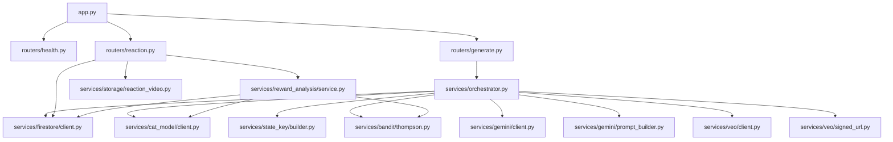
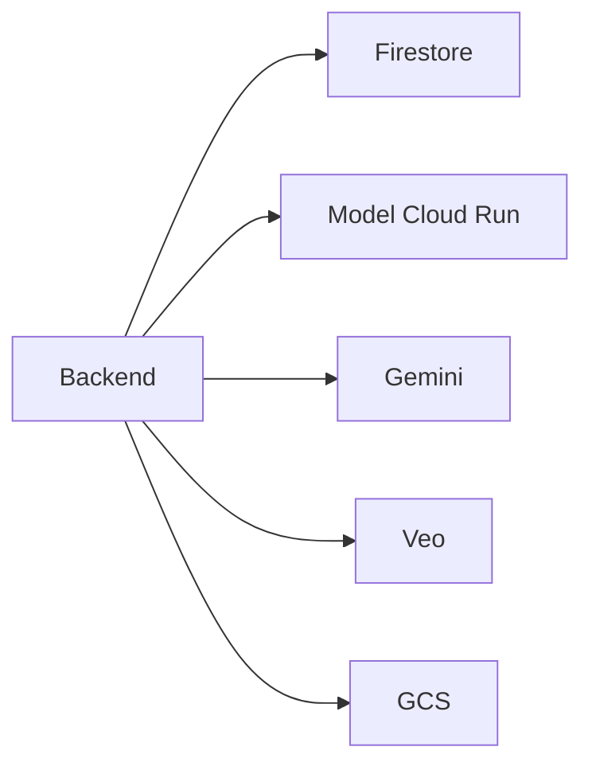
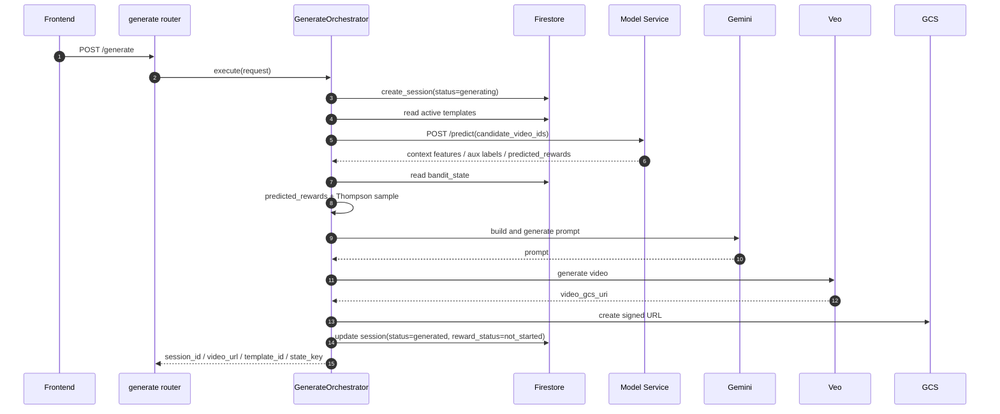
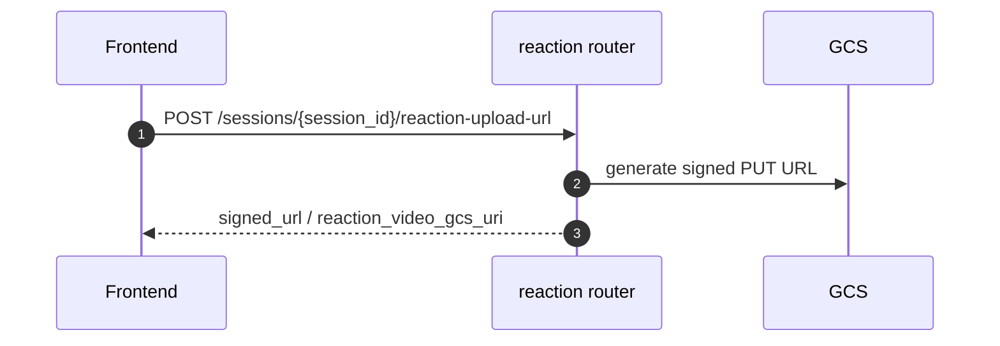
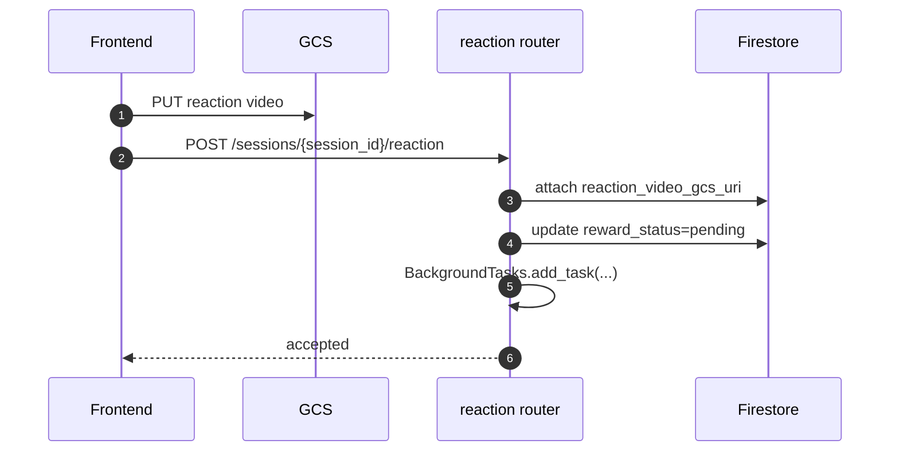
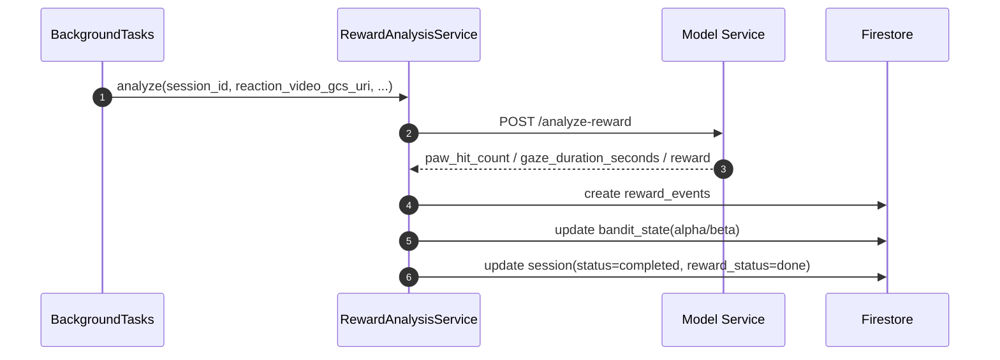

# 🐱 nekkoflix — バックエンド詳細設計書

| 項目 | 内容 |
|------|------|
| ドキュメントバージョン | target-current |
| 作成日 | 2026-03-27 |
| ステータス | Draft |
| 対応基本設計書 | docs/ja/High_Level_Design.md |
| 対応インフラ設計書 | docs/ja/INFRASTRUCTURE.md |
| 対応モデル設計書 | docs/ja/MODELING.md |
| 対象実装 | backend/ |

---

## 目次

1. [目的と責務](#1-目的と責務)
2. [ディレクトリ・ファイル構成](#2-ディレクトリファイル構成)
3. [主要ファイル責務一覧](#3-主要ファイル責務一覧)
4. [アーキテクチャ可視化（Mermaid）](#4-アーキテクチャ可視化mermaid)
5. [公開 API / 内部 API 設計](#5-公開-api--内部-api-設計)
6. [設定管理](#6-設定管理)
7. [サービス層設計](#7-サービス層設計)
8. [Firestore 設計](#8-firestore-設計)
9. [BackgroundTasks 連携設計](#9-backgroundtasks-連携設計)
10. [処理フロー詳細](#10-処理フロー詳細)
11. [例外・エラーハンドリング設計](#11-例外エラーハンドリング設計)
12. [ロギング設計](#12-ロギング設計)
13. [テスト設計](#13-テスト設計)
14. [削除・置換対象](#14-削除置換対象)
15. [実装上の留意事項](#15-実装上の留意事項)

---

## 1. 目的と責務

backend は、生成要求から報酬反映までの業務オーケストレーションを担う唯一の正本サービスとする。

主責務:

- `POST /generate` の受付
- `session_id` 発行とセッション状態管理
- model service `/predict` 呼び出し
- Firestore の `bandit_state` と model `predicted_rewards` を用いた hybrid contextual bandit 選択
- Gemini / Veo を用いた動画生成
- 生成動画 URL の返却
- reaction video upload 用 signed URL 発行
- reaction video upload 完了通知の受領
- FastAPI `BackgroundTasks` による reward analysis 起動
- model service `/analyze-reward` 呼び出し結果の Firestore 反映

非責務:

- 猫行動解析そのもの
- artifact 管理そのもの
- 人手 feedback の収集

---

## 2. ディレクトリ・ファイル構成

```text
backend/
├── src/
│   ├── app.py
│   ├── config.py
│   ├── exceptions.py
│   ├── logging_config.py
│   ├── data/
│   │   └── templates.json
│   ├── models/
│   │   ├── firestore.py
│   │   ├── internal.py
│   │   ├── request.py
│   │   └── response.py
│   ├── routers/
│   │   ├── generate.py
│   │   ├── health.py
│   │   └── reaction.py
│   └── services/
│       ├── orchestrator.py
│       ├── firestore/
│       │   └── client.py
│       ├── bandit/
│       │   ├── base.py
│       │   ├── repository.py
│       │   └── thompson.py
│       ├── storage/
│       │   └── reaction_video.py
│       ├── reward_analysis/
│       │   └── service.py
│       ├── state_key/
│       │   └── builder.py
│       ├── gemini/
│       │   ├── client.py
│       │   └── prompt_builder.py
│       ├── veo/
│       │   ├── client.py
│       │   └── signed_url.py
│       └── cat_model/
│           └── client.py
├── tests/
│   ├── integration/
│   └── unit/
└── pyproject.toml
```

注記:

- 本書では現行 target backend を正として記述する

---

## 3. 主要ファイル責務一覧

| ファイル | 責務 |
|---|---|
| `src/app.py` | FastAPI app 構築、middleware、router 登録、exception handler |
| `src/config.py` | Backend 設定定義 |
| `src/models/request.py` | `GenerateRequest`、reaction upload URL request、reaction 通知 request 定義 |
| `src/models/response.py` | `GenerateResponse`、reaction upload URL response、reaction response などの公開 response 定義 |
| `src/models/internal.py` | model predict result、template snapshot、bandit selection、reward analysis result の内部表現 |
| `src/models/firestore.py` | `sessions`、`templates`、`reward_events`、`bandit_state` の document 定義 |
| `src/routers/generate.py` | 動画生成 API |
| `src/routers/reaction.py` | reaction upload URL 発行 API と upload 完了通知 API |
| `src/services/orchestrator.py` | `/generate` の業務オーケストレーション |
| `src/services/cat_model/client.py` | model service `/predict`, `/analyze-reward` 呼び出し |
| `src/services/bandit/thompson.py` | `predicted_rewards + Thompson sample` による template 選択と更新値算出 |
| `src/services/firestore/client.py` | Firestore CRUD |
| `src/services/storage/reaction_video.py` | reaction video 用 signed URL 発行と GCS URI 検証 |
| `src/services/reward_analysis/service.py` | BackgroundTasks で起動される reward analysis フロー統括 |
| `src/services/gemini/client.py` | Gemini 呼び出し |
| `src/services/gemini/prompt_builder.py` | prompt 組み立て |
| `src/services/veo/client.py` | Veo 動画生成 |
| `src/services/veo/signed_url.py` | 生成動画の signed URL 発行 |

---

## 4. アーキテクチャ可視化（Mermaid）

### 4.1 モジュール依存関係



### 4.2 外部サービス連携



### 4.3 `/generate` フロー



### 4.4 reaction upload URL 発行フロー



### 4.5 reaction 通知フロー



### 4.6 reward analysis フロー



---

## 5. 公開 API 設計

### 5.1 公開 API

| Method | Path | 用途 |
|---|---|---|
| `GET` | `/` | 簡易生存確認 |
| `GET` | `/health` | ヘルスチェック |
| `POST` | `/generate` | 動画生成開始 |
| `POST` | `/sessions/{session_id}/reaction-upload-url` | reaction video upload 用 signed URL 発行 |
| `POST` | `/sessions/{session_id}/reaction` | reaction video upload 完了通知 |

### 5.2 候補クエリ供給元

`candidate_video_ids` は frontend から渡さない。backend が Firestore `templates` collection から active な template ID を取得し、model `/predict` に渡す。

方針:

- 候補母集団の正本は `templates`
- hackathon 期間中は active template の全件、または上限 10 件を backend 側で選ぶ
- Thompson Sampling の arm 集合と `/predict` の `candidate_video_ids` は同一集合に揃える
- `/predict` は `features`、`aux_labels`、`predicted_rewards` を返す
- backend は `predicted_rewards` を事前期待値、`bandit_state` の beta sample を探索項として合成する

---

## 6. 設定管理

主要設定:

- `GCP_PROJECT_ID`
- `FIRESTORE_DATABASE_ID`
- `VIDEO_BUCKET_NAME`
- `REACTION_VIDEO_BUCKET_NAME`
- `MODEL_SERVICE_URL`
- `MODEL_SERVICE_TIMEOUT_SECONDS`
- `THOMPSON_DEFAULT_ALPHA`
- `THOMPSON_DEFAULT_BETA`
- `REWARD_SUCCESS_THRESHOLD`
- `REACTION_VIDEO_MAX_BYTES`
- `REACTION_VIDEO_UPLOAD_URL_EXPIRES_SECONDS`

削除対象:

- `VERTEX_ENDPOINT_ID`
- `VERTEX_ENDPOINT_LOCATION`
- `VERTEX_PREDICTION_TIMEOUT`
- `BANDIT_UCB_ALPHA`

---

## 7. サービス層設計

### 7.1 GenerateOrchestrator

入力:

- 猫画像
- 任意音声
- 任意テキスト文脈
- mode

責務:

- session 初期化
- model `/predict`
- `state_key` 生成
- `templates` / `bandit_state` 取得
- `predicted_rewards + Thompson sample` で template 選択
- Gemini prompt 構築
- Veo 動画生成
- 生成動画用 signed URL 作成
- session を `generated` に更新

### 7.2 CatModelClient

責務:

- model service `/predict` 呼び出し
- model service `/analyze-reward` 呼び出し
- backend 内部表現への変換

入力方針:

- `/predict` には画像・音声・任意補助文脈を渡す
- `/analyze-reward` には `reaction_video_gcs_uri` を渡す

`/predict` の正式入力:

- `image_base64` または `image_gcs_uri`
- `audio_base64` optional
- `candidate_video_ids`

`/predict` の正式出力:

- `features`
- `aux_labels`
- `predicted_rewards`

### 7.3 ThompsonBanditService

責務:

- `bandit_state` を入力に arm を sample
- model `/predict` が返す `predicted_rewards` を入力に受ける
- `predicted_reward + Thompson sample` の合成値で最終 arm を決定する
- 選択結果を返す
- reward 結果から `alpha / beta` 更新量を算出する

### 7.4 ReactionVideoStorageService

責務:

- reaction video upload 用 signed PUT URL を発行
- 許可対象の `reaction_video_gcs_uri` を検証する
- upload 完了通知で使う GCS URI を返す

signed URL 仕様:

- method は `PUT`
- object path は `reaction_videos/{session_id}/{uuid}.mp4`
- content type は `video/mp4` を標準とする
- URL の有効期限は `REACTION_VIDEO_UPLOAD_URL_EXPIRES_SECONDS`
- backend は通知時に bucket 名と object prefix が許可範囲内かを検証する

制約:

- reaction video は frontend 側で最大 8 秒に制限する
- request payload は最大 20MB とする
- backend は 20MB 超過 payload を受け付けない
- backend は動画の byte trimming を行わない

### 7.5 StateKeyBuilder

責務:

- `state_key` を一意に構築する

フォーマット:

- `{meow_label or unknown}_{emotion_label}_{clip_top_label}`

入力要素:

- `meow_label`: model `/predict` の `aux_labels.meow_label`
- `emotion_label`: model `/predict` の `aux_labels.emotion_label`
- `clip_top_label`: model `/predict` の `aux_labels.clip_top_label`

例:

- `unknown_surprised_curious_cat`

### 7.6 RewardAnalysisService

責務:

- BackgroundTasks payload 検証
- model `/analyze-reward`
- `reward_events` 作成
- `bandit_state` 更新
- `sessions` 完了更新

---

## 8. Firestore 設計

### 8.1 collections

| Collection | 用途 |
|---|---|
| `templates` | 動画テンプレート定義 |
| `sessions` | 生成から報酬更新までの状態管理 |
| `bandit_state` | state ごとの arm 事後分布 |
| `reward_events` | 反応動画解析結果 |

### 8.2 `sessions`

主要フィールド:

- `session_id`
- `mode`
- `status`
- `reward_status`
- `state_key`
- `template_id`
- `user_context`
- `video_gcs_uri`
- `reaction_video_gcs_uri`
- `reward_event_id`
- `created_at`
- `generated_at`
- `completed_at`
- `error`

状態例:

- `generating`
- `generated`
- `completed`
- `failed`

`reward_status`:

- `not_started`
- `pending`
- `done`
- `failed`

遷移:

- session 作成時: `not_started`
- generate 完了時: `not_started`
- reaction upload 完了後: `pending`
- reward analysis 完了後: `done`
- reward analysis 失敗時: `failed`

### 8.3 `bandit_state`

ドキュメント ID:

- `{state_key}__{template_id}`

主要フィールド:

- `state_key`
- `template_id`
- `alpha`
- `beta`
- `selection_count`
- `last_reward`
- `reward_sum`
- `updated_at`

### 8.4 `reward_events`

主要フィールド:

- `reward_event_id`
- `session_id`
- `template_id`
- `state_key`
- `reaction_video_gcs_uri`
- `paw_hit_count`
- `gaze_duration_seconds`
- `reward`
- `analysis_status`
- `analysis_model_versions`
- `created_at`
- `analyzed_at`

---

## 9. BackgroundTasks 連携設計

### 9.1 起動タイミング

- reaction video の GCS direct upload 完了通知後
- `sessions.reward_status = pending` 更新後

### 9.2 task payload

最小 payload:

- `session_id`
- `reaction_video_gcs_uri`
- `template_id`
- `state_key`

前提:

- `reaction_video_gcs_uri` は backend が発行した signed URL と対になる object path であること

### 9.3 実行方針

- FastAPI `BackgroundTasks` で同一 backend process 内から起動する
- hackathon 期間中は best-effort 非同期とする
- リクエスト完了後に background 処理が落ちた場合は `reward_status=failed` または再送で補う

### 9.4 retry 方針

- model service timeout は retry 対象
- Firestore 一時障害は retry 対象
- payload 不正や session 不整合は non-retry 対象
- 自動 retry 基盤は持たないため、必要時は session 単位で手動再実行する

---

## 10. 処理フロー詳細

### 10.1 生成フロー

1. frontend が `/generate` を呼ぶ
2. backend が `sessions/{id}` を `generating` で作成
3. backend が `templates` から active template 一覧を読む
4. backend が model `/predict` を呼ぶ
5. backend が `state_key` を組み立てる
6. backend が `bandit_state` を読み込む
7. `predicted_rewards + Thompson sample` で template を選ぶ
8. backend が Gemini / Veo を呼ぶ
9. backend が signed URL を発行する
10. backend が session を `generated`、`reward_status=not_started` へ更新する
11. backend が `session_id` と `video_url` を返す

### 10.2 reaction upload フロー

1. frontend が再生中に反応動画を録画する
2. frontend が `/sessions/{session_id}/reaction-upload-url` を呼ぶ
3. backend が signed URL と `reaction_video_gcs_uri` を返す
4. frontend が GCS に direct upload する
5. frontend が `/sessions/{session_id}/reaction` で `reaction_video_gcs_uri` を通知する
6. backend が `sessions.reaction_video_gcs_uri` を更新する
7. backend が `BackgroundTasks` を起動する
8. backend は `accepted` を返す

制約:

- 録画時間は最大 8 秒
- request payload は最大 20MB
- 20MB 超過時は frontend 側で upload を中止する

### 10.3 reward analysis フロー

1. `BackgroundTasks` が `RewardAnalysisService` を呼ぶ
2. backend が task payload を検証する
3. backend が model `/analyze-reward` を呼ぶ
4. backend が `reward_events` を作成する
5. backend が reward しきい値に応じて `bandit_state.alpha/beta` を更新する
6. backend が `sessions.status=completed`, `reward_status=done` を更新する

---

## 11. 例外・エラーハンドリング設計

主要例外:

- `ModelServiceError`
- `ModelServiceTimeoutError`
- `ReactionVideoUploadError`
- `RewardAnalysisError`
- `SessionStateError`
- `FirestorePersistenceError`

方針:

- `/generate` 失敗時は session を `failed` に更新する
- reaction upload 通知失敗時は background 処理を起動しない
- reward analysis 失敗時は `reward_status=failed` を記録する
- 自動 retry は持たないため、障害時は再通知または再実行で補う

---

## 12. ロギング設計

必須イベント:

- `generate_requested`
- `session_created`
- `model_predict_completed`
- `bandit_template_selected`
- `video_generated`
- `reaction_upload_url_issued`
- `reaction_uploaded`
- `reward_analysis_background_started`
- `reward_analysis_started`
- `reward_analysis_completed`
- `bandit_state_updated`

ログに含める主キー:

- `session_id`
- `template_id`
- `state_key`
- `reward_event_id`

---

## 13. テスト設計

### 13.1 unit tests

- model client `/predict` 契約
- model client `/analyze-reward` 契約
- hybrid contextual bandit (`predicted_rewards + Thompson sample`)
- Firestore client
- reaction upload URL 発行
- reaction 通知検証

### 13.2 integration tests

- `POST /generate`
- `POST /sessions/{session_id}/reaction-upload-url`
- `POST /sessions/{session_id}/reaction`
- orchestrator 全体

### 13.3 削除対象 tests

- `/feedback` route test
- UCB test
- Vertex endpoint smoke test

---

## 14. 削除・置換対象

削除対象:

- `routers/feedback.py`
- `services/bandit/ucb.py`
- `FeedbackRequest`
- `FeedbackResponse`
- `VertexAIError`
- `VertexAITimeoutError`
- Vertex endpoint 前提の config

置換対象:

- `services/cat_model/client.py`
- `services/firestore/client.py`
- `services/orchestrator.py`
- `services/state_key/builder.py`

---

## 15. 実装上の留意事項

- reward analysis は同期処理に含めない
- frontend は再生中に reaction video を録画する
- reaction video は 8 秒以内、20MB 以下を前提とする
- reaction video は GCS に direct upload する
- Firestore 更新の正本は backend に置く
- model service は推論・解析専用とし、業務状態は持たない
- `candidate_video_ids` は backend が `templates` から供給する
