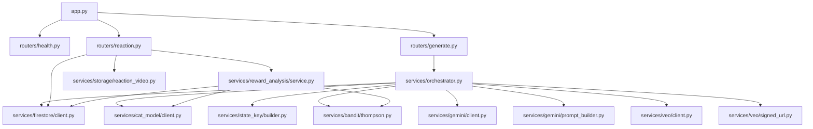
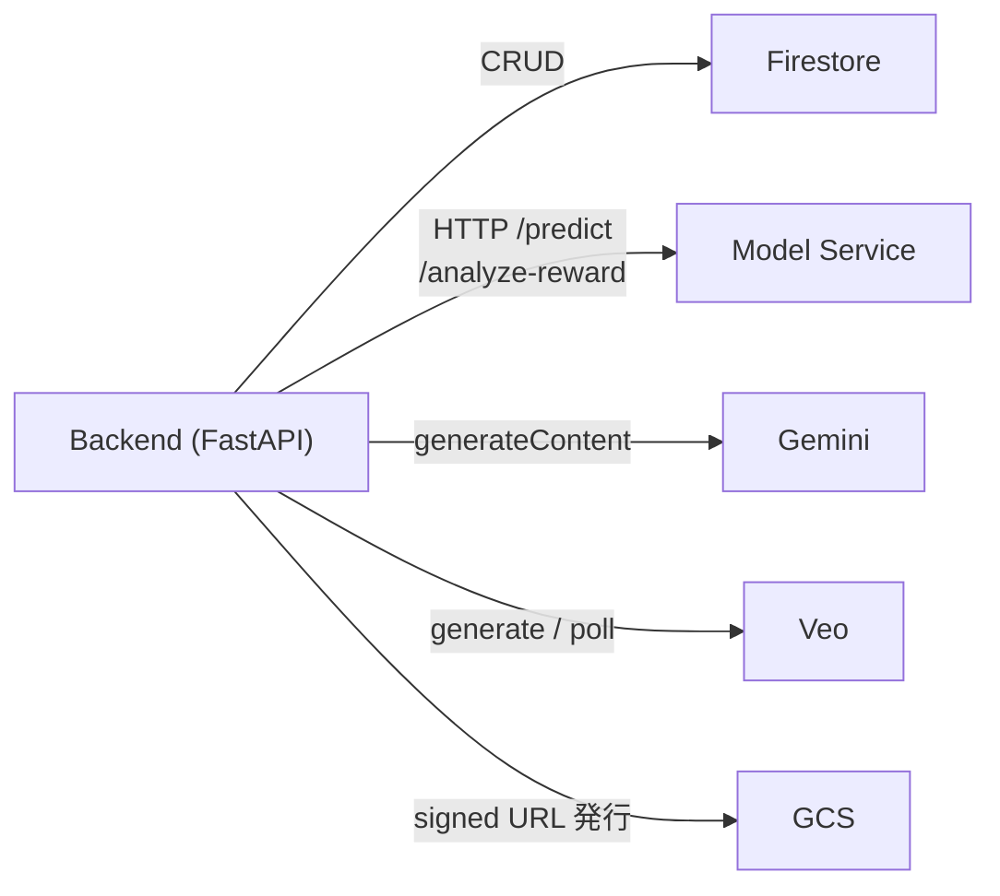
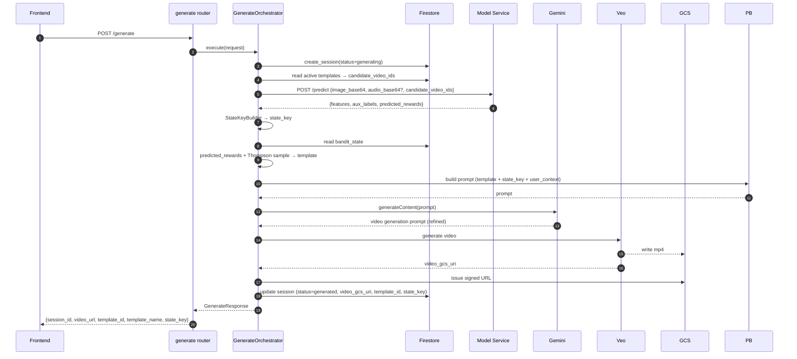
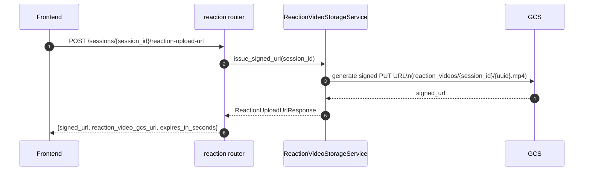
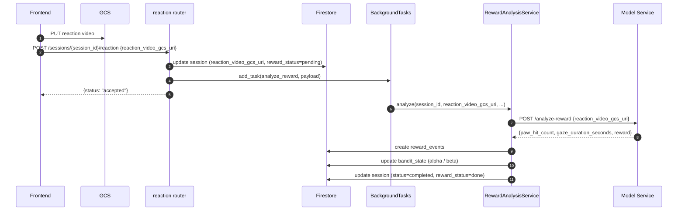
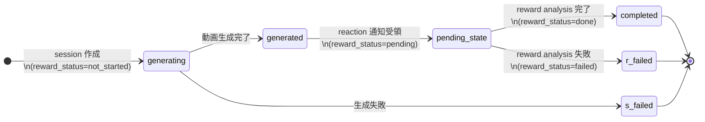
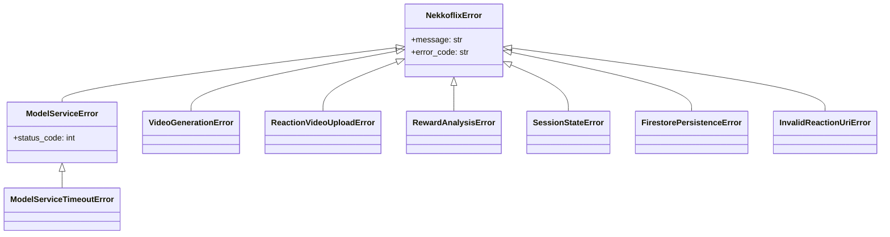

# 🐱 nekkoflix — バックエンド詳細設計書

| 項目 | 内容 |
|------|------|
| ドキュメントバージョン | v2.0 |
| 作成日 | 2026-03-28 |
| ステータス | Active |
| 対応基本設計書 | docs/ja/High_Level_Design.md |
| 対応インフラ設計書 | docs/ja/INFRASTRUCTURE.md |
| 対応モデル設計書 | docs/ja/MODELING.md |
| 対象実装 | `backend/` |

---

## 目次

1. [目的と責務](#1-目的と責務)
2. [ディレクトリ・ファイル構成](#2-ディレクトリファイル構成)
3. [主要ファイル責務一覧](#3-主要ファイル責務一覧)
4. [アーキテクチャ可視化（Mermaid）](#4-アーキテクチャ可視化mermaid)
5. [公開 API 設計](#5-公開-api-設計)
6. [設定管理](#6-設定管理)
7. [サービス層設計](#7-サービス層設計)
8. [Firestore 設計](#8-firestore-設計)
9. [BackgroundTasks 連携設計](#9-backgroundtasks-連携設計)
10. [処理フロー詳細](#10-処理フロー詳細)
11. [例外・エラーハンドリング設計](#11-例外エラーハンドリング設計)
12. [ロギング設計](#12-ロギング設計)
13. [テスト設計](#13-テスト設計)
14. [実装上の留意事項](#14-実装上の留意事項)

---

## 1. 目的と責務

backend は、生成要求から報酬反映までの業務オーケストレーションを担う唯一の正本サービス。

**主責務：**

- `POST /generate` の受付・session 発行・状態管理
- model service `/predict` 呼び出し
- `predicted_rewards + Thompson Sampling` による hybrid contextual bandit 選択
- Gemini / Veo を用いた動画生成
- 生成動画の signed URL 返却
- reaction video upload 用 signed URL 発行
- reaction video upload 完了通知の受領
- FastAPI `BackgroundTasks` による reward analysis 非同期起動
- model service `/analyze-reward` 結果の Firestore 反映

**非責務（Model Service の責務）：**

- 猫行動解析そのもの（pose / emotion / meow / CLIP）
- reaction video の映像解析（reward 算出）
- artifact 管理

---

## 2. ディレクトリ・ファイル構成

```text
backend/
├── src/
│   ├── app.py                        # FastAPI app 構築・middleware・router 登録
│   ├── config.py                     # Pydantic BaseSettings 設定定義
│   ├── exceptions.py                 # カスタム例外クラス定義
│   ├── logging_config.py             # structured logging 設定（Cloud Logging 対応）
│   ├── data/
│   │   └── templates.json            # ローカル開発用テンプレートキャッシュ
│   ├── models/
│   │   ├── request.py                # 公開 API リクエスト Pydantic モデル
│   │   ├── response.py               # 公開 API レスポンス Pydantic モデル
│   │   ├── internal.py               # 内部表現（model 出力・bandit 選択結果等）
│   │   └── firestore.py              # Firestore document の型定義
│   ├── routers/
│   │   ├── generate.py               # POST /generate
│   │   ├── health.py                 # GET / , GET /health
│   │   └── reaction.py               # POST /sessions/{id}/reaction-upload-url
│   │                                 # POST /sessions/{id}/reaction
│   └── services/
│       ├── orchestrator.py           # /generate の業務オーケストレーション
│       ├── firestore/
│       │   └── client.py             # Firestore CRUD
│       ├── bandit/
│       │   ├── base.py               # バンディット抽象基底クラス
│       │   ├── repository.py         # bandit_state 読み書き
│       │   └── thompson.py           # Thompson Sampling 実装
│       ├── storage/
│       │   └── reaction_video.py     # reaction video signed URL 発行・URI 検証
│       ├── reward_analysis/
│       │   └── service.py            # BackgroundTasks で起動する reward analysis
│       ├── state_key/
│       │   └── builder.py            # state_key 文字列生成
│       ├── gemini/
│       │   ├── client.py             # Gemini API 呼び出し
│       │   └── prompt_builder.py     # プロンプト組み立て
│       ├── veo/
│       │   ├── client.py             # Veo 動画生成
│       │   └── signed_url.py         # 生成動画の signed URL 発行
│       └── cat_model/
│           └── client.py             # model service /predict, /analyze-reward 呼び出し
├── tests/
│   ├── unit/                         # サービス単体テスト
│   └── integration/                  # API エンドポイント統合テスト
└── pyproject.toml
```

---

## 3. 主要ファイル責務一覧

| ファイル | 責務 |
|---|---|
| `src/app.py` | FastAPI app 構築、CORS middleware、router 登録、exception handler |
| `src/config.py` | `BackendConfig(BaseSettings)` — 環境変数を型付きで定義 |
| `src/models/request.py` | `GenerateRequest`、`ReactionUploadUrlRequest`、`ReactionNotifyRequest` |
| `src/models/response.py` | `GenerateResponse`、`ReactionUploadUrlResponse`、`ReactionNotifyResponse` |
| `src/models/internal.py` | `ModelPredictResult`, `BanditSelection`, `RewardAnalysisResult` |
| `src/models/firestore.py` | `SessionDocument`, `TemplateDocument`, `BanditStateDocument`, `RewardEventDocument` |
| `src/routers/generate.py` | POST /generate のルーティングと DI |
| `src/routers/reaction.py` | reaction-upload-url・reaction 通知のルーティング |
| `src/services/orchestrator.py` | `/generate` の業務フロー統括 |
| `src/services/cat_model/client.py` | model service `/predict`, `/analyze-reward` 呼び出し |
| `src/services/bandit/thompson.py` | `predicted_rewards + Thompson sample` による template 選択 |
| `src/services/firestore/client.py` | Firestore CRUD（session / template / bandit_state / reward_events）|
| `src/services/storage/reaction_video.py` | signed PUT URL 発行と GCS URI 検証 |
| `src/services/reward_analysis/service.py` | BackgroundTasks で起動する reward analysis フロー |
| `src/services/gemini/prompt_builder.py` | state_key + template + user_context からプロンプト組み立て |
| `src/services/veo/client.py` | Veo 動画生成・ポーリング |
| `src/services/state_key/builder.py` | `{meow}_{emotion}_{clip_label}` 形式のキー生成 |

---

## 4. アーキテクチャ可視化（Mermaid）

### 4.1 モジュール依存関係



### 4.2 外部サービス連携



### 4.3 `/generate` 処理フロー



### 4.4 reaction upload URL 発行フロー



### 4.5 reaction 通知・reward analysis フロー



---

## 5. 公開 API 設計

### 5.1 エンドポイント一覧

| Method | Path | 用途 | 認証 |
|---|---|---|---|
| `GET` | `/` | 簡易生存確認 | 不要 |
| `GET` | `/health` | ヘルスチェック | 不要 |
| `POST` | `/generate` | 動画生成開始 | IDトークン（将来）|
| `POST` | `/sessions/{session_id}/reaction-upload-url` | reaction video signed URL 発行 | IDトークン（将来）|
| `POST` | `/sessions/{session_id}/reaction` | reaction video 通知・Bandit 更新 | IDトークン（将来）|

---

### 5.2 POST /generate

**リクエスト（`GenerateRequest`）：**

```python
class GenerateRequest(BaseModel):
    image_base64: str                     # 必須 - JPEG/PNG 静止画（base64）
    audio_base64: str | None = None       # 任意 - 鳴き声音声（base64）
    user_context: str | None = None       # 任意 - 猫の性格・好み（最大500字）
    mode: Literal["experience", "production"] = "experience"
```

**レスポンス（`GenerateResponse`）：**

```python
class GenerateResponse(BaseModel):
    session_id: str          # UUID v4
    video_url: str           # 生成動画の signed URL
    template_id: str         # 選択されたテンプレート ID
    template_name: str       # テンプレート名（表示用）
    state_key: str           # 猫状態キー（例: "waiting_for_food_happy_curious_cat"）
```

**エラーレスポンス：**

| HTTP status | error_code | 発生条件 |
|---|---|---|
| `422` | `validation_error` | リクエストボディの型エラー |
| `503` | `model_service_error` | Model Service が応答しない |
| `504` | `model_service_timeout` | Model Service のタイムアウト |
| `500` | `video_generation_error` | Veo 動画生成失敗 |
| `500` | `internal_error` | その他の内部エラー |

```python
class ErrorResponse(BaseModel):
    error_code: str
    message: str
    session_id: str | None = None   # 生成済みの場合は含む
```

---

### 5.3 POST /sessions/{session_id}/reaction-upload-url

**レスポンス（`ReactionUploadUrlResponse`）：**

```python
class ReactionUploadUrlResponse(BaseModel):
    session_id: str
    upload_url: str                  # GCS signed PUT URL
    reaction_video_gcs_uri: str      # GCS 上の保存先 URI
    expires_in_seconds: int          # signed URL の有効秒数
```

---

### 5.4 POST /sessions/{session_id}/reaction

**リクエスト（`ReactionNotifyRequest`）：**

```python
class ReactionNotifyRequest(BaseModel):
    reaction_video_gcs_uri: str   # GCS 上の reaction video URI（backend が発行したものと一致すること）
```

**レスポンス（`ReactionNotifyResponse`）：**

```python
class ReactionNotifyResponse(BaseModel):
    status: Literal["accepted"]
```

---

### 5.5 エラーコードカタログ

| error_code | HTTP | 原因 | Firestore 影響 |
|---|---|---|---|
| `validation_error` | 422 | リクエストボディ不正 | なし |
| `model_service_error` | 503 | `/predict` または `/analyze-reward` が非 2xx | `session.status=failed` |
| `model_service_timeout` | 504 | タイムアウト | `session.status=failed` |
| `video_generation_error` | 500 | Veo 生成失敗 | `session.status=failed` |
| `session_not_found` | 404 | session_id が存在しない | なし |
| `invalid_reaction_uri` | 400 | backend 発行外の URI | なし |
| `reward_analysis_failed` | — | BackgroundTasks 内 failure | `reward_status=failed` |
| `internal_error` | 500 | その他 | `session.status=failed` |

---

## 6. 設定管理

`src/config.py` の `BackendConfig(BaseSettings)` で管理する。Cloud Run の環境変数から自動的に読み込まれる。

| 変数名 | 型 | 必須 | デフォルト | 説明 |
|---|---|---|---|---|
| `GCP_PROJECT_ID` | str | ✅ | — | GCP プロジェクト ID |
| `GCP_REGION` | str | ❌ | `asia-northeast1` | リージョン |
| `FIRESTORE_DATABASE_ID` | str | ✅ | `(default)` | Firestore DB ID |
| `VIDEO_BUCKET_NAME` | str | ✅ | — | Veo 生成動画バケット |
| `REACTION_VIDEO_BUCKET_NAME` | str | ✅ | — | reaction video バケット |
| `MODEL_SERVICE_URL` | str | ✅ | — | Model Service 内部 URL |
| `MODEL_SERVICE_TIMEOUT_SECONDS` | int | ❌ | `60` | model 呼び出し timeout |
| `THOMPSON_DEFAULT_ALPHA` | float | ❌ | `1.0` | bandit 初期 α |
| `THOMPSON_DEFAULT_BETA` | float | ❌ | `1.0` | bandit 初期 β |
| `REWARD_SUCCESS_THRESHOLD` | float | ❌ | `0.5` | α 更新の報酬しきい値 |
| `REACTION_VIDEO_MAX_BYTES` | int | ❌ | `20971520` | reaction video 上限 (20MB) |
| `REACTION_VIDEO_UPLOAD_URL_EXPIRES_SECONDS` | int | ❌ | `600` | signed URL 有効秒数 |
| `ENVIRONMENT` | str | ❌ | `production` | `development` / `production` |

```python
# src/config.py（抜粋）
from pydantic_settings import BaseSettings

class BackendConfig(BaseSettings):
    gcp_project_id: str
    gcp_region: str = "asia-northeast1"
    firestore_database_id: str = "(default)"
    video_bucket_name: str
    reaction_video_bucket_name: str
    model_service_url: str
    model_service_timeout_seconds: int = 60
    thompson_default_alpha: float = 1.0
    thompson_default_beta: float = 1.0
    reward_success_threshold: float = 0.5
    reaction_video_max_bytes: int = 20_971_520   # 20MB
    reaction_video_upload_url_expires_seconds: int = 600
    environment: str = "production"

    class Config:
        env_file = ".env"

config = BackendConfig()
```

---

## 7. サービス層設計

### 7.1 GenerateOrchestrator

`src/services/orchestrator.py`

```python
class GenerateOrchestrator:
    def __init__(
        self,
        firestore: FirestoreClient,
        cat_model: CatModelClient,
        bandit: ThompsonBanditService,
        prompt_builder: PromptBuilder,
        gemini: GeminiClient,
        veo: VeoClient,
        state_key_builder: StateKeyBuilder,
    ): ...

    async def execute(self, request: GenerateRequest) -> GenerateResponse:
        """
        1. session を generating で作成
        2. active templates → candidate_video_ids 取得
        3. model /predict → predicted_rewards / aux_labels
        4. StateKeyBuilder → state_key
        5. bandit_state 読み込み → ThompsonBandit → template 選択
        6. PromptBuilder → prompt
        7. Gemini → refined prompt
        8. Veo → video_gcs_uri
        9. signed URL 発行
        10. session を generated に更新
        """
```

---

### 7.2 CatModelClient

`src/services/cat_model/client.py`

```python
class CatModelClient:
    async def predict(
        self,
        image_base64: str,
        candidate_video_ids: list[str],
        audio_base64: str | None = None,
    ) -> ModelPredictResult:
        """model /predict を呼び出し、内部表現に変換する"""

    async def analyze_reward(
        self,
        reaction_video_gcs_uri: str,
        session_id: str,
    ) -> RewardAnalysisResult:
        """model /analyze-reward を呼び出す"""
```

**`/predict` の入出力型：**

```python
# 内部表現 (src/models/internal.py)
class ModelPredictResult(BaseModel):
    features: dict[str, float]          # 連続値特徴量
    aux_labels: AuxLabels               # 分類ラベル
    predicted_rewards: dict[str, float] # template_id → 事前期待報酬

class AuxLabels(BaseModel):
    meow_label: str                     # 例: "waiting_for_food"
    emotion_label: str                  # 例: "happy"
    clip_top_label: str                 # 例: "curious_cat"
```

---

### 7.3 ThompsonBanditService

`src/services/bandit/thompson.py`

**アルゴリズム：**

Thompson Sampling with predicted_rewards prior として、model が返す `predicted_rewards` を初期期待値に、Firestore の `bandit_state` の Beta 分布サンプルを探索項として合成する。

```
θ_i = predicted_reward_i + Beta(α_i, β_i).sample()

選択 = argmax_i θ_i
```

**α / β 更新式（reward analysis 完了後）：**

```
if reward >= REWARD_SUCCESS_THRESHOLD:
    α_i += reward          # 成功報酬を α に加算
else:
    β_i += (1 - reward)    # 失敗ペナルティを β に加算
```

```python
class ThompsonBanditService:
    def select_template(
        self,
        predicted_rewards: dict[str, float],
        bandit_states: dict[str, BanditStateDocument],
    ) -> BanditSelection:
        """θ_i = predicted_reward + Beta(α,β).sample() で選択"""

    def compute_update(
        self,
        reward: float,
        current_state: BanditStateDocument,
    ) -> BanditStateUpdate:
        """α/β の更新量を算出して返す"""
```

---

### 7.4 ReactionVideoStorageService

`src/services/storage/reaction_video.py`

```python
class ReactionVideoStorageService:
    def issue_signed_url(
        self,
        session_id: str,
    ) -> tuple[str, str]:
        """
        Returns: (signed_put_url, reaction_video_gcs_uri)
        object path: reaction_videos/{session_id}/{uuid}.mp4
        method: PUT
        content-type: video/mp4
        expires: REACTION_VIDEO_UPLOAD_URL_EXPIRES_SECONDS
        """

    def validate_uri(
        self,
        reaction_video_gcs_uri: str,
        session_id: str,
    ) -> bool:
        """bucket 名と object prefix が許可範囲内かを検証"""
```

**signed URL 仕様まとめ：**

| 項目 | 値 |
|---|---|
| method | `PUT` |
| object path | `reaction_videos/{session_id}/{uuid}.mp4` |
| content-type | `video/mp4` |
| 有効期限 | `REACTION_VIDEO_UPLOAD_URL_EXPIRES_SECONDS`（デフォルト 600 秒）|
| 上限サイズ | `20MB`（frontend 側で制御、backend は trimming しない）|
| 録画時間上限 | `8秒`（frontend 側で制御）|

---

### 7.5 StateKeyBuilder

`src/services/state_key/builder.py`

**フォーマット：**

```
{meow_label}_{emotion_label}_{clip_top_label}

例: waiting_for_food_happy_curious_cat
    unknown_surprised_alert_state
```

```python
class StateKeyBuilder:
    def build(self, aux_labels: AuxLabels) -> str:
        meow = aux_labels.meow_label or "unknown"
        emotion = aux_labels.emotion_label or "unknown"
        clip = aux_labels.clip_top_label or "unknown"
        # スペース → "_"、小文字変換、特殊文字除去
        return f"{_normalize(meow)}_{_normalize(emotion)}_{_normalize(clip)}"
```

---

### 7.6 PromptBuilder

`src/services/gemini/prompt_builder.py`

```python
class PromptBuilder:
    def build(
        self,
        template: TemplateDocument,
        state_key: str,
        user_context: str | None,
        aux_labels: AuxLabels,
    ) -> str:
        """
        テンプレートのプロンプトひな形 + 猫の状態情報 + ユーザーコンテキストを
        Gemini への最終プロンプトとして組み立てる。
        user_context が None の場合はデフォルト文言を使用。
        """
```

---

### 7.7 RewardAnalysisService

`src/services/reward_analysis/service.py`

```python
class RewardAnalysisService:
    async def analyze(
        self,
        session_id: str,
        reaction_video_gcs_uri: str,
        template_id: str,
        state_key: str,
    ) -> None:
        """
        BackgroundTasks から呼び出される。
        1. payload 検証
        2. model /analyze-reward 呼び出し
        3. reward_events 作成
        4. bandit_state 更新（α / β）
        5. session status=completed, reward_status=done に更新
        """
```

---

## 8. Firestore 設計

### 8.1 コレクション一覧

| Collection | 用途 | 更新者 |
|---|---|---|
| `templates` | 動画テンプレート定義 | `init_firestore.py`（初期投入）|
| `sessions` | 生成〜報酬更新の状態管理 | Backend |
| `bandit_state` | state_key × template_id の Beta 分布パラメータ | Backend（RewardAnalysisService）|
| `reward_events` | reaction video 解析結果 | Backend（RewardAnalysisService）|

---

### 8.2 `sessions` コレクション詳細

全フィールドの型定義（`src/models/firestore.py`）：

```python
class SessionDocument(BaseModel):
    session_id: str
    mode: Literal["experience", "production"]
    status: Literal["generating", "generated", "completed", "failed"]
    reward_status: Literal["not_started", "pending", "done", "failed"]
    state_key: str | None = None
    template_id: str | None = None
    user_context: str | None = None
    video_gcs_uri: str | None = None
    reaction_video_gcs_uri: str | None = None
    reward_event_id: str | None = None
    created_at: datetime
    generated_at: datetime | None = None
    completed_at: datetime | None = None
    error: str | None = None
```

**`status` × `reward_status` 状態遷移：**



---

### 8.3 `bandit_state` コレクション詳細

**ドキュメント ID：** `{state_key}__{template_id}`

```python
class BanditStateDocument(BaseModel):
    state_key: str
    template_id: str
    alpha: float = 1.0           # Beta 分布の α（成功累積）
    beta: float = 1.0            # Beta 分布の β（失敗累積）
    selection_count: int = 0     # arm の累積選択回数
    reward_sum: float = 0.0      # 累積報酬合計
    last_reward: float | None = None
    updated_at: datetime
```

---

### 8.4 `reward_events` コレクション詳細

```python
class RewardEventDocument(BaseModel):
    reward_event_id: str
    session_id: str
    template_id: str
    state_key: str
    reaction_video_gcs_uri: str
    paw_hit_count: int | None = None
    gaze_duration_seconds: float | None = None
    reward: float
    analysis_status: Literal["done", "failed"]
    analysis_model_versions: dict[str, str] = {}
    created_at: datetime
    analyzed_at: datetime | None = None
```

---

## 9. BackgroundTasks 連携設計

### 9.1 起動タイミング

```python
# src/routers/reaction.py
@router.post("/sessions/{session_id}/reaction")
async def notify_reaction(
    session_id: str,
    body: ReactionNotifyRequest,
    background_tasks: BackgroundTasks,
    ...
):
    # 1. Firestore 更新（reaction_video_gcs_uri, reward_status=pending）
    await firestore.update_session_reaction(session_id, body.reaction_video_gcs_uri)
    # 2. BackgroundTasks 登録
    background_tasks.add_task(
        reward_analysis_service.analyze,
        session_id=session_id,
        reaction_video_gcs_uri=body.reaction_video_gcs_uri,
        template_id=session.template_id,
        state_key=session.state_key,
    )
    # 3. 即座に accepted を返す
    return ReactionNotifyResponse(status="accepted")
```

### 9.2 task payload 最小構成

| フィールド | 説明 |
|---|---|
| `session_id` | セッション ID |
| `reaction_video_gcs_uri` | backend が発行した URI と対になること |
| `template_id` | Bandit 更新対象 |
| `state_key` | Bandit 更新対象 |

### 9.3 実行方針と retry

| 観点 | 方針 |
|---|---|
| 実行環境 | FastAPI `BackgroundTasks`（同一プロセス内） |
| 分離方式 | best-effort 非同期（ハッカソンスコープ） |
| 自動 retry | なし |
| 失敗時 | `reward_status=failed` を記録。手動で `/reaction` を再送信 |
| retry 対象 | model service timeout、Firestore 一時障害 |
| non-retry 対象 | payload 不正、session 不整合 |

---

## 10. 処理フロー詳細

### 10.1 生成フロー（実装ファイル対応付き）

| ステップ | 担当ファイル |
|---|---|
| 1. `/generate` 受付 | `routers/generate.py` |
| 2. session 作成（status=generating）| `services/firestore/client.py` |
| 3. active templates 取得 | `services/firestore/client.py` |
| 4. model `/predict` 呼び出し | `services/cat_model/client.py` |
| 5. `state_key` 生成 | `services/state_key/builder.py` |
| 6. `bandit_state` 読み込み | `services/bandit/repository.py` |
| 7. `predicted_rewards + Thompson sample` → template 選択 | `services/bandit/thompson.py` |
| 8. prompt 組み立て | `services/gemini/prompt_builder.py` |
| 9. Gemini でプロンプト生成 | `services/gemini/client.py` |
| 10. Veo で動画生成 | `services/veo/client.py` |
| 11. 生成動画 signed URL 発行 | `services/veo/signed_url.py` |
| 12. session 更新（status=generated）| `services/firestore/client.py` |

### 10.2 reaction upload フロー

```
frontend が /reaction-upload-url を呼ぶ
  → ReactionVideoStorageService.issue_signed_url(session_id)
  → GCS signed PUT URL 発行
  → frontend が GCS に直接 PUT
  → frontend が /reaction を呼ぶ
  → ReactionVideoStorageService.validate_uri(uri, session_id) で URI 検証
  → Firestore: session.reaction_video_gcs_uri = uri, reward_status = pending
  → BackgroundTasks 登録 → accepted 返却
```

### 10.3 reward analysis フロー（BackgroundTasks）

```
RewardAnalysisService.analyze(session_id, reaction_video_gcs_uri, ...)
  → payload 検証
  → CatModelClient.analyze_reward(reaction_video_gcs_uri, session_id)
  → {paw_hit_count, gaze_duration_seconds, reward}
  → FirestoreClient.create_reward_event(...)
  → ThompsonBanditService.compute_update(reward, bandit_state)
  → FirestoreClient.update_bandit_state(state_key, template_id, update)
  → FirestoreClient.update_session(session_id, status=completed, reward_status=done)
```

---

## 11. 例外・エラーハンドリング設計

### 11.1 例外クラス構造



### 11.2 例外 → HTTP ステータスコードマッピング

| 例外クラス | HTTP | error_code | Firestore 影響 |
|---|---|---|---|
| `ModelServiceError` | 503 | `model_service_error` | `session.status=failed` |
| `ModelServiceTimeoutError` | 504 | `model_service_timeout` | `session.status=failed` |
| `VideoGenerationError` | 500 | `video_generation_error` | `session.status=failed` |
| `InvalidReactionUriError` | 400 | `invalid_reaction_uri` | なし |
| `SessionStateError` | 404/409 | `session_not_found` / `session_state_error` | なし |
| `FirestorePersistenceError` | 500 | `internal_error` | 不定 |
| `RewardAnalysisError` | — | `reward_analysis_failed` | `reward_status=failed` |

### 11.3 例外ハンドラ登録（`app.py`）

```python
@app.exception_handler(NekkoflixError)
async def nekkoflix_error_handler(request, exc: NekkoflixError):
    return JSONResponse(
        status_code=exc.http_status,
        content=ErrorResponse(
            error_code=exc.error_code,
            message=exc.message,
            session_id=exc.session_id,
        ).model_dump(),
    )
```

---

## 12. ロギング設計

structured JSON logging（Cloud Logging 対応）。各ログに `session_id` / `template_id` / `state_key` を必ず含める。

**必須イベント一覧：**

| イベント名 | ログレベル | タイミング |
|---|---|---|
| `generate_requested` | INFO | `/generate` 受付 |
| `session_created` | INFO | session 作成完了 |
| `model_predict_completed` | INFO | `/predict` 成功（latency 含む）|
| `bandit_template_selected` | INFO | template 選択完了 |
| `video_generated` | INFO | Veo 生成完了 |
| `reaction_upload_url_issued` | INFO | signed URL 発行 |
| `reaction_notify_received` | INFO | `/reaction` 受付 |
| `reward_analysis_background_started` | INFO | BackgroundTasks 起動 |
| `reward_analysis_completed` | INFO | reward analysis 完了 |
| `bandit_state_updated` | INFO | bandit_state 更新完了 |
| `model_service_error` | ERROR | model service 呼び出し失敗 |
| `reward_analysis_failed` | ERROR | reward analysis 失敗 |

**ログ出力例（JSON）：**

```json
{
  "severity": "INFO",
  "message": "model_predict_completed",
  "session_id": "550e8400-e29b-41d4-a716-446655440000",
  "template_id": "T02",
  "state_key": "waiting_for_food_happy_curious_cat",
  "latency_ms": 423,
  "timestamp": "2026-03-28T04:45:00Z"
}
```

---

## 13. テスト設計

### 13.1 ユニットテスト（`tests/unit/`）

| テスト対象 | 確認内容 |
|---|---|
| `CatModelClient.predict` | model service との HTTP 契約（mock）|
| `CatModelClient.analyze_reward` | `/analyze-reward` のレスポンス変換 |
| `ThompsonBanditService.select_template` | `predicted_rewards + Beta.sample` で最大 arm を選択 |
| `ThompsonBanditService.compute_update` | α / β 更新式の正確性 |
| `StateKeyBuilder.build` | ラベル正規化・連結フォーマット |
| `ReactionVideoStorageService.validate_uri` | 許可範囲外 URI を reject |
| `FirestoreClient` | 各 CRUD メソッド（Firestore emulator）|

### 13.2 統合テスト（`tests/integration/`）

| テスト対象 | 確認内容 |
|---|---|
| `POST /generate` | 正常系エンドツーエンド（model, Gemini, Veo をモック）|
| `POST /sessions/{id}/reaction-upload-url` | signed URL の形式・session 存在確認 |
| `POST /sessions/{id}/reaction` | Firestore 更新・BackgroundTasks 登録確認 |
| オーケストレーター全体 | session 状態遷移の整合性 |

### 13.3 テスト実行コマンド

```bash
# ユニットテスト
cd backend
uv run pytest tests/unit/ -v

# 統合テスト（Firestore emulator 起動後）
gcloud emulators firestore start --host-port=localhost:8080 &
FIRESTORE_EMULATOR_HOST=localhost:8080 uv run pytest tests/integration/ -v

# カバレッジ付き
uv run pytest tests/ --cov=src --cov-report=term-missing
```

---

## 14. 実装上の留意事項

| 観点 | 方針 |
|---|---|
| reward analysis の同期処理化 | **禁止**。必ず BackgroundTasks で非同期実行する |
| reaction video の byte trimming | **禁止**。frontend 側で 8 秒・20MB 以内に制御する |
| `candidate_video_ids` の供給元 | frontend から渡さない。backend が `templates` collection から取得する |
| Firestore 更新の正本 | backend に置く。frontend は session_id / video_url のみ保持 |
| model service の状態保持 | model service は推論専用。業務状態を持たない |
| Thompson Sampling の arm 集合 | `bandit_state` の arm 集合と `/predict` の `candidate_video_ids` は必ず同一集合に揃える |
| signed URL の URI 検証 | backend が発行した URI のみ通知を受け付ける。bucket 名・object prefix を必ず検証する |
| 体験モードの Bandit 更新 | **体験モードでは reaction video 録画・reward 計算を行わない**。`mode=experience` のセッションは `reward_status=not_started` のまま終了 |
