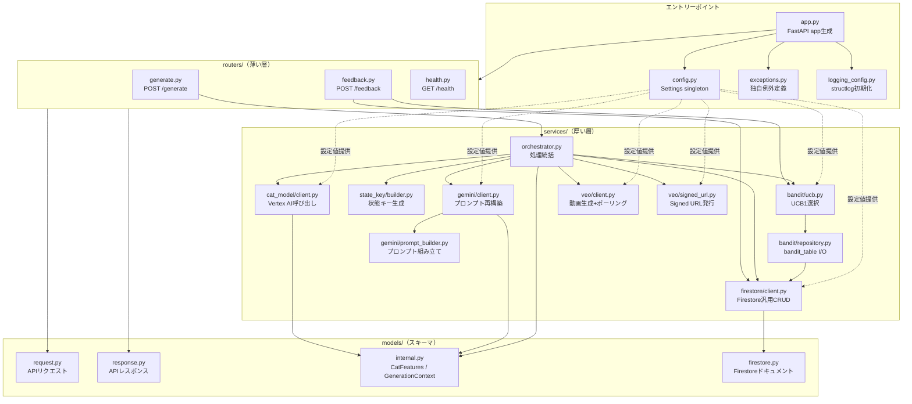
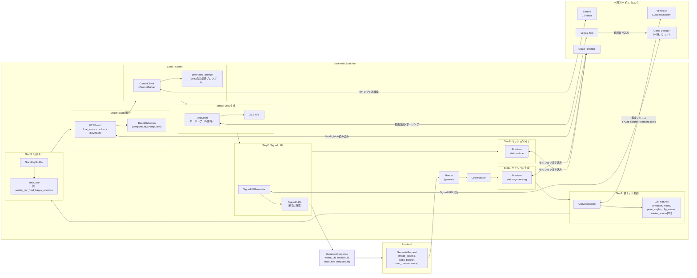
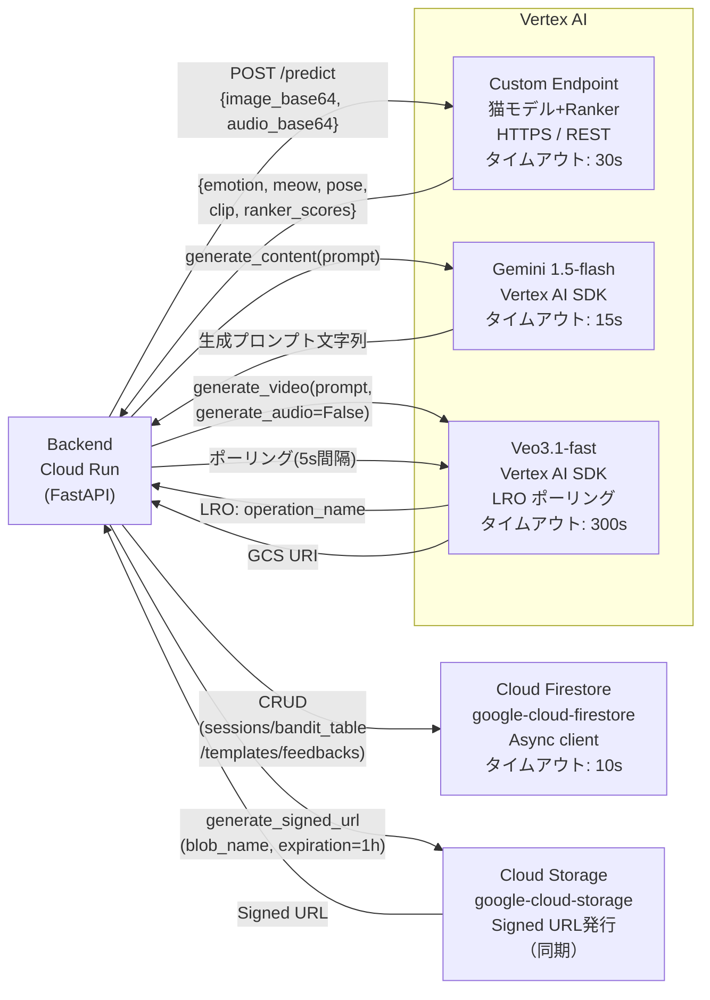
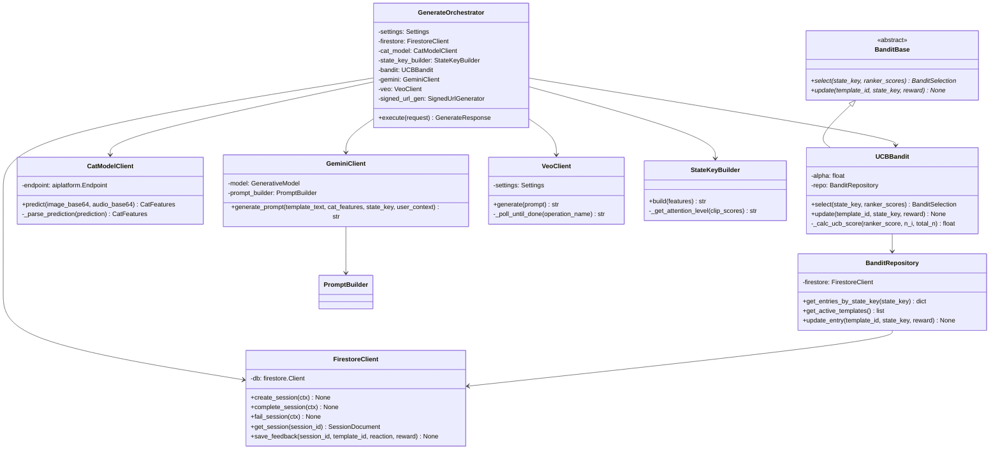
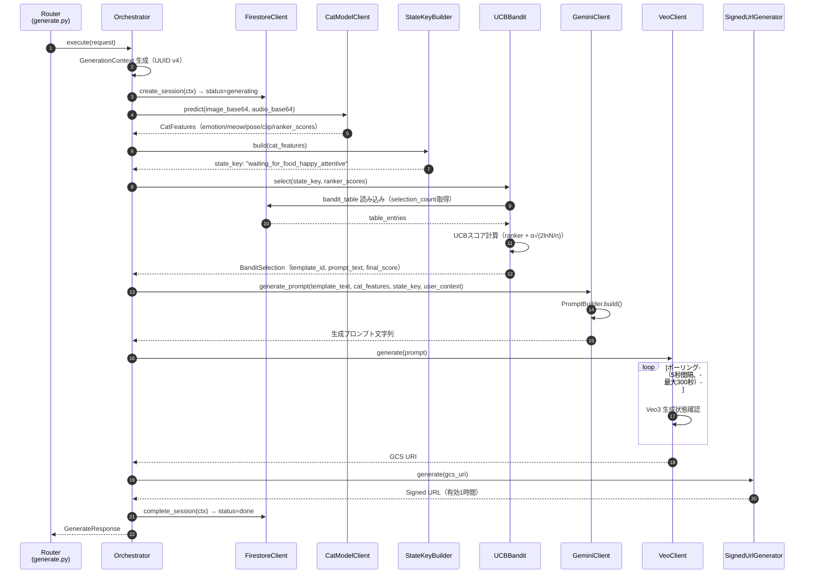
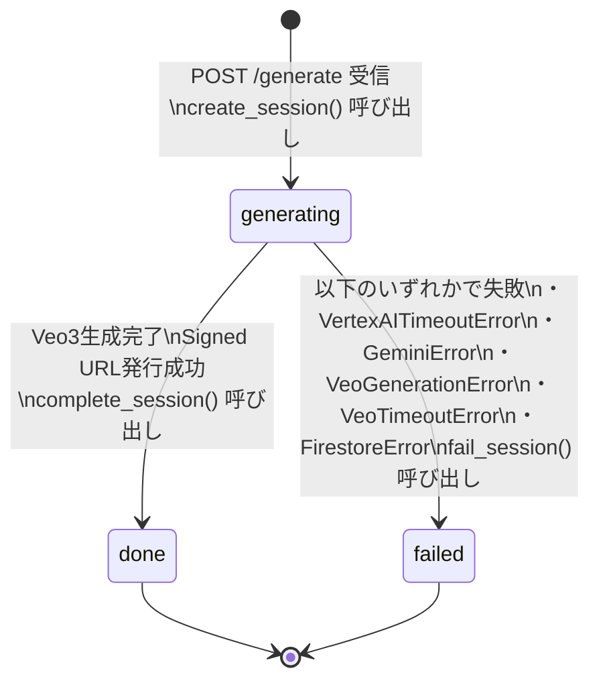

# 🐱 nekkoflix — バックエンド詳細設計書

| 項目 | 内容 |
|------|------|
| ドキュメントバージョン | v2.0 |
| 作成日 | 2026-03-19 |
| ステータス | Draft |
| 対応基本設計書 | docs/ja/High_Level_Design.md v2.0 |
| 準拠ドキュメント | docs/ja/MODELING.md v1 |

---

## v2.0 更新メモ

本ドキュメントには旧設計時点の `LightGBM Ranker` 前提記述が一部残っている。Phase 0 時点での正式前提は以下とする。

- Custom Endpoint の最終予測器は `LightGBM Regressor`
- Endpoint 出力は `features + aux_labels + predicted_rewards`
- 動画候補は `video-1` から `video-10`
- Backend は `predicted_rewards + UCB bonus` で最終テンプレートを選択する
- 状態キーは `{meow_label or unknown}_{emotion_label}_{clip_top_label}` を採用する
- `backend` は `emotion / pose / clip / meow / regressor` を持たず、Vertex AI Custom Endpoint の結果のみを利用する

詳細な差分と後続実装の正本は以下を参照する。

- `docs/_internal/Phase0_Endpoint_Contract.md`
- `docs/_internal/Phase0_Templates_Seed_Spec.md`
- `docs/_internal/Phase0_Backend_Design_Diff.md`

### 現時点の責務境界

- `backend`: Endpoint 呼び出し、状態キー生成、UCB、Gemini、Veo、Firestore
- `model`: `emotion / pose / clip` 特徴抽出、optional な `meow`、Reward Regressor
- `backend` は特徴量抽出ロジックを持たない

---

## 目次

1. [ディレクトリ・ファイル構成](#1-ディレクトリファイル構成)
2. [主要ファイル責務一覧](#2-主要ファイル責務一覧)
3. [アーキテクチャ可視化（Mermaid）](#3-アーキテクチャ可視化mermaid)
4. [依存ライブラリ（pyproject.toml）](#4-依存ライブラリpyprojecttoml)
5. [設定管理（config.py）](#5-設定管理configpy)
6. [アプリケーションエントリーポイント（app.py）](#6-アプリケーションエントリーポイントapppy)
7. [スキーマ定義（models/）](#7-スキーマ定義models)
8. [ルーター設計（routers/）](#8-ルーター設計routers)
9. [サービス層設計（services/）](#9-サービス層設計services)
10. [例外・エラーハンドリング設計](#10-例外エラーハンドリング設計)
11. [ロギング設計](#11-ロギング設計)
12. [クラス図・依存関係](#12-クラス図依存関係)
13. [シーケンス図（処理フロー詳細）](#13-シーケンス図処理フロー詳細)
14. [セッション状態遷移](#14-セッション状態遷移)
15. [非同期設計方針](#15-非同期設計方針)
16. [依存注入（DI）パターン](#16-依存注入diパターン)
17. [開発環境セットアップ](#17-開発環境セットアップ)
18. [コーディング規約（IMPLEMENTATION.md準拠）](#18-コーディング規約implementationmd準拠)
19. [テスト設計](#19-テスト設計)
20. [TBD](#20-tbd)

---

## 1. ディレクトリ・ファイル構成

```
backend/
├── src/
│   ├── app.py                        # FastAPI アプリ定義・ミドルウェア設定
│   ├── config.py                     # 設定値の一元管理（pydantic-settings）
│   ├── exceptions.py                 # アプリケーション独自例外クラス群
│   ├── logging_config.py             # structlog 初期化設定
│   │
│   ├── models/                       # Pydantic スキーマ定義（入出力・内部データ）
│   │   ├── __init__.py
│   │   ├── request.py                # API リクエストスキーマ
│   │   ├── response.py               # API レスポンススキーマ
│   │   ├── internal.py               # サービス層で使う内部データクラス
│   │   └── firestore.py              # Firestore ドキュメントスキーマ
│   │
│   ├── routers/                      # FastAPI ルーター（薄い層：バリデーション + サービス呼び出し）
│   │   ├── __init__.py
│   │   ├── generate.py               # POST /generate
│   │   ├── feedback.py               # POST /feedback
│   │   └── health.py                 # GET /health
│   │
│   └── services/                     # ビジネスロジック（厚い層）
│       ├── __init__.py
│       │
│       ├── cat_model/
│       │   ├── __init__.py
│       │   ├── client.py             # Vertex AI Endpoint 呼び出しクライアント
│       │   └── schemas.py            # Vertex AI の入出力スキーマ（raw dict → dataclass変換）
│       │
│       ├── bandit/
│       │   ├── __init__.py
│       │   ├── base.py               # BanditBase 抽象クラス
│       │   ├── ucb.py                # UCB1 実装
│       │   └── repository.py         # Firestore bandit_table の読み書き
│       │
│       ├── state_key/
│       │   ├── __init__.py
│       │   └── builder.py            # 4モデル出力 → 状態キー生成ロジック
│       │
│       ├── gemini/
│       │   ├── __init__.py
│       │   ├── client.py             # Gemini API クライアント
│       │   └── prompt_builder.py     # プロンプト組み立てロジック
│       │
│       ├── veo/
│       │   ├── __init__.py
│       │   ├── client.py             # Veo3 生成 + LRO ポーリング
│       │   └── signed_url.py         # GCS Signed URL 発行
│       │
│       ├── firestore/
│       │   ├── __init__.py
│       │   └── client.py             # Firestore 汎用ラッパー（全コレクション操作）
│       │
│       └── orchestrator.py           # /generate の処理フロー全体を統括するクラス
│
├── tests/
│   ├── conftest.py                   # pytest フィクスチャ定義（共通モック・設定）
│   ├── unit/
│   │   ├── test_state_key_builder.py
│   │   ├── test_ucb.py
│   │   ├── test_prompt_builder.py
│   │   ├── test_reward_converter.py
│   │   └── test_firestore_client.py
│   └── integration/
│       └── test_orchestrator.py      # 外部サービスをモックした統合テスト
│
├── Dockerfile
├── pyproject.toml                    # uv 管理・ruff・mypy・pytest 設定
├── uv.lock                           # ロックファイル（必ずコミット）
├── .env.example
└── .pre-commit-config.yaml           # pre-commit フック設定
```

---

## 2. 主要ファイル責務一覧

| ファイルパス | 責務 | 依存先 | 備考 |
|---|---|---|---|
| `src/app.py` | FastAPIアプリ生成・ミドルウェア登録・ルーター登録・例外ハンドラー設定 | routers/、exceptions.py、logging_config.py | `create_app()` ファクトリ関数で生成 |
| `src/config.py` | 全環境変数の型安全な読み込み・シングルトン提供 | pydantic-settings | `get_settings()` を `lru_cache` でシングルトン化 |
| `src/exceptions.py` | アプリ独自例外の定義（NekkoflixBaseError継承ヒエラルキー） | なし | HTTPステータスとエラーコードをクラスに持たせる |
| `src/logging_config.py` | structlog初期化・JSON出力設定 | structlog | `app.py` 起動時に1回呼ぶ |
| `src/models/request.py` | APIリクエストのPydanticスキーマ | pydantic | FastAPIがバリデーションに使用 |
| `src/models/response.py` | APIレスポンスのPydanticスキーマ | pydantic | FastAPIがシリアライズに使用 |
| `src/models/internal.py` | サービス層内部で引き回すデータクラス（CatFeatures・BanditSelection・GenerationContext） | dataclasses | Pydanticではなくdataclassで軽量化 |
| `src/models/firestore.py` | Firestoreドキュメントのスキーマ | pydantic | Firestoreの生dictとの相互変換に使用 |
| `src/routers/generate.py` | `POST /generate` エンドポイント定義・GenerateOrchestratorへの委譲 | orchestrator.py、schemas | ビジネスロジックを持たない薄い層 |
| `src/routers/feedback.py` | `POST /feedback` エンドポイント定義・報酬変換・Bandit更新呼び出し | UCBBandit、FirestoreClient | 報酬マッピング定数`REACTION_TO_REWARD`を保持 |
| `src/routers/health.py` | `GET /health` エンドポイント定義 | config.py | Cloud Run ヘルスチェック用 |
| `src/services/orchestrator.py` | `/generate` 全処理フローの統括・エラー時Firestoreステータス更新 | 全サービス | ここだけが全サービスを知る。他サービスは互いを知らない |
| `src/services/cat_model/client.py` | Vertex AI Endpoint呼び出し・レスポンスパース | google-cloud-aiplatform | `_parse_prediction()` でdictをCatFeaturesに変換 |
| `src/services/cat_model/schemas.py` | Vertex AI の生レスポンス辞書の型定義（TypedDict） | typing | `client.py` 内の `_parse_prediction()` で使用 |
| `src/services/bandit/base.py` | `BanditBase` 抽象クラス定義（select/updateインターフェース） | abc | UCB差し替え時もOrchestratorを変更不要にする |
| `src/services/bandit/ucb.py` | UCB1アルゴリズム実装・LightGBMスコアへのボーナス加算・テンプレート選択 | BanditBase、BanditRepository | `select()` と `update()` を実装 |
| `src/services/bandit/repository.py` | Firestoreの `bandit_table`・`templates` コレクションへのアクセス | FirestoreClient | UCBから分離してFirestore操作を一元管理 |
| `src/services/state_key/builder.py` | CatFeaturesから状態キー文字列を生成 | models/internal.py | 純粋関数的実装・副作用なし |
| `src/services/gemini/client.py` | Gemini APIへのリクエスト・レスポンス取得 | google-cloud-aiplatform、PromptBuilder | タイムアウト制御・エラーラップ |
| `src/services/gemini/prompt_builder.py` | Geminiへ送るプロンプト文字列の組み立て | models/internal.py | 純粋関数的実装・副作用なし |
| `src/services/veo/client.py` | Veo3動画生成リクエスト・LROポーリング・GCS URI取得 | google-cloud-aiplatform | ポーリング間隔・タイムアウトは config.py から取得 |
| `src/services/veo/signed_url.py` | GCS Signed URL発行 | google-cloud-storage | 有効期限は config.py から取得 |
| `src/services/firestore/client.py` | Firestoreの全コレクションへの汎用CRUD操作 | google-cloud-firestore | sessions/bandit_table/templates/feedbacks全てのI/Oを担う |

---

## 3. アーキテクチャ可視化（Mermaid）

### 3.1 ディレクトリ構造・モジュール依存関係



### 3.2 データフロー図（POST /generate）



### 3.3 外部通信一覧図



---

## 4. 依存ライブラリ（pyproject.toml）

```toml
# backend/pyproject.toml
[project]
name = "nekkoflix-backend"
version = "0.1.0"
description = "nekkoflix Backend API"
requires-python = ">=3.11"
dependencies = [
    # Web framework
    "fastapi>=0.115.0",
    "uvicorn[standard]>=0.32.0",
    # Settings management
    "pydantic-settings>=2.6.0",
    # GCP SDKs
    "google-cloud-aiplatform>=1.71.0",
    "google-cloud-firestore>=2.19.0",
    "google-cloud-storage>=2.19.0",
    # Logging
    "structlog>=24.4.0",
    # HTTP client（Veo3ポーリング用）
    "httpx>=0.27.0",
]

[project.optional-dependencies]
dev = [
    "pytest>=8.3.0",
    "pytest-asyncio>=0.24.0",
    "pytest-cov>=6.0.0",
    "pytest-mock>=3.14.0",
    "mypy>=1.13.0",
    "ruff>=0.8.0",
    "pre-commit>=4.0.0",
    # mypy stubs
    "types-google-cloud-ndb>=2.3.0",
]

[build-system]
requires = ["hatchling"]
build-backend = "hatchling.build"

# ── ruff ──────────────────────────────────────────────────────────
[tool.ruff]
target-version = "py311"
line-length = 100
src = ["src"]

[tool.ruff.lint]
select = [
    "E",   # pycodestyle errors
    "W",   # pycodestyle warnings
    "F",   # pyflakes
    "I",   # isort
    "B",   # flake8-bugbear
    "UP",  # pyupgrade
    "N",   # pep8-naming
    "ANN", # flake8-annotations（型アノテーション強制）
]
ignore = [
    "ANN101",  # self の型注釈は不要
    "ANN102",  # cls の型注釈は不要
]

# ── mypy ──────────────────────────────────────────────────────────
[tool.mypy]
python_version = "3.11"
strict = true
ignore_missing_imports = false
disallow_untyped_defs = true
disallow_any_explicit = false
warn_return_any = true
warn_unused_ignores = true

# ── pytest ────────────────────────────────────────────────────────
[tool.pytest.ini_options]
testpaths = ["tests"]
asyncio_mode = "auto"
addopts = "-v --tb=short"
```

---

## 5. 設定管理（config.py）

すべての環境変数・設定値はこのファイルを唯一の参照元とする（DRYの原則）。`pydantic-settings` による型安全な設定管理を行う。

```python
# backend/src/config.py
"""アプリケーション設定の一元管理.

全サービスの設定値はここから取得する。
環境変数は .env または Cloud Run の環境変数設定から自動的に読み込まれる。
"""
from functools import lru_cache

from pydantic import Field
from pydantic_settings import BaseSettings, SettingsConfigDict


class Settings(BaseSettings):
    """アプリケーション全体の設定値.

    環境変数から自動的に読み込む。
    各フィールドは対応する環境変数名（大文字）にマッピングされる。
    """

    model_config = SettingsConfigDict(
        env_file=".env",
        env_file_encoding="utf-8",
        case_sensitive=False,
    )

    # ── GCP ──────────────────────────────────────────────────────
    gcp_project_id: str = Field(..., description="GCP Project ID")
    gcp_region: str = Field(default="asia-northeast1", description="GCP Region")

    # ── Vertex AI ─────────────────────────────────────────────────
    vertex_endpoint_id: str = Field(..., description="猫モデル+RankerのVertex AI Endpoint ID")
    vertex_endpoint_location: str = Field(
        default="asia-northeast1",
        description="Vertex AI Endpoint リージョン",
    )
    vertex_prediction_timeout: int = Field(
        default=30,
        description="Vertex AI 推論タイムアウト（秒）",
    )

    # ── Gemini ────────────────────────────────────────────────────
    gemini_model: str = Field(default="gemini-1.5-flash", description="Gemini モデル名")
    gemini_timeout: int = Field(default=15, description="Gemini タイムアウト（秒）")

    # ── Veo3 ──────────────────────────────────────────────────────
    veo_model: str = Field(default="veo-3.1-fast", description="Veo モデル名")
    veo_timeout: int = Field(default=300, description="Veo3 生成タイムアウト（秒）")
    veo_polling_interval: int = Field(default=5, description="Veo3 ポーリング間隔（秒）")

    # ── GCS ───────────────────────────────────────────────────────
    gcs_bucket_name: str = Field(..., description="動画保存GCSバケット名")
    gcs_signed_url_expiration_hours: int = Field(
        default=1,
        description="Signed URL の有効期限（時間）",
    )

    # ── Firestore ─────────────────────────────────────────────────
    firestore_database_id: str = Field(
        default="(default)",
        description="Firestore データベース ID",
    )

    # ── Bandit ────────────────────────────────────────────────────
    bandit_ucb_alpha: float = Field(
        default=1.0,
        description="UCB探索パラメータ α（大きいほど探索重視）",
    )

    # ── App ───────────────────────────────────────────────────────
    environment: str = Field(default="development", description="実行環境")
    log_level: str = Field(default="INFO", description="ログレベル")


@lru_cache
def get_settings() -> Settings:
    """設定インスタンスを返す（シングルトン）.

    lru_cache により同一プロセス内では同一インスタンスが返される。
    テスト時は cache_clear() でリセット可能。

    Returns:
        Settings: アプリケーション設定インスタンス。
    """
    return Settings()
```

---

## 6. アプリケーションエントリーポイント（app.py）

```python
# backend/src/app.py
"""FastAPI アプリケーション定義.

ミドルウェア・ルーター・例外ハンドラーをここで組み立てる。
"""
import time
import uuid
from collections.abc import Callable
from typing import Any

import structlog
from fastapi import FastAPI, Request, Response
from fastapi.middleware.cors import CORSMiddleware

from src.config import get_settings
from src.exceptions import NekkoflixBaseError
from src.logging_config import configure_logging
from src.routers import feedback, generate, health

logger = structlog.get_logger(__name__)
settings = get_settings()


def create_app() -> FastAPI:
    """FastAPI アプリケーションを生成して返す.

    Returns:
        FastAPI: 設定済みのアプリケーションインスタンス。
    """
    app = FastAPI(
        title="nekkoflix API",
        description="猫のための動画生成API",
        version="1.0.0",
    )

    # ── ミドルウェア ──────────────────────────────────────────────
    app.add_middleware(
        CORSMiddleware,
        allow_origins=["*"],  # API GatewayでJWT検証するためBackend側は制限しない
        allow_methods=["GET", "POST"],
        allow_headers=["*"],
    )

    @app.middleware("http")
    async def add_request_id(request: Request, call_next: Any) -> Response:
        """リクエストIDをヘッダーに付与し、ログに含める."""
        request_id = str(uuid.uuid4())
        start_time = time.perf_counter()

        with structlog.contextvars.bind_contextvars(request_id=request_id):
            logger.info(
                "request_start",
                method=request.method,
                path=request.url.path,
            )
            response = await call_next(request)
            duration_ms = int((time.perf_counter() - start_time) * 1000)
            logger.info(
                "request_end",
                status_code=response.status_code,
                duration_ms=duration_ms,
            )

        response.headers["X-Request-ID"] = request_id
        return response

    # ── ルーター登録 ──────────────────────────────────────────────
    app.include_router(health.router)
    app.include_router(generate.router)
    app.include_router(feedback.router)

    # ── 例外ハンドラー ────────────────────────────────────────────
    @app.exception_handler(NekkoflixBaseError)
    async def nekkoflix_error_handler(
        request: Request,
        exc: NekkoflixBaseError,
    ) -> Response:
        """アプリケーション独自例外のハンドラー."""
        logger.error(
            "application_error",
            error_code=exc.error_code,
            message=exc.message,
        )
        from fastapi.responses import JSONResponse
        return JSONResponse(
            status_code=exc.status_code,
            content={
                "error_code": exc.error_code,
                "message": exc.message,
            },
        )

    return app


app = create_app()
```

---

## 7. スキーマ定義（models/）

### 5.1 request.py

```python
# backend/src/models/request.py
"""API リクエストスキーマ定義."""
from typing import Literal

from pydantic import BaseModel, Field


class GenerateRequest(BaseModel):
    """POST /generate リクエストボディ."""

    mode: Literal["experience", "production"] = Field(
        ...,
        description="動作モード: experience=体験モード / production=本番モード",
    )
    image_base64: str = Field(
        ...,
        description="猫の画像（Base64エンコード済み JPEG/PNG）",
        min_length=1,
    )
    audio_base64: str | None = Field(
        default=None,
        description="猫の鳴き声（Base64エンコード済み WAV）。未指定時は音声なし扱い",
    )
    user_context: str | None = Field(
        default=None,
        description="猫の性格・好みの記述。Geminiのプロンプト再構築に使用する",
        max_length=500,
    )


class FeedbackRequest(BaseModel):
    """POST /feedback リクエストボディ."""

    session_id: str = Field(
        ...,
        description="/generate で返却されたセッションID（UUID v4）",
    )
    reaction: Literal["good", "neutral", "bad"] = Field(
        ...,
        description="猫の反応: good=😺 / neutral=😐 / bad=😾",
    )
```

### 5.2 response.py

```python
# backend/src/models/response.py
"""API レスポンススキーマ定義."""
from pydantic import BaseModel, Field


class GenerateResponse(BaseModel):
    """POST /generate レスポンスボディ."""

    session_id: str = Field(..., description="セッションID（UUID v4）")
    video_url: str = Field(..., description="GCS Signed URL（有効期限1時間）")
    state_key: str = Field(..., description="生成された状態キー")
    template_id: str = Field(..., description="Banditが選択したテンプレートID")
    template_name: str = Field(..., description="テンプレート名")


class FeedbackResponse(BaseModel):
    """POST /feedback レスポンスボディ."""

    reward: float = Field(..., description="変換後の報酬値")
    updated_template_id: str = Field(..., description="更新対象のテンプレートID")


class HealthResponse(BaseModel):
    """GET /health レスポンスボディ."""

    status: Literal["ok"] = "ok"
    environment: str = Field(..., description="実行環境")


class ErrorResponse(BaseModel):
    """エラーレスポンスボディ."""

    error_code: str = Field(..., description="エラーコード")
    message: str = Field(..., description="エラーの説明")
    session_id: str | None = Field(default=None, description="セッションID（生成済みの場合）")
```

### 5.3 internal.py

```python
# backend/src/models/internal.py
"""サービス層で使用する内部データクラス定義."""
from dataclasses import dataclass, field


@dataclass
class CatFeatures:
    """猫モデル Endpoint の出力を格納する内部データクラス."""

    # 顔感情スコア
    emotion_label: str                    # "happy" | "sad" | "angry"
    emotion_probs: dict[str, float]       # {"happy": 0.72, "sad": 0.15, "angry": 0.13}

    # 鳴き声分類
    meow_label: str | None                # "brushing" | "waiting_for_food" | "isolation" | None
    meow_probs: dict[str, float] | None

    # ポーズ特徴量（12次元の角度特徴）
    pose_angles: list[float]              # 12次元
    pose_activity_score: float

    # CLIP ゼロショットスコア（8種）
    clip_scores: dict[str, float]         # {"attentive": 0.81, "relaxed": 0.34, ...}

    # LightGBM Ranker スコア（11テンプレート）
    ranker_scores: list[float]            # shape: (11,)


@dataclass
class BanditSelection:
    """Bandit による選択結果."""

    template_id: str
    template_name: str
    prompt_text: str
    final_score: float
    ranker_score: float
    ucb_bonus: float


@dataclass
class GenerationContext:
    """/generate 処理全体で引き回すコンテキスト."""

    session_id: str
    mode: str
    image_base64: str
    audio_base64: str | None
    user_context: str | None
    cat_features: CatFeatures | None = None
    state_key: str | None = None
    bandit_selection: BanditSelection | None = None
    generated_prompt: str | None = None
    video_gcs_uri: str | None = None
    video_signed_url: str | None = None
```

### 5.4 firestore.py

```python
# backend/src/models/firestore.py
"""Firestore ドキュメントのスキーマ定義."""
from datetime import datetime

from pydantic import BaseModel, Field


class SessionDocument(BaseModel):
    """sessions/{session_id} ドキュメント."""

    session_id: str
    mode: str
    status: str                           # "generating" | "done" | "failed"
    state_key: str | None = None
    template_id: str | None = None
    user_context: str | None = None
    video_gcs_uri: str | None = None
    error: str | None = None
    created_at: datetime | None = None
    completed_at: datetime | None = None


class BanditTableDocument(BaseModel):
    """bandit_table/{template_id}__{state_key} ドキュメント."""

    template_id: str
    state_key: str
    selection_count: int = Field(default=1)
    cumulative_reward: float = Field(default=0.0)
    mean_reward: float = Field(default=0.0)
    updated_at: datetime | None = None


class TemplateDocument(BaseModel):
    """templates/{template_id} ドキュメント."""

    template_id: str
    name: str
    prompt_text: str
    clip_embedding: list[float] | None = None
    is_active: bool = True
    auto_generated: bool = False
    created_at: datetime | None = None


class FeedbackDocument(BaseModel):
    """feedbacks/{feedback_id} ドキュメント."""

    feedback_id: str
    session_id: str
    template_id: str
    reaction: str                         # "good" | "neutral" | "bad"
    reward: float
    created_at: datetime | None = None
```

---

## 8. ルーター設計（routers/）

ルーターは**薄い層**として設計する。バリデーション・DI注入・サービス呼び出し・レスポンス返却のみを行い、ビジネスロジックはすべてサービス層に委譲する。

### 6.1 generate.py

```python
# backend/src/routers/generate.py
"""POST /generate エンドポイント定義."""
import structlog
from fastapi import APIRouter, Depends

from src.config import Settings, get_settings
from src.models.request import GenerateRequest
from src.models.response import ErrorResponse, GenerateResponse
from src.services.orchestrator import GenerateOrchestrator

logger = structlog.get_logger(__name__)
router = APIRouter(tags=["generate"])


@router.post(
    "/generate",
    response_model=GenerateResponse,
    responses={
        400: {"model": ErrorResponse},
        502: {"model": ErrorResponse},
        504: {"model": ErrorResponse},
    },
    summary="猫の状態から最適な動画を生成して返す",
)
async def generate(
    request: GenerateRequest,
    settings: Settings = Depends(get_settings),
) -> GenerateResponse:
    """猫の画像・音声・ユーザーコンテキストを受け取り、動画URLを返す.

    処理フロー:
        1. 猫モデル推論（Vertex AI Endpoint）
        2. 状態キー生成
        3. Bandit によるテンプレート選択（UCB）
        4. Gemini によるプロンプト再構築
        5. Veo3 による動画生成
        6. GCS Signed URL 発行

    Args:
        request: リクエストボディ（画像・音声・コンテキスト）。
        settings: アプリケーション設定。

    Returns:
        GenerateResponse: 動画URL・セッションID・状態キー。

    Raises:
        VertexAITimeoutError: Vertex AI 推論がタイムアウトした場合。
        VeoGenerationError: Veo3 動画生成に失敗した場合。
    """
    orchestrator = GenerateOrchestrator(settings=settings)
    return await orchestrator.execute(request=request)
```

### 6.2 feedback.py

```python
# backend/src/routers/feedback.py
"""POST /feedback エンドポイント定義."""
import structlog
from fastapi import APIRouter, Depends

from src.config import Settings, get_settings
from src.models.request import FeedbackRequest
from src.models.response import FeedbackResponse
from src.services.bandit.ucb import UCBBandit
from src.services.firestore.client import FirestoreClient

logger = structlog.get_logger(__name__)
router = APIRouter(tags=["feedback"])

# 報酬値マッピング（IMPLEMENTATION.md: 定数は UPPER_SNAKE_CASE）
REACTION_TO_REWARD: dict[str, float] = {
    "good": 1.0,
    "neutral": 0.0,
    "bad": -0.5,
}


@router.post(
    "/feedback",
    response_model=FeedbackResponse,
    summary="フィードバックを記録してBanditテーブルを更新する",
)
async def feedback(
    request: FeedbackRequest,
    settings: Settings = Depends(get_settings),
) -> FeedbackResponse:
    """フィードバックを受け取り、Banditテーブルを更新する.

    Args:
        request: セッションIDと反応（good/neutral/bad）。
        settings: アプリケーション設定。

    Returns:
        FeedbackResponse: 報酬値と更新されたテンプレートID。
    """
    reward = REACTION_TO_REWARD[request.reaction]
    firestore = FirestoreClient(settings=settings)
    bandit = UCBBandit(settings=settings, firestore_client=firestore)

    # セッション情報を取得してテンプレートIDを特定
    session = await firestore.get_session(session_id=request.session_id)
    template_id = session.template_id or ""

    logger.info(
        "feedback_received",
        session_id=request.session_id,
        reaction=request.reaction,
        reward=reward,
        template_id=template_id,
    )

    # Firestoreにフィードバック記録
    await firestore.save_feedback(
        session_id=request.session_id,
        template_id=template_id,
        reaction=request.reaction,
        reward=reward,
    )

    # Banditテーブル更新
    await bandit.update(
        template_id=template_id,
        state_key=session.state_key or "",
        reward=reward,
    )

    return FeedbackResponse(reward=reward, updated_template_id=template_id)
```

### 6.3 health.py

```python
# backend/src/routers/health.py
"""GET /health エンドポイント定義."""
from fastapi import APIRouter, Depends

from src.config import Settings, get_settings
from src.models.response import HealthResponse

router = APIRouter(tags=["health"])


@router.get("/health", response_model=HealthResponse, summary="ヘルスチェック")
async def health(settings: Settings = Depends(get_settings)) -> HealthResponse:
    """Cloud Run ヘルスチェック用エンドポイント.

    Returns:
        HealthResponse: status="ok" と実行環境。
    """
    return HealthResponse(environment=settings.environment)
```

---

## 9. サービス層設計（services/）

### 7.1 orchestrator.py（/generate の処理統括）

`GenerateOrchestrator` が `/generate` の全処理を統括する。各ステップで何が起きたかを `GenerationContext` に記録しながら処理を進める。

```python
# backend/src/services/orchestrator.py
"""POST /generate の処理フロー全体を統括するオーケストレーター."""
import uuid

import structlog

from src.config import Settings
from src.exceptions import (
    GeminiError,
    VertexAITimeoutError,
    VeoGenerationError,
)
from src.models.internal import GenerationContext
from src.models.request import GenerateRequest
from src.models.response import GenerateResponse
from src.services.bandit.ucb import UCBBandit
from src.services.cat_model.client import CatModelClient
from src.services.firestore.client import FirestoreClient
from src.services.gemini.client import GeminiClient
from src.services.state_key.builder import StateKeyBuilder
from src.services.veo.client import VeoClient
from src.services.veo.signed_url import SignedUrlGenerator

logger = structlog.get_logger(__name__)


class GenerateOrchestrator:
    """動画生成フローを統括するオーケストレーター.

    各サービスへの依存はコンストラクタで注入する（DI）。
    テスト時はモックに差し替え可能。
    """

    def __init__(self, settings: Settings) -> None:
        """初期化.

        Args:
            settings: アプリケーション設定。
        """
        self._settings = settings
        self._firestore = FirestoreClient(settings=settings)
        self._cat_model = CatModelClient(settings=settings)
        self._state_key_builder = StateKeyBuilder()
        self._bandit = UCBBandit(settings=settings, firestore_client=self._firestore)
        self._gemini = GeminiClient(settings=settings)
        self._veo = VeoClient(settings=settings)
        self._signed_url_gen = SignedUrlGenerator(settings=settings)

    async def execute(self, request: GenerateRequest) -> GenerateResponse:
        """動画生成フロー全体を実行する.

        Args:
            request: /generate リクエスト。

        Returns:
            GenerateResponse: 動画URLを含むレスポンス。

        Raises:
            VertexAITimeoutError: Vertex AI 推論タイムアウト。
            VeoGenerationError: Veo3 動画生成失敗。
            GeminiError: Gemini プロンプト生成失敗。
        """
        ctx = GenerationContext(
            session_id=str(uuid.uuid4()),
            mode=request.mode,
            image_base64=request.image_base64,
            audio_base64=request.audio_base64,
            user_context=request.user_context,
        )

        logger.info("generate_start", session_id=ctx.session_id, mode=ctx.mode)

        try:
            # Step 1: セッション作成
            await self._firestore.create_session(ctx)

            # Step 2: 猫モデル推論（Vertex AI Endpoint）
            ctx.cat_features = await self._cat_model.predict(
                image_base64=ctx.image_base64,
                audio_base64=ctx.audio_base64,
            )
            logger.info(
                "cat_model_complete",
                session_id=ctx.session_id,
                emotion=ctx.cat_features.emotion_label,
                meow=ctx.cat_features.meow_label,
            )

            # Step 3: 状態キー生成
            ctx.state_key = self._state_key_builder.build(ctx.cat_features)

            # Step 4: Banditによるテンプレート選択
            ctx.bandit_selection = await self._bandit.select(
                state_key=ctx.state_key,
                ranker_scores=ctx.cat_features.ranker_scores,
            )
            logger.info(
                "bandit_selected",
                session_id=ctx.session_id,
                template_id=ctx.bandit_selection.template_id,
                final_score=ctx.bandit_selection.final_score,
            )

            # Step 5: Gemini プロンプト再構築
            ctx.generated_prompt = await self._gemini.generate_prompt(
                template_text=ctx.bandit_selection.prompt_text,
                cat_features=ctx.cat_features,
                state_key=ctx.state_key,
                user_context=ctx.user_context,
            )

            # Step 6: Veo3 動画生成
            ctx.video_gcs_uri = await self._veo.generate(
                prompt=ctx.generated_prompt,
            )
            logger.info(
                "veo_complete",
                session_id=ctx.session_id,
                gcs_uri=ctx.video_gcs_uri,
            )

            # Step 7: Signed URL 発行
            ctx.video_signed_url = self._signed_url_gen.generate(
                gcs_uri=ctx.video_gcs_uri,
            )

            # Step 8: Firestore ステータス更新
            await self._firestore.complete_session(ctx)

        except (VertexAITimeoutError, VeoGenerationError, GeminiError):
            await self._firestore.fail_session(ctx)
            raise

        return GenerateResponse(
            session_id=ctx.session_id,
            video_url=ctx.video_signed_url or "",
            state_key=ctx.state_key or "",
            template_id=ctx.bandit_selection.template_id if ctx.bandit_selection else "",
            template_name=ctx.bandit_selection.template_name if ctx.bandit_selection else "",
        )
```

---

### 7.2 cat_model/client.py

```python
# backend/src/services/cat_model/client.py
"""Vertex AI 猫モデル Endpoint クライアント."""
import structlog
from google.cloud import aiplatform

from src.config import Settings
from src.exceptions import VertexAITimeoutError
from src.models.internal import CatFeatures

logger = structlog.get_logger(__name__)


class CatModelClient:
    """Vertex AI Custom Endpoint（猫4モデル + LightGBM Ranker統合）のクライアント.

    Endpoint は音声・画像を受け取り、感情/鳴き声/ポーズ/CLIPスコア/
    LightGBM Rankerスコアをまとめて返す。
    """

    def __init__(self, settings: Settings) -> None:
        """初期化.

        Args:
            settings: アプリケーション設定。
        """
        self._settings = settings
        self._endpoint = aiplatform.Endpoint(
            endpoint_name=settings.vertex_endpoint_id,
            project=settings.gcp_project_id,
            location=settings.vertex_endpoint_location,
        )

    async def predict(
        self,
        image_base64: str,
        audio_base64: str | None,
    ) -> CatFeatures:
        """猫の画像・音声から特徴量を抽出する.

        Args:
            image_base64: Base64エンコード済みの猫画像。
            audio_base64: Base64エンコード済みの鳴き声WAV。Noneなら音声なし扱い。

        Returns:
            CatFeatures: 全モデルの出力をまとめた特徴量データクラス。

        Raises:
            VertexAITimeoutError: タイムアウト（設定値: vertex_prediction_timeout 秒）。
        """
        instance = {"image_base64": image_base64}
        if audio_base64 is not None:
            instance["audio_base64"] = audio_base64

        try:
            response = self._endpoint.predict(
                instances=[instance],
                timeout=self._settings.vertex_prediction_timeout,
            )
        except Exception as e:
            raise VertexAITimeoutError(
                message=f"Vertex AI prediction failed: {e}",
            ) from e

        prediction = response.predictions[0]
        return self._parse_prediction(prediction)

    def _parse_prediction(self, prediction: dict) -> CatFeatures:
        """Endpoint レスポンスを CatFeatures に変換する.

        Args:
            prediction: Endpoint から返却された辞書型予測結果。

        Returns:
            CatFeatures: パース済みの特徴量。
        """
        return CatFeatures(
            emotion_label=prediction["emotion"]["label"],
            emotion_probs=prediction["emotion"]["probabilities"],
            meow_label=prediction.get("meow", {}).get("label"),
            meow_probs=prediction.get("meow", {}).get("probabilities"),
            pose_angles=prediction["pose"]["angles_list"],
            pose_activity_score=prediction["pose"]["activity_score"],
            clip_scores=prediction["clip"],
            ranker_scores=prediction["ranker_scores"],
        )
```

---

### 7.3 bandit/base.py・ucb.py

```python
# backend/src/services/bandit/base.py
"""Bandit アルゴリズムの抽象基底クラス.

将来的なアルゴリズム差し替えに備えてインターフェースを定義する。
"""
from abc import ABC, abstractmethod

from src.models.internal import BanditSelection


class BanditBase(ABC):
    """Bandit アルゴリズムの抽象基底クラス."""

    @abstractmethod
    async def select(
        self,
        state_key: str,
        ranker_scores: list[float],
    ) -> BanditSelection:
        """テンプレートを選択する.

        Args:
            state_key: 猫の現在の状態キー。
            ranker_scores: LightGBM Ranker が出力した11テンプレートのスコア。

        Returns:
            BanditSelection: 選択されたテンプレート情報。
        """

    @abstractmethod
    async def update(
        self,
        template_id: str,
        state_key: str,
        reward: float,
    ) -> None:
        """Banditテーブルを更新する.

        Args:
            template_id: フィードバックを受けたテンプレートID。
            state_key: 対応する状態キー。
            reward: 報酬値（+1.0 / 0.0 / -0.5）。
        """
```

```python
# backend/src/services/bandit/ucb.py
"""UCB1 アルゴリズム実装."""
import math

import structlog

from src.config import Settings
from src.models.internal import BanditSelection
from src.services.bandit.base import BanditBase
from src.services.bandit.repository import BanditRepository
from src.services.firestore.client import FirestoreClient

logger = structlog.get_logger(__name__)


class UCBBandit(BanditBase):
    """UCB1（Upper Confidence Bound 1）アルゴリズム実装.

    LightGBM Rankerの予測スコアに UCB探索ボーナスを加算して最終スコアを決定する。

    final_score(i) = ranker_score(i) + α × √(2 × ln(N) / n(i))
    """

    def __init__(
        self,
        settings: Settings,
        firestore_client: FirestoreClient,
    ) -> None:
        """初期化.

        Args:
            settings: アプリケーション設定（ucb_alpha を参照）。
            firestore_client: Firestore クライアント（DI）。
        """
        self._alpha = settings.bandit_ucb_alpha
        self._repo = BanditRepository(firestore_client=firestore_client)

    async def select(
        self,
        state_key: str,
        ranker_scores: list[float],
    ) -> BanditSelection:
        """UCB スコアが最大のテンプレートを選択する.

        Args:
            state_key: 猫の状態キー。
            ranker_scores: LightGBM Ranker スコア（11次元）。

        Returns:
            BanditSelection: 最終スコアが最高のテンプレート情報。
        """
        table_entries = await self._repo.get_entries_by_state_key(state_key=state_key)
        templates = await self._repo.get_active_templates()

        # 全テンプレートの累積選択回数
        total_n = sum(e.selection_count for e in table_entries.values())
        # ゼロ除算防止
        log_total = math.log(max(total_n, 1))

        best_template_id = ""
        best_score = float("-inf")
        best_entry = None

        for i, template in enumerate(templates):
            entry = table_entries.get(template.template_id)
            n_i = entry.selection_count if entry else 1
            ranker_score = ranker_scores[i] if i < len(ranker_scores) else 0.0

            ucb_bonus = self._alpha * math.sqrt(2 * log_total / n_i)
            final_score = ranker_score + ucb_bonus

            if final_score > best_score:
                best_score = final_score
                best_template_id = template.template_id
                best_entry = entry

        logger.info(
            "bandit_ucb_selected",
            state_key=state_key,
            template_id=best_template_id,
            final_score=best_score,
            total_n=total_n,
        )

        selected_template = next(
            t for t in templates if t.template_id == best_template_id
        )
        return BanditSelection(
            template_id=best_template_id,
            template_name=selected_template.name,
            prompt_text=selected_template.prompt_text,
            final_score=best_score,
            ranker_score=ranker_scores[templates.index(selected_template)],
            ucb_bonus=best_score - ranker_scores[templates.index(selected_template)],
        )

    async def update(
        self,
        template_id: str,
        state_key: str,
        reward: float,
    ) -> None:
        """選択されたテンプレートの Bandit テーブルを更新する.

        Args:
            template_id: 更新対象のテンプレートID。
            state_key: 対応する状態キー。
            reward: 報酬値。
        """
        await self._repo.update_entry(
            template_id=template_id,
            state_key=state_key,
            reward=reward,
        )
```

---

### 7.4 state_key/builder.py

```python
# backend/src/services/state_key/builder.py
"""猫の状態キー生成ロジック."""
from src.models.internal import CatFeatures

# CLIP attentive スコアのしきい値（TBD: 詳細設計フェーズで調整）
_ATTENTIVE_THRESHOLD = 0.5


class StateKeyBuilder:
    """4モデルの出力から状態キー文字列を生成するクラス.

    状態キー形式: "{meow_label}_{emotion_label}_{attention_level}"
    例: "waiting_for_food_happy_attentive"
    """

    def build(self, features: CatFeatures) -> str:
        """CatFeatures から状態キーを生成する.

        Args:
            features: 猫モデルの推論結果。

        Returns:
            str: 状態キー文字列。
        """
        meow_part = features.meow_label or "unknown"
        emotion_part = features.emotion_label
        attention_part = self._get_attention_level(features.clip_scores)

        return f"{meow_part}_{emotion_part}_{attention_part}"

    def _get_attention_level(self, clip_scores: dict[str, float]) -> str:
        """CLIP attentive スコアから注目レベルを返す.

        Args:
            clip_scores: CLIPゼロショットスコア辞書。

        Returns:
            str: "attentive" または "inattentive"。
        """
        attentive_score = clip_scores.get("attentive", 0.0)
        return "attentive" if attentive_score >= _ATTENTIVE_THRESHOLD else "inattentive"
```

---

### 9.5 gemini/client.py・prompt_builder.py

```python
# backend/src/services/gemini/prompt_builder.py
"""Gemini へ送るプロンプトの組み立てロジック."""
from src.models.internal import CatFeatures

_SYSTEM_INSTRUCTION = """\
あなたは猫向け動画のプロンプトクリエイターです。
以下の情報を元に、Veo3で生成する動画のプロンプトを1件出力してください。
出力はプロンプト文字列のみ（説明文・前置き不要）。"""

_CONSTRAINTS = """\
- 動画は音声なし
- 猫が興味を持ちやすい動きのある映像
- 10〜15秒程度の短編"""


class PromptBuilder:
    """Gemini プロンプト組み立てクラス."""

    def build(
        self,
        template_text: str,
        cat_features: CatFeatures,
        state_key: str,
        user_context: str | None,
    ) -> str:
        """Gemini に渡すプロンプト文字列を組み立てる.

        Args:
            template_text: Bandit が選択したテンプレートのプロンプトひな形。
            cat_features: 猫の特徴量（感情・鳴き声・CLIP等）。
            state_key: 猫の状態キー。
            user_context: オーナーが設定した猫の性格・好み。

        Returns:
            str: Gemini に送信するプロンプト文字列。
        """
        context_section = (
            f"[オーナーが設定した猫の性格・好み]\n{user_context}"
            if user_context
            else "[オーナーが設定した猫の性格・好み]\n（指定なし）"
        )

        attentive = cat_features.clip_scores.get("attentive", 0.0)

        return f"""{_SYSTEM_INSTRUCTION}

[テンプレート]
{template_text}

[猫の現在の状態]
感情: {cat_features.emotion_label}
鳴き声: {cat_features.meow_label or "不明"}
注目スコア: {attentive:.2f}
活発度: {cat_features.pose_activity_score:.2f}
状態キー: {state_key}

{context_section}

[制約]
{_CONSTRAINTS}"""
```

```python
# backend/src/services/gemini/client.py
"""Gemini API クライアント."""
import structlog
import vertexai
from vertexai.generative_models import GenerativeModel

from src.config import Settings
from src.exceptions import GeminiError
from src.models.internal import CatFeatures
from src.services.gemini.prompt_builder import PromptBuilder

logger = structlog.get_logger(__name__)


class GeminiClient:
    """Gemini 1.5-flash クライアント.

    PromptBuilder でプロンプトを組み立て、Gemini に送信して動画生成用プロンプトを取得する。
    """

    def __init__(self, settings: Settings) -> None:
        """初期化.

        Args:
            settings: アプリケーション設定。
        """
        self._settings = settings
        self._prompt_builder = PromptBuilder()
        vertexai.init(project=settings.gcp_project_id, location=settings.gcp_region)
        self._model = GenerativeModel(settings.gemini_model)

    async def generate_prompt(
        self,
        template_text: str,
        cat_features: CatFeatures,
        state_key: str,
        user_context: str | None,
    ) -> str:
        """テンプレートと猫の状態からVeo3向けプロンプトを再構築する.

        Args:
            template_text: Bandit が選択したテンプレートのひな形テキスト。
            cat_features: 猫の特徴量。
            state_key: 猫の状態キー。
            user_context: オーナーが設定した猫の性格・好み。

        Returns:
            str: Veo3 に渡す動画生成プロンプト文字列。

        Raises:
            GeminiError: Gemini API の呼び出しに失敗した場合。
        """
        prompt = self._prompt_builder.build(
            template_text=template_text,
            cat_features=cat_features,
            state_key=state_key,
            user_context=user_context,
        )

        try:
            response = await self._model.generate_content_async(
                prompt,
                generation_config={"max_output_tokens": 512, "temperature": 0.7},
                timeout=self._settings.gemini_timeout,
            )
        except Exception as e:
            raise GeminiError(message=f"Gemini API call failed: {e}") from e

        generated_text = response.text.strip()
        logger.info("gemini_prompt_generated", prompt_length=len(generated_text))
        return generated_text
```

---

### 9.6 veo/client.py・signed_url.py

```python
# backend/src/services/veo/client.py
"""Veo3 動画生成クライアント（LRO ポーリング実装）."""
import asyncio
import time

import structlog
import vertexai
from google.cloud import aiplatform_v1

from src.config import Settings
from src.exceptions import VeoGenerationError, VeoTimeoutError

logger = structlog.get_logger(__name__)


class VeoClient:
    """Veo3.1-fast 動画生成クライアント.

    動画生成リクエストを送信し、Long Running Operation（LRO）を
    ポーリングして完了を待つ。完了後に GCS URI を返す。
    """

    def __init__(self, settings: Settings) -> None:
        """初期化.

        Args:
            settings: アプリケーション設定。
        """
        self._settings = settings
        vertexai.init(
            project=settings.gcp_project_id,
            location=settings.gcp_region,
        )

    async def generate(self, prompt: str) -> str:
        """プロンプトから動画を生成し、GCS URI を返す.

        Args:
            prompt: Gemini が生成した動画生成プロンプト。

        Returns:
            str: 生成された動画の GCS URI（例: "gs://nekkoflix-videos/xxx.mp4"）。

        Raises:
            VeoGenerationError: 動画生成リクエストに失敗した場合。
            VeoTimeoutError: ポーリングがタイムアウトした場合。
        """
        client = aiplatform_v1.PredictionServiceAsyncClient()

        request_body = {
            "instances": [{"prompt": prompt}],
            "parameters": {
                "model": self._settings.veo_model,
                "generate_audio": False,
                "output_gcs_uri": f"gs://{self._settings.gcs_bucket_name}/",
            },
        }

        try:
            endpoint = (
                f"projects/{self._settings.gcp_project_id}"
                f"/locations/{self._settings.gcp_region}"
                f"/publishers/google/models/{self._settings.veo_model}"
            )
            operation = await client.predict(
                endpoint=endpoint,
                instances=request_body["instances"],
                parameters=request_body["parameters"],
            )
        except Exception as e:
            raise VeoGenerationError(message=f"Veo3 request failed: {e}") from e

        logger.info("veo_generation_started", model=self._settings.veo_model)

        # LRO ポーリング
        gcs_uri = await self._poll_until_done(operation_name=str(operation.operation.name))
        return gcs_uri

    async def _poll_until_done(self, operation_name: str) -> str:
        """LRO ポーリングで完了を待ち、GCS URI を返す.

        Args:
            operation_name: Long Running Operation の名前。

        Returns:
            str: 生成動画の GCS URI。

        Raises:
            VeoTimeoutError: タイムアウト秒数（veo_timeout）を超過した場合。
            VeoGenerationError: 操作がエラーで完了した場合。
        """
        operations_client = aiplatform_v1.OperationsAsyncClient()
        start = time.monotonic()

        while True:
            elapsed = time.monotonic() - start
            if elapsed > self._settings.veo_timeout:
                raise VeoTimeoutError(
                    message=f"Veo3 generation timed out after {self._settings.veo_timeout}s",
                )

            operation = await operations_client.get_operation(name=operation_name)

            if operation.done:
                if operation.error.code != 0:
                    raise VeoGenerationError(
                        message=f"Veo3 generation failed: {operation.error.message}",
                    )
                # レスポンスから GCS URI を取得
                gcs_uri = operation.response.value.decode()
                logger.info(
                    "veo_generation_complete",
                    gcs_uri=gcs_uri,
                    elapsed_seconds=int(elapsed),
                )
                return gcs_uri

            logger.debug(
                "veo_polling",
                elapsed_seconds=int(elapsed),
                timeout=self._settings.veo_timeout,
            )
            await asyncio.sleep(self._settings.veo_polling_interval)
```

```python
# backend/src/services/veo/signed_url.py
"""GCS Signed URL 発行."""
import datetime

import structlog
from google.cloud import storage

from src.config import Settings

logger = structlog.get_logger(__name__)


class SignedUrlGenerator:
    """GCS オブジェクトの Signed URL を発行するクラス."""

    def __init__(self, settings: Settings) -> None:
        """初期化.

        Args:
            settings: アプリケーション設定。
        """
        self._settings = settings
        self._client = storage.Client(project=settings.gcp_project_id)

    def generate(self, gcs_uri: str) -> str:
        """GCS URI から Signed URL を発行する.

        Args:
            gcs_uri: 対象オブジェクトのGCS URI（例: "gs://nekkoflix-videos/abc.mp4"）。

        Returns:
            str: Signed URL（有効期限は settings.gcs_signed_url_expiration_hours 時間）。
        """
        # "gs://bucket-name/path/to/object" をパース
        without_scheme = gcs_uri.removeprefix("gs://")
        bucket_name, blob_name = without_scheme.split("/", 1)

        bucket = self._client.bucket(bucket_name)
        blob = bucket.blob(blob_name)

        expiration = datetime.timedelta(
            hours=self._settings.gcs_signed_url_expiration_hours,
        )

        signed_url = blob.generate_signed_url(
            expiration=expiration,
            method="GET",
            version="v4",
        )

        logger.info(
            "signed_url_generated",
            blob_name=blob_name,
            expiration_hours=self._settings.gcs_signed_url_expiration_hours,
        )
        return signed_url
```

---

### 9.7 firestore/client.py

```python
# backend/src/services/firestore/client.py
"""Cloud Firestore 汎用ラッパー.

全コレクション（sessions / bandit_table / templates / feedbacks）の
CRUD操作を一元管理する。
"""
import uuid
from datetime import UTC, datetime

import structlog
from google.cloud import firestore
from google.cloud.firestore import AsyncClient

from src.config import Settings
from src.exceptions import FirestoreError
from src.models.firestore import (
    BanditTableDocument,
    FeedbackDocument,
    SessionDocument,
    TemplateDocument,
)
from src.models.internal import GenerationContext

logger = structlog.get_logger(__name__)

# コレクション名定数
_COL_SESSIONS = "sessions"
_COL_BANDIT_TABLE = "bandit_table"
_COL_TEMPLATES = "templates"
_COL_FEEDBACKS = "feedbacks"


class FirestoreClient:
    """Firestore への全 CRUD 操作を担うクライアント."""

    def __init__(self, settings: Settings) -> None:
        """初期化.

        Args:
            settings: アプリケーション設定。
        """
        self._db: AsyncClient = firestore.AsyncClient(
            project=settings.gcp_project_id,
            database=settings.firestore_database_id,
        )

    # ── sessions コレクション ──────────────────────────────────────

    async def create_session(self, ctx: GenerationContext) -> None:
        """セッションドキュメントを生成中ステータスで作成する.

        Args:
            ctx: 生成コンテキスト（session_id・mode・user_context を使用）。

        Raises:
            FirestoreError: 書き込みに失敗した場合。
        """
        doc = {
            "session_id": ctx.session_id,
            "mode": ctx.mode,
            "status": "generating",
            "user_context": ctx.user_context,
            "created_at": firestore.SERVER_TIMESTAMP,
        }
        try:
            await self._db.collection(_COL_SESSIONS).document(ctx.session_id).set(doc)
        except Exception as e:
            raise FirestoreError(message=f"Failed to create session: {e}") from e

    async def complete_session(self, ctx: GenerationContext) -> None:
        """セッションを完了ステータスに更新する.

        Args:
            ctx: 完了済みの生成コンテキスト。

        Raises:
            FirestoreError: 書き込みに失敗した場合。
        """
        update = {
            "status": "done",
            "state_key": ctx.state_key,
            "template_id": ctx.bandit_selection.template_id if ctx.bandit_selection else None,
            "video_gcs_uri": ctx.video_gcs_uri,
            "completed_at": firestore.SERVER_TIMESTAMP,
        }
        try:
            await self._db.collection(_COL_SESSIONS).document(ctx.session_id).update(update)
        except Exception as e:
            raise FirestoreError(message=f"Failed to complete session: {e}") from e

    async def fail_session(self, ctx: GenerationContext, error_msg: str = "") -> None:
        """セッションを失敗ステータスに更新する.

        Args:
            ctx: 失敗した生成コンテキスト。
            error_msg: エラーメッセージ。

        Raises:
            FirestoreError: 書き込みに失敗した場合。
        """
        update = {
            "status": "failed",
            "error": error_msg,
            "completed_at": firestore.SERVER_TIMESTAMP,
        }
        try:
            await self._db.collection(_COL_SESSIONS).document(ctx.session_id).update(update)
        except Exception as e:
            raise FirestoreError(message=f"Failed to fail session: {e}") from e

    async def get_session(self, session_id: str) -> SessionDocument:
        """セッションドキュメントを取得する.

        Args:
            session_id: 取得するセッションID。

        Returns:
            SessionDocument: セッションドキュメント。

        Raises:
            FirestoreError: ドキュメントが存在しない、または読み取りに失敗した場合。
        """
        try:
            doc = await self._db.collection(_COL_SESSIONS).document(session_id).get()
        except Exception as e:
            raise FirestoreError(message=f"Failed to get session: {e}") from e

        if not doc.exists:
            raise FirestoreError(message=f"Session not found: {session_id}")

        return SessionDocument(**doc.to_dict())

    # ── bandit_table コレクション ─────────────────────────────────

    async def get_bandit_entries_by_state_key(
        self, state_key: str
    ) -> dict[str, BanditTableDocument]:
        """指定した状態キーに対する全テンプレートのBanditエントリを取得する.

        Args:
            state_key: 検索する状態キー。

        Returns:
            dict[str, BanditTableDocument]: template_id をキーとする辞書。

        Raises:
            FirestoreError: 読み取りに失敗した場合。
        """
        try:
            docs = (
                self._db.collection(_COL_BANDIT_TABLE)
                .where("state_key", "==", state_key)
                .stream()
            )
            result = {}
            async for doc in docs:
                entry = BanditTableDocument(**doc.to_dict())
                result[entry.template_id] = entry
            return result
        except Exception as e:
            raise FirestoreError(message=f"Failed to get bandit entries: {e}") from e

    async def update_bandit_entry(
        self,
        template_id: str,
        state_key: str,
        reward: float,
    ) -> None:
        """Banditテーブルの選択回数・累積報酬・平均報酬を更新する.

        Firestoreのトランザクションを使い、競合読み書きを防ぐ。

        Args:
            template_id: 更新対象のテンプレートID。
            state_key: 対応する状態キー。
            reward: 加算する報酬値。

        Raises:
            FirestoreError: 更新に失敗した場合。
        """
        doc_id = f"{state_key}__{template_id}"
        doc_ref = self._db.collection(_COL_BANDIT_TABLE).document(doc_id)

        @firestore.async_transactional
        async def update_in_transaction(
            transaction: firestore.AsyncTransaction,
        ) -> None:
            snapshot = await doc_ref.get(transaction=transaction)
            if snapshot.exists:
                data = snapshot.to_dict()
                new_count = data["selection_count"] + 1
                new_cumulative = data["cumulative_reward"] + reward
                new_mean = new_cumulative / new_count
            else:
                new_count = 1
                new_cumulative = reward
                new_mean = reward

            transaction.set(
                doc_ref,
                {
                    "template_id": template_id,
                    "state_key": state_key,
                    "selection_count": new_count,
                    "cumulative_reward": new_cumulative,
                    "mean_reward": new_mean,
                    "updated_at": firestore.SERVER_TIMESTAMP,
                },
            )

        try:
            transaction = self._db.transaction()
            await update_in_transaction(transaction)
        except Exception as e:
            raise FirestoreError(message=f"Failed to update bandit entry: {e}") from e

    # ── templates コレクション ────────────────────────────────────

    async def get_active_templates(self) -> list[TemplateDocument]:
        """有効なテンプレート一覧を取得する.

        Returns:
            list[TemplateDocument]: is_active=True のテンプレート一覧。

        Raises:
            FirestoreError: 読み取りに失敗した場合。
        """
        try:
            docs = (
                self._db.collection(_COL_TEMPLATES)
                .where("is_active", "==", True)
                .stream()
            )
            return [TemplateDocument(**doc.to_dict()) async for doc in docs]
        except Exception as e:
            raise FirestoreError(message=f"Failed to get templates: {e}") from e

    # ── feedbacks コレクション ────────────────────────────────────

    async def save_feedback(
        self,
        session_id: str,
        template_id: str,
        reaction: str,
        reward: float,
    ) -> None:
        """フィードバックドキュメントを保存する.

        Args:
            session_id: 対応するセッションID。
            template_id: フィードバック対象のテンプレートID。
            reaction: ユーザーの反応（"good" / "neutral" / "bad"）。
            reward: 変換後の報酬値。

        Raises:
            FirestoreError: 書き込みに失敗した場合。
        """
        feedback_id = str(uuid.uuid4())
        doc = {
            "feedback_id": feedback_id,
            "session_id": session_id,
            "template_id": template_id,
            "reaction": reaction,
            "reward": reward,
            "created_at": firestore.SERVER_TIMESTAMP,
        }
        try:
            await self._db.collection(_COL_FEEDBACKS).document(feedback_id).set(doc)
        except Exception as e:
            raise FirestoreError(message=f"Failed to save feedback: {e}") from e
```

---

### 9.8 bandit/repository.py

```python
# backend/src/services/bandit/repository.py
"""Firestore bandit_table・templates コレクションへのアクセス層."""
import structlog

from src.models.firestore import BanditTableDocument, TemplateDocument
from src.services.firestore.client import FirestoreClient

logger = structlog.get_logger(__name__)


class BanditRepository:
    """Bandit アルゴリズムが必要とするデータの読み書きを担うリポジトリ.

    UCBBandit から FirestoreClient の詳細を隠蔽する。
    """

    def __init__(self, firestore_client: FirestoreClient) -> None:
        """初期化.

        Args:
            firestore_client: Firestore クライアント（DI）。
        """
        self._fs = firestore_client

    async def get_entries_by_state_key(
        self, state_key: str
    ) -> dict[str, BanditTableDocument]:
        """状態キーに対する全テンプレートのBanditエントリを返す.

        Args:
            state_key: 対象の状態キー。

        Returns:
            dict[str, BanditTableDocument]: template_id → BanditTableDocument。
        """
        return await self._fs.get_bandit_entries_by_state_key(state_key=state_key)

    async def get_active_templates(self) -> list[TemplateDocument]:
        """有効なテンプレート一覧を返す.

        Returns:
            list[TemplateDocument]: is_active=True のテンプレート一覧。
        """
        return await self._fs.get_active_templates()

    async def update_entry(
        self,
        template_id: str,
        state_key: str,
        reward: float,
    ) -> None:
        """Banditエントリを更新する.

        Args:
            template_id: 更新対象テンプレートID。
            state_key: 対応する状態キー。
            reward: 加算する報酬値。
        """
        await self._fs.update_bandit_entry(
            template_id=template_id,
            state_key=state_key,
            reward=reward,
        )
        logger.info(
            "bandit_entry_updated",
            template_id=template_id,
            state_key=state_key,
            reward=reward,
        )
```

---

## 10. 例外・エラーハンドリング設計

IMPLEMENTATION.md: 素の `except Exception` は禁止。必ず例外の型を明示する。

```python
# backend/src/exceptions.py
"""アプリケーション独自例外クラス定義."""
from http import HTTPStatus


class NekkoflixBaseError(Exception):
    """全例外の基底クラス.

    Attributes:
        error_code: フロントエンドに返すエラーコード文字列。
        message: エラーの説明。
        status_code: HTTP ステータスコード。
    """

    error_code: str = "INTERNAL_ERROR"
    message: str = "予期しないエラーが発生しました"
    status_code: int = HTTPStatus.INTERNAL_SERVER_ERROR

    def __init__(self, message: str | None = None) -> None:
        """初期化.

        Args:
            message: カスタムエラーメッセージ。Noneの場合はクラスデフォルトを使用。
        """
        if message is not None:
            self.message = message
        super().__init__(self.message)


class VertexAITimeoutError(NekkoflixBaseError):
    """Vertex AI 推論タイムアウト."""

    error_code = "VERTEX_TIMEOUT"
    message = "猫の状態解析に時間がかかっています。もう一度お試しください"
    status_code = HTTPStatus.GATEWAY_TIMEOUT


class VeoGenerationError(NekkoflixBaseError):
    """Veo3 動画生成失敗."""

    error_code = "VEO_FAILED"
    message = "動画の生成に失敗しました。もう一度お試しください"
    status_code = HTTPStatus.BAD_GATEWAY


class VeoTimeoutError(NekkoflixBaseError):
    """Veo3 動画生成タイムアウト."""

    error_code = "VEO_TIMEOUT"
    message = "動画生成がタイムアウトしました"
    status_code = HTTPStatus.GATEWAY_TIMEOUT


class GeminiError(NekkoflixBaseError):
    """Gemini プロンプト生成失敗."""

    error_code = "GEMINI_FAILED"
    message = "プロンプトの生成に失敗しました"
    status_code = HTTPStatus.BAD_GATEWAY


class FirestoreError(NekkoflixBaseError):
    """Firestore 読み書き失敗."""

    error_code = "INTERNAL_ERROR"
    message = "データの保存に失敗しました"
    status_code = HTTPStatus.INTERNAL_SERVER_ERROR


class InvalidInputError(NekkoflixBaseError):
    """入力バリデーションエラー."""

    error_code = "INVALID_INPUT"
    message = "入力データに問題があります"
    status_code = HTTPStatus.BAD_REQUEST
```

---

## 11. ロギング設計

IMPLEMENTATION.md: `print()` は禁止。`logging` モジュールを使用する。本設計では `structlog` による JSON 構造化ログを採用する。

```python
# backend/src/logging_config.py
"""structlog 初期化設定."""
import logging
import sys

import structlog


def configure_logging(log_level: str = "INFO") -> None:
    """structlog を設定する.

    Cloud Logging が JSON ログを自動解析できるよう、
    本番環境では JSON 形式で出力する。

    Args:
        log_level: ログレベル文字列（"DEBUG" / "INFO" / "WARNING" / "ERROR"）。
    """
    logging.basicConfig(
        format="%(message)s",
        stream=sys.stdout,
        level=getattr(logging, log_level.upper()),
    )

    structlog.configure(
        processors=[
            structlog.contextvars.merge_contextvars,
            structlog.processors.add_log_level,
            structlog.processors.TimeStamper(fmt="iso"),
            structlog.processors.StackInfoRenderer(),
            structlog.processors.JSONRenderer(),
        ],
        wrapper_class=structlog.make_filtering_bound_logger(
            getattr(logging, log_level.upper())
        ),
        context_class=dict,
        logger_factory=structlog.PrintLoggerFactory(),
        cache_logger_on_first_use=True,
    )
```

**ログ出力例（Cloud Logging で自動解析される JSON）：**

```json
{"event": "generate_start", "session_id": "550e8400-...", "mode": "experience",
 "request_id": "abc-123", "level": "info", "timestamp": "2026-03-19T10:00:00Z"}

{"event": "bandit_selected", "session_id": "550e8400-...", "template_id": "T02",
 "final_score": 1.23, "request_id": "abc-123", "level": "info", "timestamp": "..."}

{"event": "veo_failed", "session_id": "550e8400-...", "error": "timeout after 300s",
 "request_id": "abc-123", "level": "error", "timestamp": "..."}
```

---

## 12. クラス図・依存関係



---

## 13. シーケンス図（処理フロー詳細）



---

## 14. セッション状態遷移

`sessions` コレクションの `status` フィールドが取りうる状態と遷移条件を定義する。



| 状態 | 説明 | Firestoreへの書き込みタイミング |
|---|---|---|
| `generating` | `/generate` 受信直後・処理中 | セッション生成時（`create_session`） |
| `done` | 動画URL発行まで完了 | Signed URL発行後（`complete_session`） |
| `failed` | いずれかのステップで例外発生 | 例外キャッチ時（`fail_session`） |

---

## 15. 非同期設計方針

### async / sync の使い分け

| メソッド | async/sync | 理由 |
|---|---|---|
| `CatModelClient.predict()` | **sync** | `google-cloud-aiplatform` の `predict()` はsync SDKのため。asyncラッパー化はTBD |
| `GeminiClient.generate_prompt()` | **async** | `generate_content_async()` が利用可能 |
| `VeoClient.generate()` | **async** | ポーリングループ内で `asyncio.sleep()` を使用するため |
| `FirestoreClient.*` | **async** | `google-cloud-firestore` の `AsyncClient` を使用 |
| `SignedUrlGenerator.generate()` | **sync** | GCS Signed URLの発行はCPUバウンド・ネットワーク不要 |
| `StateKeyBuilder.build()` | **sync** | 純粋計算処理・I/O不要 |
| `PromptBuilder.build()` | **sync** | 純粋計算処理・I/O不要 |
| `UCBBandit.select()` | **async** | 内部でFirestoreへのasync読み込みを呼ぶため |
| `UCBBandit.update()` | **async** | 内部でFirestoreへのasync書き込みを呼ぶため |
| `GenerateOrchestrator.execute()` | **async** | async/syncメソッドを順次呼び出すコーディネーター |

### uvicorn ワーカー設定

Cloud RunはCPU 2コアのため、ワーカー数は `1`（シングルプロセス）とし、asyncioのイベントループで並行処理する。Veo3の長い待機時間（最大300秒）をブロッキングせずに処理できる。

```dockerfile
# backend/Dockerfile 抜粋
CMD ["uvicorn", "src.app:app", "--host", "0.0.0.0", "--port", "8080", "--workers", "1"]
```

---

## 16. 依存注入（DI）パターン

### 設計方針

本プロジェクトでは、FastAPIの `Depends()` と **コンストラクタ注入** を組み合わせて依存を管理する。

- **ルーター層** → `Depends(get_settings)` で設定を注入
- **サービス層** → コンストラクタ引数で依存オブジェクトを受け取る
- **テスト時** → コンストラクタにモックを渡すことで外部依存を切り離せる

### 依存グラフ

```
[FastAPI Depends]
  get_settings() → Settings (lru_cache singleton)
       │
       ▼
[Router]
  GenerateOrchestrator(settings=settings)
       │
       ├── FirestoreClient(settings)
       ├── CatModelClient(settings)
       ├── StateKeyBuilder()              ← 依存なし（純粋関数）
       ├── UCBBandit(settings, FirestoreClient)
       │       └── BanditRepository(FirestoreClient)
       ├── GeminiClient(settings)
       │       └── PromptBuilder()        ← 依存なし（純粋関数）
       ├── VeoClient(settings)
       └── SignedUrlGenerator(settings)
```

### テスト時のモック差し替え例

```python
# Orchestratorのコンストラクタにモックを渡す
orchestrator = GenerateOrchestrator.__new__(GenerateOrchestrator)
orchestrator._settings = mock_settings
orchestrator._firestore = mock_firestore_client
orchestrator._cat_model = mock_cat_model_client
# ...
result = await orchestrator.execute(request)
```

---


```bash
# 1. uv インストール
curl -LsSf https://astral.sh/uv/install.sh | sh

# 2. 依存関係インストール
cd backend
uv sync --extra dev

# 3. pre-commit フック設定
uv run pre-commit install

# 4. 環境変数設定
cp .env.example .env
# .env を編集して実際の値を設定

# 5. ローカル起動（docker-compose 経由）
cd ..  # teapiller/ ルートへ
docker compose up backend

# 6. 単体で起動する場合
cd backend
uv run uvicorn src.app:app --reload --port 8080
```

**`.pre-commit-config.yaml`：**

```yaml
# backend/.pre-commit-config.yaml
repos:
  - repo: https://github.com/astral-sh/ruff-pre-commit
    rev: v0.8.0
    hooks:
      - id: ruff
        args: [--fix]
      - id: ruff-format

  - repo: https://github.com/pre-commit/mirrors-mypy
    rev: v1.13.0
    hooks:
      - id: mypy
        additional_dependencies:
          - pydantic>=2.0
          - pydantic-settings>=2.0
          - types-google-cloud-ndb
        args: [--strict]
```

---

## 17. 開発環境セットアップ


---

## 18. コーディング規約（IMPLEMENTATION.md準拠）

| 規約 | 内容 |
|---|---|
| 命名規則（変数・関数） | `snake_case` |
| 命名規則（クラス） | `PascalCase` |
| 命名規則（定数） | `UPPER_SNAKE_CASE` |
| 命名規則（ファイル） | `snake_case.py` |
| 型アノテーション | 全関数の引数・戻り値に必須（`mypy --strict` で保証） |
| docstring スタイル | Google スタイル（Args / Returns / Raises を明記） |
| 例外処理 | 素の `except Exception` 禁止。必ず型を明示 |
| ログ出力 | `structlog.get_logger(__name__)` を使用。`print()` 禁止 |
| パッケージ追加 | `uv add <package>` のみ。`pip install` 禁止 |
| コミット必須ファイル | `pyproject.toml` + `uv.lock` を必ず含める |

---

## 19. テスト設計

### 19.1 テスト対象と方針

| テスト種別 | 対象 | 外部依存 | 配置 |
|---|---|---|---|
| 単体テスト | `StateKeyBuilder`, `UCBBandit`, `PromptBuilder`, 報酬変換ロジック | モック不要（純粋関数） | `tests/unit/` |
| 単体テスト（モック有） | `CatModelClient`, `GeminiClient`, `VeoClient`, `FirestoreClient` | `pytest-mock` でモック | `tests/unit/` |
| 統合テスト | `GenerateOrchestrator` 全体フロー | 全外部サービスをモック | `tests/integration/` |

### 19.2 conftest.py（共通フィクスチャ）

```python
# tests/conftest.py
"""pytest 共通フィクスチャ定義."""
from unittest.mock import AsyncMock, MagicMock

import pytest

from src.config import Settings
from src.models.internal import BanditSelection, CatFeatures
from src.models.firestore import BanditTableDocument, TemplateDocument


@pytest.fixture
def mock_settings() -> MagicMock:
    """テスト用 Settings モック."""
    settings = MagicMock(spec=Settings)
    settings.gcp_project_id = "test-project"
    settings.gcp_region = "asia-northeast1"
    settings.vertex_endpoint_id = "test-endpoint-id"
    settings.vertex_endpoint_location = "asia-northeast1"
    settings.vertex_prediction_timeout = 30
    settings.gemini_model = "gemini-1.5-flash"
    settings.gemini_timeout = 15
    settings.veo_model = "veo-3.1-fast"
    settings.veo_timeout = 300
    settings.veo_polling_interval = 5
    settings.gcs_bucket_name = "test-bucket"
    settings.gcs_signed_url_expiration_hours = 1
    settings.firestore_database_id = "(default)"
    settings.bandit_ucb_alpha = 1.0
    settings.environment = "test"
    return settings


@pytest.fixture
def sample_cat_features() -> CatFeatures:
    """テスト用 CatFeatures サンプル."""
    return CatFeatures(
        emotion_label="happy",
        emotion_probs={"happy": 0.72, "sad": 0.15, "angry": 0.13},
        meow_label="waiting_for_food",
        meow_probs={"waiting_for_food": 0.88, "brushing": 0.07, "isolation": 0.05},
        pose_angles=[12.3, 45.1, 8.7, 33.2, 0.82, 15.4, 0.67, 0.91, 28.3, 22.1, 0.44, 0.88],
        pose_activity_score=0.85,
        clip_scores={
            "attentive": 0.81, "relaxed": 0.34, "stressed": 0.22,
            "playful": 0.71, "sleepy": 0.12, "alert": 0.65,
            "content": 0.55, "bored": 0.18,
        },
        ranker_scores=[0.5, 0.8, 0.3, 0.6, 0.4, 0.7, 0.2, 0.9, 0.5, 0.3, 0.6],
    )


@pytest.fixture
def sample_bandit_selection() -> BanditSelection:
    """テスト用 BanditSelection サンプル."""
    return BanditSelection(
        template_id="T02",
        template_name="playful yarn ball bouncing",
        prompt_text="A colorful yarn ball bouncing across a wooden floor",
        final_score=1.23,
        ranker_score=0.8,
        ucb_bonus=0.43,
    )


@pytest.fixture
def mock_firestore_client() -> MagicMock:
    """FirestoreClient モック."""
    client = MagicMock()
    client.create_session = AsyncMock()
    client.complete_session = AsyncMock()
    client.fail_session = AsyncMock()
    client.get_session = AsyncMock()
    client.get_bandit_entries_by_state_key = AsyncMock(return_value={})
    client.get_active_templates = AsyncMock(return_value=[
        TemplateDocument(
            template_id=f"T{i:02d}",
            name=f"template_{i}",
            prompt_text=f"prompt text {i}",
            is_active=True,
            auto_generated=False,
        )
        for i in range(11)
    ])
    client.update_bandit_entry = AsyncMock()
    client.save_feedback = AsyncMock()
    return client
```

### 19.3 テスト実装例

```python
# tests/unit/test_ucb.py
"""UCBBandit の単体テスト."""
import math
from unittest.mock import AsyncMock, MagicMock

import pytest

from src.services.bandit.ucb import UCBBandit


@pytest.fixture
def mock_settings() -> MagicMock:
    """設定モック."""
    settings = MagicMock()
    settings.bandit_ucb_alpha = 1.0
    return settings


@pytest.fixture
def mock_firestore() -> MagicMock:
    """Firestore クライアントモック."""
    return MagicMock()


class TestUCBBandit:
    """UCBBandit のテストクラス."""

    @pytest.mark.asyncio
    async def test_select_chooses_highest_score(
        self,
        mock_settings: MagicMock,
        mock_firestore: MagicMock,
    ) -> None:
        """UCBスコアが最高のテンプレートが選ばれることを確認する."""
        bandit = UCBBandit(settings=mock_settings, firestore_client=mock_firestore)

        # モック: 全テンプレートの選択回数を均等に設定
        bandit._repo.get_entries_by_state_key = AsyncMock(return_value={
            "T01": MagicMock(selection_count=10),
            "T02": MagicMock(selection_count=1),  # 少ない → UCBボーナス大
        })
        bandit._repo.get_active_templates = AsyncMock(return_value=[
            MagicMock(template_id="T01", name="template1", prompt_text="p1"),
            MagicMock(template_id="T02", name="template2", prompt_text="p2"),
        ])

        # T01のRankerスコアが高くても、T02のUCBボーナスで逆転するケース
        ranker_scores = [0.9, 0.5]
        result = await bandit.select(
            state_key="waiting_for_food_happy_attentive",
            ranker_scores=ranker_scores,
        )

        # T02 のUCBボーナスが大きいため選ばれることを確認
        assert result.template_id in ["T01", "T02"]
        assert result.final_score > 0

    @pytest.mark.asyncio
    async def test_update_increments_selection_count(
        self,
        mock_settings: MagicMock,
        mock_firestore: MagicMock,
    ) -> None:
        """update() 呼び出しでリポジトリの update_entry が呼ばれることを確認する."""
        bandit = UCBBandit(settings=mock_settings, firestore_client=mock_firestore)
        bandit._repo.update_entry = AsyncMock()

        await bandit.update(
            template_id="T02",
            state_key="waiting_for_food_happy_attentive",
            reward=1.0,
        )

        bandit._repo.update_entry.assert_called_once_with(
            template_id="T02",
            state_key="waiting_for_food_happy_attentive",
            reward=1.0,
        )
```

```python
# tests/unit/test_state_key_builder.py
"""StateKeyBuilder の単体テスト."""
import pytest

from src.models.internal import CatFeatures
from src.services.state_key.builder import StateKeyBuilder


@pytest.fixture
def builder() -> StateKeyBuilder:
    return StateKeyBuilder()


@pytest.fixture
def base_features() -> CatFeatures:
    return CatFeatures(
        emotion_label="happy",
        emotion_probs={"happy": 0.72, "sad": 0.15, "angry": 0.13},
        meow_label="waiting_for_food",
        meow_probs={"waiting_for_food": 0.88},
        pose_angles=[12.3] * 12,
        pose_activity_score=0.85,
        clip_scores={"attentive": 0.75, "relaxed": 0.3},
        ranker_scores=[0.5] * 11,
    )


class TestStateKeyBuilder:
    def test_build_returns_correct_format(
        self, builder: StateKeyBuilder, base_features: CatFeatures
    ) -> None:
        """状態キーが正しい形式で生成されることを確認する."""
        result = builder.build(base_features)
        assert result == "waiting_for_food_happy_attentive"

    def test_build_inattentive_when_low_clip_score(
        self, builder: StateKeyBuilder, base_features: CatFeatures
    ) -> None:
        """CLIPスコアが低い場合は inattentive になることを確認する."""
        base_features.clip_scores["attentive"] = 0.3
        result = builder.build(base_features)
        assert result.endswith("_inattentive")

    def test_build_unknown_meow_when_none(
        self, builder: StateKeyBuilder, base_features: CatFeatures
    ) -> None:
        """鳴き声なしの場合は unknown になることを確認する."""
        base_features.meow_label = None
        result = builder.build(base_features)
        assert result.startswith("unknown_")
```

---

## 20. TBD

| # | 項目 | 内容 | 優先度 |
|---|---|---|---|
| TBD-1 | `_ATTENTIVE_THRESHOLD` の値 | CLIP attentive スコアのしきい値（現在: 0.5）。実際の猫画像で検証後に調整 | 高 |
| TBD-2 | Veo3 LRO レスポンスの GCS URI 取得方法 | `operation.response.value` の実際のフォーマットを Vertex AI SDK で確認 | 高 |
| TBD-3 | `CatModelClient.predict()` の async 化 | `google-cloud-aiplatform` の async predict 対応を確認し、必要なら `asyncio.to_thread()` でラップ | 高 |
| TBD-4 | `fail_session()` のエラーメッセージ取得 | Orchestratorの例外ハンドラーで `str(exc)` を渡すよう実装時に確認 | 中 |
| TBD-5 | 状態キーの設計完成 | meow × emotion × attention 以外の次元追加の要否（pose_activity等）| 中 |
| TBD-6 | GeminiClient の Few-shot 例 | プロンプト品質向上のためのFew-shot事例設計・検証 | 中 |
| TBD-7 | Firestoreトランザクション競合時のリトライ | `update_bandit_entry()` のトランザクション失敗時の再試行回数・バックオフ設計 | 中 |
| TBD-8 | ローカル開発用モックサーバー | Vertex AI Endpointのモック方式（docker-compose内でローカル起動 or スタブ用意） | 中 |
| TBD-9 | テストカバレッジ目標 | MVP完成後に設定（暫定: 主要ビジネスロジック60%以上） | 低 |
| TBD-10 | `bandit_ucb_alpha` の初期値調整 | デモデータ収集後に最適値を検証（現在: 1.0） | 低 |
| TBD-11 | `app.py` の `add_request_id` ミドルウェア型注釈 | `call_next: Callable` の完全な型定義（`RequestResponseEndpoint`） | 低 |
