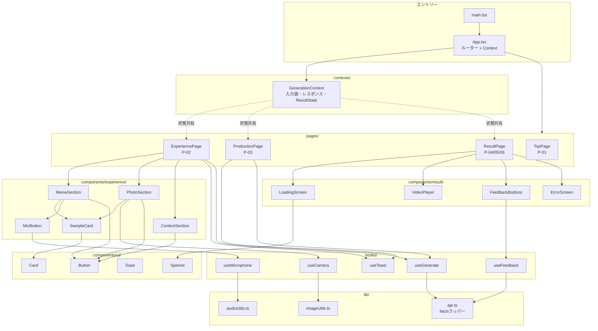
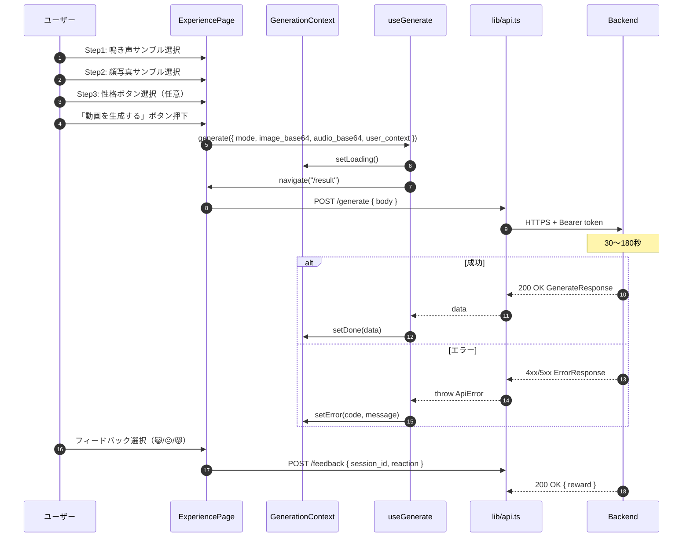
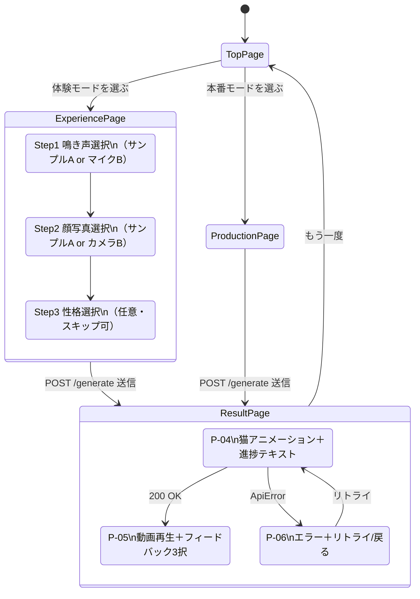

# 🐱 nekkoflix — フロントエンド詳細設計書

| 項目 | 内容 |
|------|------|
| ドキュメントバージョン | v1.0 |
| 作成日 | 2026-03-19 |
| ステータス | Draft |
| 対応基本設計書 | docs/ja/BasicDesign.md v1.1 |
| 準拠ドキュメント | docs/ja/IMPLEMENTATION.md |

---

## 目次

1. [技術スタック](#1-技術スタック)
2. [デザインシステム](#2-デザインシステム)
3. [ディレクトリ・ファイル構成](#3-ディレクトリファイル構成)
4. [主要ファイル責務一覧](#4-主要ファイル責務一覧)
5. [アーキテクチャ可視化（Mermaid）](#5-アーキテクチャ可視化mermaid)
6. [ルーティング設計](#6-ルーティング設計)
7. [状態管理設計](#7-状態管理設計)
8. [APIクライアント設計](#8-apiクライアント設計)
9. [ページ設計](#9-ページ設計)
10. [共通UIコンポーネント設計](#10-共通uiコンポーネント設計)
11. [カスタムフック設計](#11-カスタムフック設計)
12. [画面遷移・フォールバックフロー](#12-画面遷移フォールバックフロー)
13. [ブラウザAPI利用設計](#13-ブラウザapi利用設計)
14. [エラーハンドリング設計](#14-エラーハンドリング設計)
15. [型定義](#15-型定義)
16. [環境変数・設定](#16-環境変数設定)
17. [コーディング規約（IMPLEMENTATION.md準拠）](#17-コーディング規約implementationmd準拠)
18. [TBD](#18-tbd)

---

## 1. 技術スタック

| カテゴリ | 選定 | バージョン |
|---|---|---|
| UIフレームワーク | React | ^19 |
| ビルドツール | Vite | ^6 |
| 言語 | TypeScript | ^5 |
| ルーティング | React Router v7 | ^7 |
| スタイリング | Tailwind CSS | ^3 |
| APIクライアント | fetch（標準） | — |
| 状態管理 | useState / useContext | — |
| 型チェック | tsc --noEmit | — |
| Lint | ESLint | — |
| Format | Prettier | — |

---

## 2. デザインシステム

### 2.1 コンセプト

**「パステル・テック」** — 温かみのあるモダン。白を基調とした清潔感と、グリーン系のアクセントで自然・やさしさを表現する。過度に可愛くせず、ハッカソン審査員にも刺さる落ち着いたトーンを維持する。

### 2.2 カラーパレット

```
背景・ベース
  --color-bg:          #FAFAF8   白に極わずかウォームを乗せたオフホワイト
  --color-surface:     #FFFFFF   カード・パネルの白
  --color-surface-alt: #F4F4F0   入力欄・セカンダリ背景

テキスト
  --color-text-primary:   #1C1C1A   ほぼ黒（ウォームブラック）
  --color-text-secondary: #6B7280   グレー（説明文・ラベル）
  --color-text-muted:     #9CA3AF   薄いグレー（プレースホルダー等）

アクセント（グリーン）
  --color-accent:          #4D8C6F   中明度のセージグリーン（メインボタン）
  --color-accent-light:    #E8F4EE   アクセントの薄い版（ホバー・バッジ背景）
  --color-accent-dark:     #3A6E56   アクセントのダーク版（プレス時）

ボーダー・区切り
  --color-border:          #E5E7EB   薄いグレー（カード枠）
  --color-border-selected: #4D8C6F   選択状態のボーダー（アクセントと同色）

フィードバック
  --color-success:  #4D8C6F   （アクセントと共用）
  --color-error:    #DC2626   赤
  --color-warning:  #D97706   オレンジ
```

**Tailwind カスタム設定（`tailwind.config.ts`）：**

```ts
// frontend/tailwind.config.ts
import type { Config } from "tailwindcss";

export default {
  content: ["./index.html", "./src/**/*.{ts,tsx}"],
  theme: {
    extend: {
      colors: {
        bg: "#FAFAF8",
        surface: "#FFFFFF",
        "surface-alt": "#F4F4F0",
        accent: {
          DEFAULT: "#4D8C6F",
          light: "#E8F4EE",
          dark: "#3A6E56",
        },
        text: {
          primary: "#1C1C1A",
          secondary: "#6B7280",
          muted: "#9CA3AF",
        },
        border: {
          DEFAULT: "#E5E7EB",
          selected: "#4D8C6F",
        },
      },
      fontFamily: {
        sans: ["Inter", "Noto Sans JP", "sans-serif"],
      },
      borderRadius: {
        card: "12px",
        btn: "8px",
      },
      boxShadow: {
        card: "0 1px 4px rgba(0,0,0,0.06), 0 0 0 1px rgba(0,0,0,0.04)",
        "card-selected": "0 0 0 2px #4D8C6F",
      },
    },
  },
  plugins: [],
} satisfies Config;
```

### 2.3 タイポグラフィ

| 用途 | クラス例 | サイズ | ウェイト |
|---|---|---|---|
| ロゴ（トップ） | `text-3xl font-semibold` | 30px | 600 |
| ページタイトル | `text-2xl font-semibold` | 24px | 600 |
| セクション見出し | `text-lg font-medium` | 18px | 500 |
| ボディテキスト | `text-base` | 16px | 400 |
| ラベル・説明 | `text-sm text-text-secondary` | 14px | 400 |
| ヒント・バッジ | `text-xs` | 12px | 400 |

### 2.4 コンポーネント共通仕様

| 要素 | 仕様 |
|---|---|
| カード | `rounded-card bg-surface shadow-card p-4` |
| 選択済みカード | `shadow-card-selected border-border-selected border-2` |
| プライマリボタン | `bg-accent text-white rounded-btn px-6 py-3 hover:bg-accent-dark` |
| セカンダリボタン | `bg-surface border border-border text-text-primary rounded-btn px-6 py-3` |
| 最大幅 | `max-w-2xl mx-auto`（全ページ共通） |
| ページ余白 | `px-4 py-8`（モバイル考慮） |

---

## 3. ディレクトリ・ファイル構成

```
frontend/
├── public/
│   └── samples/
│       ├── audio/
│       │   ├── brushing.wav            # 鳴き声①「なでられてゴロゴロ」
│       │   ├── waiting_for_food.wav    # 鳴き声②「ごはん待ちのにゃー」
│       │   └── isolation.wav          # 鳴き声③「ひとりぼっちの声」
│       └── images/
│           ├── happy.jpg               # 顔写真「happy」
│           ├── sad.jpg                 # 顔写真「sad」
│           └── angry.jpg              # 顔写真「angry」
│
├── src/
│   ├── main.tsx                        # Reactエントリーポイント
│   ├── App.tsx                         # ルーター定義 + Context配置
│   │
│   ├── types/
│   │   ├── api.ts                      # API型定義（リクエスト/レスポンス）
│   │   └── app.ts                      # アプリ内部型定義
│   │
│   ├── contexts/
│   │   └── GenerationContext.tsx       # 生成フロー全体の状態Context
│   │
│   ├── hooks/
│   │   ├── useGenerate.ts              # POST /generate フック
│   │   ├── useFeedback.ts              # POST /feedback フック
│   │   ├── useMicrophone.ts            # マイク録音フック
│   │   ├── useCamera.ts               # カメラ撮影フック
│   │   └── useToast.ts                # トースト通知フック
│   │
│   ├── lib/
│   │   ├── api.ts                      # fetchラッパー（タイムアウト・エラー処理）
│   │   ├── imageUtils.ts              # 画像→Base64変換
│   │   └── audioUtils.ts              # 音声Blob→WAV Base64変換
│   │
│   ├── pages/
│   │   ├── TopPage.tsx                 # P-01: トップ（モード選択）
│   │   ├── ExperiencePage.tsx          # P-02: 体験モード（Step1〜3 縦並び）
│   │   ├── ProductionPage.tsx          # P-03: 本番モード入力
│   │   └── ResultPage.tsx             # P-04/05/06: 結果（状態で分岐）
│   │
│   └── components/
│       ├── ui/                         # 汎用UIプリミティブ
│       │   ├── Button.tsx              # プライマリ/セカンダリ/テキストボタン
│       │   ├── Card.tsx               # 基本カード（選択可能バリアント付き）
│       │   ├── Toast.tsx              # トースト通知
│       │   ├── Spinner.tsx            # ローディングスピナー
│       │   └── Badge.tsx              # ラベル/バッジ
│       │
│       ├── experience/                 # 体験モード専用
│       │   ├── MeowSection.tsx         # Step1: 鳴き声選択エリア全体
│       │   ├── PhotoSection.tsx        # Step2: 顔写真選択エリア全体
│       │   ├── ContextSection.tsx      # Step3: 性格選択エリア全体
│       │   ├── SampleCard.tsx          # サンプル選択共通カード（テキスト中心）
│       │   └── MicButton.tsx          # マイク録音ボタン（録音中アニメ付き）
│       │
│       ├── result/                     # 結果画面専用
│       │   ├── LoadingScreen.tsx       # P-04: 猫アニメ付きローディング
│       │   ├── VideoPlayer.tsx         # P-05: 動画プレーヤー
│       │   ├── FeedbackButtons.tsx     # P-05: フィードバック3択ボタン
│       │   └── ErrorScreen.tsx         # P-06: エラー表示
│       │
│       └── layout/
│           ├── AppLayout.tsx           # 全ページ共通レイアウト
│           └── PageHeader.tsx          # ページ見出し＋戻るボタン
│
├── index.html
├── vite.config.ts
├── tsconfig.json
├── tailwind.config.ts
├── postcss.config.js
├── eslint.config.js
├── .prettierrc
├── package.json
└── .env.example
```

---

## 4. 主要ファイル責務一覧

| ファイル | 責務 | 依存先 |
|---|---|---|
| `src/main.tsx` | ReactルートのDOM描画 | App.tsx |
| `src/App.tsx` | `createBrowserRouter` ルート定義・Context配置 | pages/、contexts/ |
| `src/types/api.ts` | Backend API の Request/Response 型 | — |
| `src/types/app.ts` | `ResultState`・`PersonalityType`・`InputMode` 等のアプリ内部型 | — |
| `src/contexts/GenerationContext.tsx` | 入力値・レスポンス・ResultState をページ間共有 | types/ |
| `src/hooks/useGenerate.ts` | `/generate` 呼び出し・Context更新・navigate | lib/api.ts、contexts/ |
| `src/hooks/useFeedback.ts` | `/feedback` 呼び出し・送信済みフラグ管理 | lib/api.ts |
| `src/hooks/useMicrophone.ts` | MediaRecorder API・録音・Blob取得・Base64変換 | lib/audioUtils.ts |
| `src/hooks/useCamera.ts` | MediaDevices API・撮影・Canvas→Blob→Base64変換 | lib/imageUtils.ts |
| `src/hooks/useToast.ts` | トースト配列の追加・自動削除タイマー管理 | — |
| `src/lib/api.ts` | fetch ラッパー（IDトークン付与・360秒タイムアウト・エラーパース） | types/api.ts |
| `src/lib/imageUtils.ts` | File / Blob / HTMLCanvasElement → Base64 変換 | — |
| `src/lib/audioUtils.ts` | Blob（WAV） → Base64 変換 | — |
| `src/pages/TopPage.tsx` | P-01: ロゴ＋キャッチコピー＋モード選択ボタン2つ | ui/Button |
| `src/pages/ExperiencePage.tsx` | P-02: Step1〜3 を縦に並べた1ページ入力UI | experience/、hooks/ |
| `src/pages/ProductionPage.tsx` | P-03: ファイルアップロード＋自由記述＋送信 | ui/、hooks/ |
| `src/pages/ResultPage.tsx` | ResultState で P-04/05/06 を切り替え表示 | result/、contexts/ |
| `src/components/experience/SampleCard.tsx` | 選択可能なテキスト中心カード（選択時グリーンボーダー） | ui/Card |
| `src/components/result/LoadingScreen.tsx` | 猫アニメ（肉球/しっぽCSS）＋進捗テキスト | ui/Spinner |
| `src/components/result/VideoPlayer.tsx` | `<video>` タグ・ミュート制御・Signed URL再生 | — |
| `src/components/result/FeedbackButtons.tsx` | 😺/😐/😾 3択ボタン・送信後のサンクス表示 | useFeedback |

---

## 5. アーキテクチャ可視化（Mermaid）

### 5.1 コンポーネント依存関係



### 5.2 データフロー（体験モード）



### 5.3 画面遷移図



---

## 6. ルーティング設計

```tsx
// src/App.tsx
import { createBrowserRouter, RouterProvider } from "react-router-dom";
import { GenerationContextProvider } from "@/contexts/GenerationContext";
import { AppLayout } from "@/components/layout/AppLayout";
import { TopPage } from "@/pages/TopPage";
import { ExperiencePage } from "@/pages/ExperiencePage";
import { ProductionPage } from "@/pages/ProductionPage";
import { ResultPage } from "@/pages/ResultPage";

const router = createBrowserRouter([
  {
    path: "/",
    element: <AppLayout />,
    children: [
      { index: true, element: <TopPage /> },
      { path: "experience", element: <ExperiencePage /> },
      { path: "production", element: <ProductionPage /> },
      { path: "result", element: <ResultPage /> },
    ],
  },
]);

export function App(): JSX.Element {
  return (
    <GenerationContextProvider>
      <RouterProvider router={router} />
    </GenerationContextProvider>
  );
}
```

**ナビゲーション方針：**

| 遷移元 | 遷移先 | 方法 |
|---|---|---|
| TopPage | ExperiencePage / ProductionPage | `useNavigate()` |
| ExperiencePage / ProductionPage | ResultPage | `useGenerate` 内で `navigate("/result")` |
| ResultPage（完了） | TopPage | `navigate("/")` |
| ResultPage（エラー） | リトライ | `navigate("/result")` + 再送信 |
| ResultPage（エラー） | 前の入力画面 | `navigate(-1)` |

---

## 7. 状態管理設計

### 7.1 GenerationContext

```tsx
// src/contexts/GenerationContext.tsx
import {
  createContext,
  useCallback,
  useContext,
  useMemo,
  useState,
  type ReactNode,
} from "react";
import type { GenerateRequest, GenerateResponse } from "@/types/api";
import type { ResultState } from "@/types/app";

interface GenerationContextValue {
  input: GenerateRequest | null;
  response: GenerateResponse | null;
  resultState: ResultState;        // "idle" | "loading" | "done" | "error"
  errorCode: string | null;
  errorMessage: string | null;
  setInput: (input: GenerateRequest) => void;
  setLoading: () => void;
  setDone: (response: GenerateResponse) => void;
  setError: (code: string, message: string) => void;
  reset: () => void;
}

const GenerationContext = createContext<GenerationContextValue | null>(null);

export function GenerationContextProvider({ children }: { children: ReactNode }): JSX.Element {
  const [input, setInputState] = useState<GenerateRequest | null>(null);
  const [response, setResponse] = useState<GenerateResponse | null>(null);
  const [resultState, setResultState] = useState<ResultState>("idle");
  const [errorCode, setErrorCode] = useState<string | null>(null);
  const [errorMessage, setErrorMessage] = useState<string | null>(null);

  const setInput = useCallback((v: GenerateRequest) => setInputState(v), []);
  const setLoading = useCallback(() => {
    setResultState("loading");
    setErrorCode(null);
    setErrorMessage(null);
  }, []);
  const setDone = useCallback((res: GenerateResponse) => {
    setResponse(res);
    setResultState("done");
  }, []);
  const setError = useCallback((code: string, message: string) => {
    setErrorCode(code);
    setErrorMessage(message);
    setResultState("error");
  }, []);
  const reset = useCallback(() => {
    setInputState(null);
    setResponse(null);
    setResultState("idle");
    setErrorCode(null);
    setErrorMessage(null);
  }, []);

  const value = useMemo(
    () => ({ input, response, resultState, errorCode, errorMessage,
             setInput, setLoading, setDone, setError, reset }),
    [input, response, resultState, errorCode, errorMessage,
     setInput, setLoading, setDone, setError, reset],
  );

  return (
    <GenerationContext.Provider value={value}>{children}</GenerationContext.Provider>
  );
}

export function useGenerationContext(): GenerationContextValue {
  const ctx = useContext(GenerationContext);
  if (!ctx) throw new Error("useGenerationContext must be inside GenerationContextProvider");
  return ctx;
}
```

### 7.2 ローカル state の用途

| コンポーネント | 管理する state |
|---|---|
| `ExperiencePage` | `selectedMeow`・`selectedPhoto`・`selectedPersonality`・`inputMode`（"A" \| "B"） |
| `MicButton` | `isRecording`（録音中フラグ）・`countdown`（録音秒数） |
| `ProductionPage` | `audioFile`・`imageFile`・`userContext`・`isSubmitting` |
| `FeedbackButtons` | `submitted`（送信済みフラグ）・`selectedReaction` |
| `VideoPlayer` | `isMuted`・`isPlaying` |
| `useToast` | `toasts: Toast[]` |

---

## 8. APIクライアント設計

```ts
// src/lib/api.ts
const BASE_URL = import.meta.env.VITE_BACKEND_URL as string;
const TIMEOUT_MS = 360_000; // 360秒

export class ApiError extends Error {
  constructor(
    public readonly errorCode: string,
    message: string,
    public readonly status: number,
  ) {
    super(message);
    this.name = "ApiError";
  }
}

/**
 * Backend API への POST リクエストを送信する.
 *
 * @param path - エンドポイントパス（例: "/generate"）
 * @param body - リクエストボディ
 * @returns パース済みレスポンス
 * @throws {ApiError} HTTPエラーまたはタイムアウト時
 */
export async function post<TResponse>(path: string, body: unknown): Promise<TResponse> {
  const controller = new AbortController();
  const timeoutId = setTimeout(() => controller.abort(), TIMEOUT_MS);

  try {
    const res = await fetch(`${BASE_URL}${path}`, {
      method: "POST",
      headers: { "Content-Type": "application/json" },
      body: JSON.stringify(body),
      signal: controller.signal,
    });

    if (!res.ok) {
      const err = (await res.json()) as { error_code: string; message: string };
      throw new ApiError(err.error_code ?? "UNKNOWN_ERROR", err.message, res.status);
    }

    return (await res.json()) as TResponse;
  } catch (e) {
    if (e instanceof ApiError) throw e;
    if (e instanceof DOMException && e.name === "AbortError") {
      throw new ApiError("TIMEOUT", "リクエストがタイムアウトしました", 504);
    }
    throw new ApiError("NETWORK_ERROR", "ネットワークエラーが発生しました", 0);
  } finally {
    clearTimeout(timeoutId);
  }
}
```

---

## 9. ページ設計

### 9.1 P-01 TopPage

**レイアウト：** 画面中央揃え、最大幅 `max-w-md`。ミニマルに徹する。

```
┌──────────────────────────────────────┐
│                                      │
│          🐱  nekkoflix               │ ← ロゴテキスト (text-3xl font-semibold)
│                                      │
│   猫に、最高の動画を。               │ ← キャッチコピー (text-lg text-text-secondary)
│                                      │
│  ┌──────────────────────────────┐   │
│  │  🐾 体験モード（あなたが猫になる）│  │ ← アクセントグリーン・プライマリボタン
│  └──────────────────────────────┘   │
│                                      │
│  ┌──────────────────────────────┐   │
│  │  📹 本番モード（実際の猫データ）│  │ ← セカンダリボタン（ボーダー）
│  └──────────────────────────────┘   │
│                                      │
└──────────────────────────────────────┘
```

```tsx
// src/pages/TopPage.tsx
import { useNavigate } from "react-router-dom";
import { Button } from "@/components/ui/Button";
import { useGenerationContext } from "@/contexts/GenerationContext";

export function TopPage(): JSX.Element {
  const navigate = useNavigate();
  const { reset } = useGenerationContext();

  const handleMode = (mode: "experience" | "production"): void => {
    reset();
    navigate(`/${mode}`);
  };

  return (
    <div className="flex min-h-[80vh] flex-col items-center justify-center gap-10 px-4">
      <div className="text-center">
        <h1 className="text-3xl font-semibold text-text-primary">🐱 nekkoflix</h1>
        <p className="mt-2 text-lg text-text-secondary">猫に、最高の動画を。</p>
      </div>

      <div className="flex w-full max-w-sm flex-col gap-4">
        <Button variant="primary" size="lg" onClick={() => handleMode("experience")}>
          🐾 体験モード（あなたが猫になる）
        </Button>
        <Button variant="secondary" size="lg" onClick={() => handleMode("production")}>
          📹 本番モード（実際の猫データ）
        </Button>
      </div>
    </div>
  );
}
```

---

### 9.2 P-02 ExperiencePage

**レイアウト：** 1ページ縦スクロール。Step1→2→3 が縦に並ぶ。各 Step はセクション見出し＋コンテンツカードエリア。最下部に「動画を生成する」ボタン。

```
┌──────────────────────────────────────┐
│ ← 戻る                               │
│ あなたが猫になる                      │ ← ページタイトル
│──────────────────────────────────────│
│                                      │
│ Step 1 鳴き声                        │ ← セクション見出し
│                                      │
│  ┌────────┐ ┌────────┐ ┌────────┐   │
│  │🍚      │ │😺      │ │😿      │   │ ← SampleCard × 3
│  │ごはん  │ │なで    │ │一人    │   │   テキスト中心・選択でグリーンボーダー
│  │待ちの  │ │られて  │ │ぼっち  │   │
│  │にゃー  │ │ゴロゴロ│ │の声    │   │
│  └────────┘ └────────┘ └────────┘   │
│  [ 🎤 マイクで鳴いてみる ]           │ ← MicButton（方法B）
│──────────────────────────────────────│
│                                      │
│ Step 2 表情                          │
│                                      │
│  ┌────────┐ ┌────────┐ ┌────────┐   │
│  │😊      │ │😢      │ │😠      │   │
│  │happy   │ │sad     │ │angry   │   │
│  └────────┘ └────────┘ └────────┘   │
│  [ 📷 カメラで撮影する ]             │
│──────────────────────────────────────│
│                                      │
│ Step 3 性格（任意）                  │
│                                      │
│  [🌟 好奇心旺盛] [😴 のんびり屋]    │
│  [😱 ビビりな猫] [👑 気まぐれ]      │
│           [スキップ]                 │
│──────────────────────────────────────│
│                                      │
│  [ 🎬 動画を生成する ]              │ ← プライマリボタン（Step1&2が選択済みで活性化）
│                                      │
└──────────────────────────────────────┘
```

**実装概要：**

```tsx
// src/pages/ExperiencePage.tsx（概略）
export function ExperiencePage(): JSX.Element {
  const navigate = useNavigate();
  const { setInput, setLoading } = useGenerationContext();
  const { generate, isLoading } = useGenerate();
  const { showToast } = useToast();

  const [selectedMeow, setSelectedMeow] = useState<MeowSample | null>(null);
  const [selectedPhoto, setSelectedPhoto] = useState<PhotoSample | null>(null);
  const [selectedPersonality, setSelectedPersonality] = useState<PersonalityType | null>(null);
  const [inputMode, setInputMode] = useState<"A" | "B">("A");

  const canSubmit = selectedMeow !== null && selectedPhoto !== null;

  const handleSubmit = async (): Promise<void> => {
    if (!canSubmit) return;
    const audioBase64 = await toBase64FromUrl(selectedMeow.url);
    const imageBase64 = await toBase64FromUrl(selectedPhoto.url);
    await generate({
      mode: "experience",
      image_base64: imageBase64,
      audio_base64: audioBase64,
      user_context: selectedPersonality ?? undefined,
    });
  };

  return (
    <div className="mx-auto max-w-2xl space-y-10 px-4 py-8">
      <PageHeader title="あなたが猫になる" onBack={() => navigate("/")} />
      <MeowSection selected={selectedMeow} onSelect={setSelectedMeow} onToast={showToast} />
      <PhotoSection selected={selectedPhoto} onSelect={setSelectedPhoto} onToast={showToast} />
      <ContextSection selected={selectedPersonality} onSelect={setSelectedPersonality} />
      <Button
        variant="primary"
        size="lg"
        disabled={!canSubmit || isLoading}
        onClick={handleSubmit}
        className="w-full"
      >
        🎬 動画を生成する
      </Button>
    </div>
  );
}
```

---

### 9.3 P-03 ProductionPage

**レイアウト：** 縦スクロール。ファイルアップロード2項目＋テキストエリア1項目。

```
┌──────────────────────────────────────┐
│ ← 戻る                               │
│ 猫のデータを入力                      │
│──────────────────────────────────────│
│                                      │
│ 鳴き声ファイル（.wav）               │
│  ┌──────────────────────────────┐   │
│  │ ファイルを選択 or ドロップ    │   │ ← ドラッグ&ドロップエリア
│  └──────────────────────────────┘   │
│                                      │
│ 顔・全身写真（.jpg / .png）          │
│  ┌──────────────────────────────┐   │
│  │ ファイルを選択 or ドロップ    │   │
│  └──────────────────────────────┘   │
│                                      │
│ 猫の性格・好み（任意）               │
│  ┌──────────────────────────────┐   │
│  │ 例：魚が好き、臆病な性格、   │   │
│  │ 外を眺めるのが趣味           │   │ ← textarea（max 500文字）
│  └──────────────────────────────┘   │
│                                      │
│  [ 🎬 動画を生成する ]              │
│                                      │
└──────────────────────────────────────┘
```

---

### 9.4 P-04 ResultPage（LoadingScreen）

**デザイン：** 画面中央に猫アニメーション。CSSアニメーションで肉球がポヨポヨ弾む、またはしっぽが左右に揺れる演出。

```
┌──────────────────────────────────────┐
│                                      │
│                                      │
│         🐾  🐾  🐾                 │ ← 肉球が順番にフェードイン・アウト
│                                      │   （CSS animation: bounce / pulse）
│      Veo3 が動画を生成中です         │ ← テキスト（text-text-secondary）
│      通常30秒〜3分かかります         │ ← サブテキスト（text-sm text-text-muted）
│                                      │
│  ┌──────────────────────────────┐   │
│  │ 状態キー: waiting_for_food…  │   │ ← Badgeスタイルの情報表示（薄い背景）
│  │ テンプレート: T02 yarn ball  │   │
│  └──────────────────────────────┘   │
│                                      │
└──────────────────────────────────────┘
```

**肉球アニメーションCSS：**

```tsx
// src/components/result/LoadingScreen.tsx
const PAW_DELAYS = ["delay-0", "delay-150", "delay-300"] as const;

export function LoadingScreen({ stateKey, templateName }: LoadingScreenProps): JSX.Element {
  return (
    <div className="flex min-h-[70vh] flex-col items-center justify-center gap-8 px-4">
      {/* 肉球アニメーション */}
      <div className="flex gap-4">
        {PAW_DELAYS.map((delay, i) => (
          <span
            key={i}
            className={`text-4xl animate-bounce ${delay}`}
            style={{ animationDuration: "1.2s" }}
          >
            🐾
          </span>
        ))}
      </div>

      <div className="text-center">
        <p className="text-base text-text-secondary">Veo3 が動画を生成中です</p>
        <p className="mt-1 text-sm text-text-muted">通常30秒〜3分かかります</p>
      </div>

      {(stateKey || templateName) && (
        <div className="rounded-card bg-surface-alt px-4 py-3 text-sm text-text-secondary space-y-1">
          {stateKey && <p>状態キー: <span className="font-mono text-xs">{stateKey}</span></p>}
          {templateName && <p>テンプレート: {templateName}</p>}
        </div>
      )}
    </div>
  );
}
```

---

### 9.5 P-05 ResultPage（VideoPlayer + FeedbackButtons）

**レイアウト：** 動画を大きく表示。その直下にフィードバックボタン3択。

```
┌──────────────────────────────────────┐
│                                      │
│  ┌──────────────────────────────┐   │
│  │                              │   │
│  │        [ 動画再生 ]         │   │ ← <video> タグ、幅100%
│  │                              │   │
│  └──────────────────────────────┘   │
│                                      │
│  猫の反応はどうでしたか？            │ ← 小見出し
│                                      │
│  ┌──────┐  ┌──────┐  ┌──────┐     │
│  │  😺  │  │  😐  │  │  😾  │     │ ← フィードバック3択
│  │テンション│ まあ │ 興味 │     │
│  │上がった│  まあ  │  なし │     │
│  └──────┘  └──────┘  └──────┘     │
│                                      │
│         [ もう一度試す ]            │ ← テキストボタン（小さめ）
│                                      │
└──────────────────────────────────────┘
```

---

### 9.6 P-06 ResultPage（ErrorScreen）

```
┌──────────────────────────────────────┐
│                                      │
│              😿                      │ ← 絵文字
│                                      │
│      動画の生成に失敗しました        │ ← エラータイトル
│      もう一度お試しください          │ ← エラーメッセージ
│                                      │
│  [ 🔄 もう一度試す ] [ ← 戻る ]    │ ← 2ボタン横並び
│                                      │
└──────────────────────────────────────┘
```

---

## 10. 共通UIコンポーネント設計

### 10.1 Button

```tsx
// src/components/ui/Button.tsx
type ButtonVariant = "primary" | "secondary" | "text";
type ButtonSize = "sm" | "md" | "lg";

interface ButtonProps extends React.ButtonHTMLAttributes<HTMLButtonElement> {
  variant?: ButtonVariant;
  size?: ButtonSize;
}

const VARIANT_CLASSES: Record<ButtonVariant, string> = {
  primary: "bg-accent text-white hover:bg-accent-dark active:scale-95",
  secondary: "bg-surface border border-border text-text-primary hover:bg-surface-alt",
  text: "text-accent hover:underline bg-transparent",
};

const SIZE_CLASSES: Record<ButtonSize, string> = {
  sm: "px-3 py-1.5 text-sm",
  md: "px-5 py-2.5 text-base",
  lg: "px-6 py-3 text-base",
};

export function Button({
  variant = "primary",
  size = "md",
  className = "",
  children,
  disabled,
  ...props
}: ButtonProps): JSX.Element {
  return (
    <button
      className={[
        "inline-flex items-center justify-center rounded-btn font-medium transition-all",
        "focus-visible:outline-none focus-visible:ring-2 focus-visible:ring-accent",
        "disabled:opacity-40 disabled:cursor-not-allowed",
        VARIANT_CLASSES[variant],
        SIZE_CLASSES[size],
        className,
      ].join(" ")}
      disabled={disabled}
      {...props}
    >
      {children}
    </button>
  );
}
```

### 10.2 Card（SampleCard）

選択可能なテキスト中心カード。選択時はグリーンボーダーで強調。

```tsx
// src/components/experience/SampleCard.tsx
interface SampleCardProps {
  emoji: string;
  label: string;
  sublabel?: string;
  selected: boolean;
  onClick: () => void;
}

export function SampleCard({ emoji, label, sublabel, selected, onClick }: SampleCardProps): JSX.Element {
  return (
    <button
      onClick={onClick}
      className={[
        "flex flex-col items-center gap-1 rounded-card p-4 text-center transition-all w-full",
        "focus-visible:outline-none focus-visible:ring-2 focus-visible:ring-accent",
        selected
          ? "shadow-card-selected bg-accent-light border-2 border-border-selected"
          : "shadow-card bg-surface border border-border hover:border-accent",
      ].join(" ")}
    >
      <span className="text-2xl">{emoji}</span>
      <span className="text-sm font-medium text-text-primary">{label}</span>
      {sublabel && <span className="text-xs text-text-muted">{sublabel}</span>}
    </button>
  );
}
```

### 10.3 Toast

```tsx
// src/components/ui/Toast.tsx
interface ToastProps {
  message: string;
  type?: "info" | "error";
  onClose: () => void;
}

export function Toast({ message, type = "info", onClose }: ToastProps): JSX.Element {
  const bg = type === "error" ? "bg-red-50 border-red-200 text-red-700" : "bg-accent-light border-accent text-accent-dark";
  return (
    <div className={`flex items-center gap-3 rounded-card border px-4 py-3 shadow-card ${bg}`}>
      <span className="flex-1 text-sm">{message}</span>
      <button onClick={onClose} className="text-xs opacity-60 hover:opacity-100">✕</button>
    </div>
  );
}
```

### 10.4 AppLayout

```tsx
// src/components/layout/AppLayout.tsx
import { Outlet } from "react-router-dom";
import { useToast } from "@/hooks/useToast";
import { Toast } from "@/components/ui/Toast";

export function AppLayout(): JSX.Element {
  const { toasts, removeToast } = useToast();

  return (
    <div className="min-h-screen bg-bg font-sans text-text-primary">
      <main className="mx-auto max-w-2xl">
        <Outlet />
      </main>

      {/* トースト通知エリア */}
      <div className="fixed bottom-4 left-1/2 -translate-x-1/2 w-full max-w-sm space-y-2 px-4 z-50">
        {toasts.map((t) => (
          <Toast key={t.id} message={t.message} type={t.type} onClose={() => removeToast(t.id)} />
        ))}
      </div>
    </div>
  );
}
```

---

## 11. カスタムフック設計

### 11.1 useGenerate

```ts
// src/hooks/useGenerate.ts
import { useCallback, useState } from "react";
import { useNavigate } from "react-router-dom";
import { post, ApiError } from "@/lib/api";
import { useGenerationContext } from "@/contexts/GenerationContext";
import type { GenerateRequest, GenerateResponse } from "@/types/api";

interface UseGenerateReturn {
  generate: (req: GenerateRequest) => Promise<void>;
  isLoading: boolean;
}

export function useGenerate(): UseGenerateReturn {
  const navigate = useNavigate();
  const { setLoading, setDone, setError } = useGenerationContext();
  const [isLoading, setIsLoading] = useState(false);

  const generate = useCallback(async (req: GenerateRequest): Promise<void> => {
    setIsLoading(true);
    setLoading();
    navigate("/result");

    try {
      const data = await post<GenerateResponse>("/generate", req);
      setDone(data);
    } catch (e) {
      if (e instanceof ApiError) {
        setError(e.errorCode, e.message);
      } else {
        setError("UNKNOWN_ERROR", "予期しないエラーが発生しました");
      }
    } finally {
      setIsLoading(false);
    }
  }, [navigate, setLoading, setDone, setError]);

  return { generate, isLoading };
}
```

### 11.2 useFeedback

```ts
// src/hooks/useFeedback.ts
import { useCallback, useState } from "react";
import { post, ApiError } from "@/lib/api";
import type { FeedbackRequest, FeedbackResponse } from "@/types/api";

interface UseFeedbackReturn {
  submitFeedback: (req: FeedbackRequest) => Promise<void>;
  submitted: boolean;
  isLoading: boolean;
}

export function useFeedback(): UseFeedbackReturn {
  const [submitted, setSubmitted] = useState(false);
  const [isLoading, setIsLoading] = useState(false);

  const submitFeedback = useCallback(async (req: FeedbackRequest): Promise<void> => {
    if (submitted) return;
    setIsLoading(true);
    try {
      await post<FeedbackResponse>("/feedback", req);
      setSubmitted(true);
    } catch (e) {
      // フィードバック送信失敗はUIに影響しない（サイレント処理）
      console.warn("Feedback submission failed:", e instanceof ApiError ? e.message : e);
    } finally {
      setIsLoading(false);
    }
  }, [submitted]);

  return { submitFeedback, submitted, isLoading };
}
```

### 11.3 useMicrophone

```ts
// src/hooks/useMicrophone.ts
import { useCallback, useRef, useState } from "react";
import { blobToBase64 } from "@/lib/audioUtils";

interface UseMicrophoneReturn {
  isRecording: boolean;
  audioBase64: string | null;
  startRecording: () => Promise<void>;
  stopRecording: () => void;
  error: string | null;
}

export function useMicrophone(): UseMicrophoneReturn {
  const [isRecording, setIsRecording] = useState(false);
  const [audioBase64, setAudioBase64] = useState<string | null>(null);
  const [error, setError] = useState<string | null>(null);
  const mediaRecorderRef = useRef<MediaRecorder | null>(null);
  const chunksRef = useRef<Blob[]>([]);

  const startRecording = useCallback(async (): Promise<void> => {
    setError(null);
    try {
      const stream = await navigator.mediaDevices.getUserMedia({ audio: true });
      const recorder = new MediaRecorder(stream);
      mediaRecorderRef.current = recorder;
      chunksRef.current = [];

      recorder.ondataavailable = (e) => chunksRef.current.push(e.data);
      recorder.onstop = async () => {
        const blob = new Blob(chunksRef.current, { type: "audio/wav" });
        const base64 = await blobToBase64(blob);
        setAudioBase64(base64);
        stream.getTracks().forEach((t) => t.stop());
      };

      recorder.start();
      setIsRecording(true);
    } catch (e) {
      setError("マイクへのアクセスが許可されていません");
    }
  }, []);

  const stopRecording = useCallback((): void => {
    mediaRecorderRef.current?.stop();
    setIsRecording(false);
  }, []);

  return { isRecording, audioBase64, startRecording, stopRecording, error };
}
```

### 11.4 useCamera

```ts
// src/hooks/useCamera.ts
import { useCallback, useRef, useState } from "react";
import { canvasToBase64 } from "@/lib/imageUtils";

interface UseCameraReturn {
  imageBase64: string | null;
  capturePhoto: () => Promise<void>;
  error: string | null;
}

export function useCamera(): UseCameraReturn {
  const [imageBase64, setImageBase64] = useState<string | null>(null);
  const [error, setError] = useState<string | null>(null);

  const capturePhoto = useCallback(async (): Promise<void> => {
    setError(null);
    try {
      const stream = await navigator.mediaDevices.getUserMedia({ video: true });
      const video = document.createElement("video");
      video.srcObject = stream;
      await video.play();

      const canvas = document.createElement("canvas");
      canvas.width = video.videoWidth;
      canvas.height = video.videoHeight;
      canvas.getContext("2d")?.drawImage(video, 0, 0);

      const base64 = canvasToBase64(canvas);
      setImageBase64(base64);
      stream.getTracks().forEach((t) => t.stop());
    } catch (e) {
      setError("カメラへのアクセスが許可されていません");
    }
  }, []);

  return { imageBase64, capturePhoto, error };
}
```

### 11.5 useToast

```ts
// src/hooks/useToast.ts
import { useCallback, useState } from "react";

interface Toast {
  id: string;
  message: string;
  type: "info" | "error";
}

interface UseToastReturn {
  toasts: Toast[];
  showToast: (message: string, type?: "info" | "error") => void;
  removeToast: (id: string) => void;
}

export function useToast(): UseToastReturn {
  const [toasts, setToasts] = useState<Toast[]>([]);

  const showToast = useCallback((message: string, type: "info" | "error" = "info"): void => {
    const id = crypto.randomUUID();
    setToasts((prev) => [...prev, { id, message, type }]);
    setTimeout(() => {
      setToasts((prev) => prev.filter((t) => t.id !== id));
    }, 4000);
  }, []);

  const removeToast = useCallback((id: string): void => {
    setToasts((prev) => prev.filter((t) => t.id !== id));
  }, []);

  return { toasts, showToast, removeToast };
}
```

---

## 12. 画面遷移・フォールバックフロー

### 12.1 体験モードB→A フォールバック

```
マイク/カメラボタン押下
    │
    ├── getUserMedia 成功 → 録音・撮影 → Base64取得 → state更新
    │
    └── getUserMedia 失敗（NotAllowedError / NotFoundError）
              │
              ▼
          showToast("カメラ/マイクが使用できませんでした。サンプル選択に切り替えます", "error")
              │
              ▼
          setInputMode("A")  ← サンプル選択モードに切り替え
```

### 12.2 ResultPage 内の状態分岐

```tsx
// src/pages/ResultPage.tsx（概略）
export function ResultPage(): JSX.Element {
  const { resultState, response, errorCode, errorMessage } = useGenerationContext();
  const navigate = useNavigate();

  if (resultState === "loading") {
    return <LoadingScreen stateKey={response?.state_key} templateName={response?.template_name} />;
  }
  if (resultState === "done" && response) {
    return <DoneView response={response} onRetry={() => navigate(-1)} />;
  }
  if (resultState === "error") {
    return <ErrorScreen code={errorCode} message={errorMessage} onRetry={() => navigate(0)} onBack={() => navigate(-1)} />;
  }
  // idle: /result に直アクセスした場合はトップへリダイレクト
  navigate("/", { replace: true });
  return null;
}
```

---

## 13. ブラウザAPI利用設計

| API | 用途 | フォールバック |
|---|---|---|
| `navigator.mediaDevices.getUserMedia({ audio: true })` | マイク録音 | エラー時にサンプル選択Aへ切り替え＋トースト |
| `navigator.mediaDevices.getUserMedia({ video: true })` | カメラ撮影 | 同上 |
| `MediaRecorder` | 録音データのBlobを生成 | getUserMedia失敗時は未到達 |
| `HTMLCanvasElement.toDataURL("image/jpeg")` | カメラフレームをBase64化 | getUserMedia失敗時は未到達 |
| `FileReader.readAsDataURL` | アップロードファイルをBase64化 | — |
| `AbortController` + `setTimeout` | fetchタイムアウト（360秒） | タイムアウト時にApiError("TIMEOUT")をthrow |
| `crypto.randomUUID()` | Toastの一意ID生成 | — |

---

## 14. エラーハンドリング設計

| エラー発生箇所 | エラー種別 | ユーザーへの表示 |
|---|---|---|
| `getUserMedia` 失敗 | `NotAllowedError` / `NotFoundError` | トーストで通知＋入力方法Aへ自動切り替え |
| `POST /generate` タイムアウト | `ApiError("TIMEOUT")` | P-06 エラー画面（リトライ可） |
| `POST /generate` 500系 | `ApiError("VEO_FAILED"等)` | P-06 エラー画面（リトライ可） |
| `POST /generate` 400系 | `ApiError("INVALID_INPUT")` | P-06 エラー画面（戻るのみ） |
| `POST /feedback` 失敗 | `ApiError` | サイレント処理（UIに影響させない） |
| `/result` への直接アクセス | `resultState === "idle"` | トップへリダイレクト |

---

## 15. 型定義

```ts
// src/types/api.ts
export interface GenerateRequest {
  mode: "experience" | "production";
  image_base64: string;
  audio_base64?: string;
  user_context?: string;
}

export interface GenerateResponse {
  session_id: string;
  video_url: string;
  state_key: string;
  template_id: string;
  template_name: string;
}

export interface FeedbackRequest {
  session_id: string;
  reaction: "good" | "neutral" | "bad";
}

export interface FeedbackResponse {
  reward: number;
  updated_template_id: string;
}
```

```ts
// src/types/app.ts
export type ResultState = "idle" | "loading" | "done" | "error";
export type InputMode = "A" | "B";
export type PersonalityType = "curious" | "relaxed" | "timid" | "capricious";
export type Reaction = "good" | "neutral" | "bad";

export interface MeowSample {
  id: "brushing" | "waiting_for_food" | "isolation";
  emoji: string;
  label: string;
  url: string;          // /samples/audio/*.wav
}

export interface PhotoSample {
  id: "happy" | "sad" | "angry";
  emoji: string;
  label: string;
  url: string;          // /samples/images/*.jpg
}

// 体験モードのサンプルデータ定数
export const MEOW_SAMPLES: MeowSample[] = [
  { id: "waiting_for_food", emoji: "🍚", label: "ごはん待ちのにゃー", url: "/samples/audio/waiting_for_food.wav" },
  { id: "brushing",         emoji: "😺", label: "なでられてゴロゴロ", url: "/samples/audio/brushing.wav" },
  { id: "isolation",        emoji: "😿", label: "ひとりぼっちの声",   url: "/samples/audio/isolation.wav" },
];

export const PHOTO_SAMPLES: PhotoSample[] = [
  { id: "happy", emoji: "😊", label: "happy", url: "/samples/images/happy.jpg" },
  { id: "sad",   emoji: "😢", label: "sad",   url: "/samples/images/sad.jpg" },
  { id: "angry", emoji: "😠", label: "angry", url: "/samples/images/angry.jpg" },
];

export const PERSONALITY_OPTIONS: { type: PersonalityType; emoji: string; label: string }[] = [
  { type: "curious",    emoji: "🌟", label: "好奇心旺盛" },
  { type: "relaxed",   emoji: "😴", label: "のんびり屋" },
  { type: "timid",     emoji: "😱", label: "ビビりな猫" },
  { type: "capricious",emoji: "👑", label: "気まぐれ" },
];
```

---

## 16. 環境変数・設定

**`.env.example`：**

```bash
# Backend APIのURL（Cloud Run API Gateway のURL）
VITE_BACKEND_URL=http://localhost:8080

# 本番用
# VITE_BACKEND_URL=https://nekkoflix-gateway-xxxx.ew.gateway.dev
```

**`vite.config.ts`：**

```ts
// frontend/vite.config.ts
import { defineConfig } from "vite";
import react from "@vitejs/plugin-react";
import path from "path";

export default defineConfig({
  plugins: [react()],
  resolve: {
    alias: {
      "@": path.resolve(__dirname, "./src"),
    },
  },
  server: {
    port: 3000,
    proxy: {
      // ローカル開発時のCORS回避
      "/generate": "http://localhost:8080",
      "/feedback": "http://localhost:8080",
      "/health":   "http://localhost:8080",
    },
  },
});
```

---

## 17. コーディング規約（IMPLEMENTATION.md準拠）

| 規約 | 内容 |
|---|---|
| 命名（変数・関数） | `camelCase` |
| 命名（型・インターフェース） | `PascalCase` |
| 命名（定数） | `UPPER_SNAKE_CASE` |
| ファイル名（コンポーネント） | `PascalCase.tsx` |
| ファイル名（フック・ユーティリティ） | `camelCase.ts` |
| 型注釈 | 全関数の引数・戻り値に必須（`tsc --noEmit` で保証） |
| コンポーネントの戻り値型 | `JSX.Element` を明示 |
| `any` 禁止 | `unknown` または具体的な型を使用 |
| `console.log` | コミットに含めない。デバッグは `console.warn` / `console.error` のみ |
| Props型 | `interface`（`type` ではなく）で定義 |
| イベントハンドラー名 | `handle` プレフィックス（例: `handleSubmit`） |
| カスタムフック | `use` プレフィックス必須 |

---

## 18. TBD

| # | 項目 | 内容 | 優先度 |
|---|---|---|---|
| TBD-1 | IDトークン取得実装 | `lib/api.ts` の `getIdToken()` を Google Identity Services で実装するか、MVP段階では省略するか | 高 |
| TBD-2 | ViTPose++/CLIP の体験モードB対応 | マイク/カメラ入力をBackendに送った場合、Vertex AIでViTPose++・CLIPを走らせる実装が必要（Backend TBD-3と連動） | 高 |
| TBD-3 | 肉球アニメーションの詳細実装 | Tailwindのanimateクラスのみで表現するか、CSS keyframesを別途定義するか | 中 |
| TBD-4 | ロゴのデザイン確定 | テキストロゴ（現在）か、アイコン付きロゴを作るか | 中 |
| TBD-5 | 動画プレーヤーのオートプレイ設定 | Signed URL受信後に自動再生するか、ユーザーが再生ボタンを押すか | 中 |
| TBD-6 | 本番モードのファイルアップロードUX | ドラッグ&ドロップの実装有無（ファイル選択ボタンのみで十分か） | 低 |
| TBD-7 | フォント読み込み | Google FontsからInterとNoto Sans JPを読み込むか、システムフォントで済ませるか | 低 |
| TBD-8 | ESLint設定の詳細 | `eslint-plugin-react-hooks`・`@typescript-eslint` の設定値を詰める | 低 |