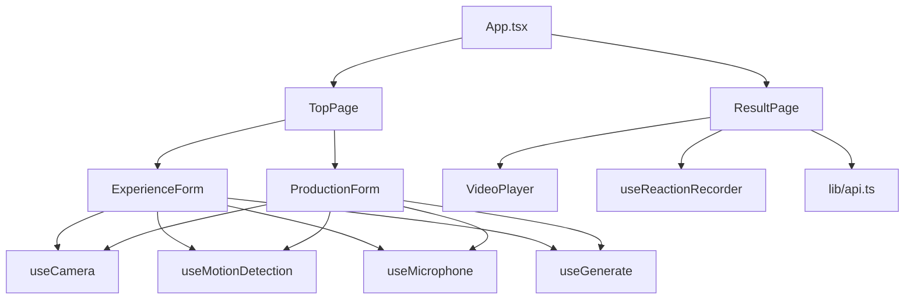
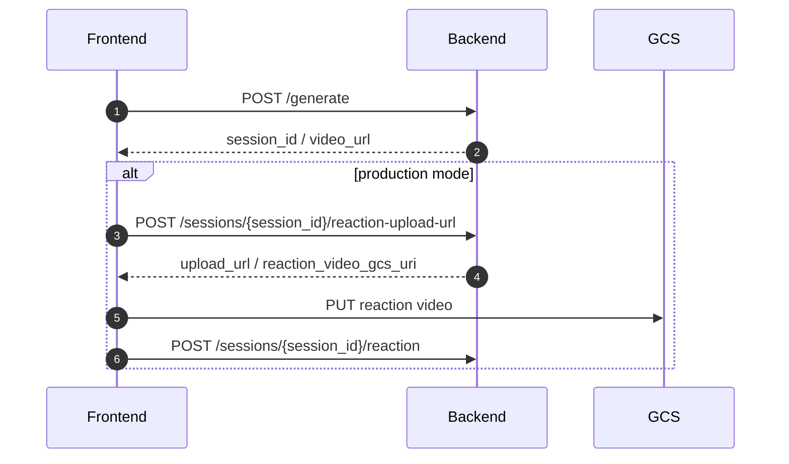

# 🐱 nekkoflix — フロントエンド詳細設計書

| 項目 | 内容 |
|------|------|
| ドキュメントバージョン | current |
| 作成日 | 2026-03-27 |
| ステータス | Draft |
| 対応基本設計書 | docs/ja/High_Level_Design.md |
| 対応バックエンド設計書 | docs/ja/Backend_Design.md |
| 対応インフラ設計書 | docs/ja/INFRASTRUCTURE.md |
| 対象実装 | frontend/ |

---

## 目次

1. [技術スタック](#1-技術スタック)
2. [設計方針](#2-設計方針)
3. [ディレクトリ・ファイル構成](#3-ディレクトリファイル構成)
4. [主要ファイル責務一覧](#4-主要ファイル責務一覧)
5. [アーキテクチャ可視化（Mermaid）](#5-アーキテクチャ可視化mermaid)
6. [ルーティング設計](#6-ルーティング設計)
7. [状態管理設計](#7-状態管理設計)
8. [APIクライアント設計](#8-apiクライアント設計)
9. [画面設計](#9-画面設計)
10. [モード別フロー設計](#10-モード別フロー設計)
11. [結果画面設計](#11-結果画面設計)
12. [カスタムフック設計](#12-カスタムフック設計)
13. [ブラウザAPI利用設計](#13-ブラウザapi利用設計)
14. [スタイル・レイアウト方針](#14-スタイルレイアウト方針)
15. [環境変数・ビルド設定](#15-環境変数ビルド設定)
16. [テスト・品質観点](#16-テスト品質観点)
17. [実装上の留意事項](#17-実装上の留意事項)

---

## 1. 技術スタック

| カテゴリ | 選定 | 実装状況 |
|---|---|---|
| UI フレームワーク | React 19 | 使用中 |
| ビルドツール | Vite 8 | 使用中 |
| 言語 | TypeScript 5 | 使用中 |
| ルーティング | `react-router-dom` 7 | 使用中 |
| スタイリング | Tailwind CSS 3 + hand-written CSS | 使用中 |
| アイコン | `lucide-react` | 使用中 |
| API 通信 | `fetch` ベース自前 wrapper | 使用中 |
| 状態管理 | `useState` + `useContext` | 使用中 |
| 動作検知 | `diff-cam-engine` | 新規採用 |
| 録音 / 録画 | `MediaRecorder` | 使用中 / 拡張 |

### 1.1 実装の特徴

- モード切替は `TopPage` 内タブを維持する
- 体験モード / 本番モードの UI は同一レイアウト内で切り替える
- カメラ・録音・動作検知・reaction 録画は hook を分離する
- 生成開始と reaction upload の orchestration は page / form 側で行う
- 既存の色味・カード配置・ヒーロー構成は大きく変えない

---

## 2. 設計方針

### 2.1 UI 方針

- `TopPage` のヒーロー、説明、タブ、カードベースの構成を維持する
- 大幅なレイアウト刷新は行わず、既存カードの中身を camera / motion flow に差し替える
- 新規 UI は最小限に留める
  - カメラプレビュー
  - 動作検知状態
  - 録音状態
  - reaction upload 状態

### 2.2 処理方針

- 静止画・音声は `/generate` に直接送る
- reaction video 本体は backend から signed URL を取得して GCS に direct upload する
- reaction upload 完了後に `/sessions/{session_id}/reaction` へ `reaction_video_gcs_uri` を通知する
- 旧 `/feedback` UI は廃止する

### 2.3 hook 分離方針

フロントの主要機能は以下の単位で分ける。

- `useCamera`
- `useMotionDetection`
- `useMicrophone`
- `useReactionRecorder`
- `useGenerate`

ページ側はこれらを束ねる orchestration 層とする。

---

## 3. ディレクトリ・ファイル構成

```text
frontend/
├── src/
│   ├── App.tsx
│   ├── main.tsx
│   ├── index.css
│   ├── components/
│   │   ├── forms/
│   │   │   ├── ExperienceForm.tsx
│   │   │   └── ProductionForm.tsx
│   │   ├── layout/
│   │   ├── result/
│   │   └── ui/
│   ├── contexts/
│   │   └── GenerationContext.tsx
│   ├── hooks/
│   │   ├── useCamera.ts
│   │   ├── useGenerate.ts
│   │   ├── useMicrophone.ts
│   │   ├── useMotionDetection.ts
│   │   ├── useReactionRecorder.ts
│   │   └── useToast.ts
│   ├── lib/
│   │   ├── api.ts
│   │   ├── audioUtils.ts
│   │   ├── imageUtils.ts
│   │   └── uploadLimits.ts
│   ├── pages/
│   │   ├── ResultPage.tsx
│   │   └── TopPage.tsx
│   └── types/
│       ├── api.ts
│       └── app.ts
```

### 3.1 実行経路に乗る主要ディレクトリ

- `pages/`
- `components/forms/`
- `components/result/`
- `contexts/`
- `hooks/`
- `lib/`

### 3.2 削除・縮小候補

- `hooks/useFeedback.ts`
- `components/result/FeedbackButtons.tsx`
- `pages/ExperiencePage.tsx`
- `pages/ProductionPage.tsx`
- サンプル音声・サンプル写真ベースの体験 UI

---

## 4. 主要ファイル責務一覧

| ファイル | 責務 |
|---|---|
| `src/App.tsx` | Router 定義、`GenerationContextProvider` 配置 |
| `src/contexts/GenerationContext.tsx` | 生成結果・エラー・状態遷移の共有 |
| `src/lib/api.ts` | `/generate`、reaction upload URL、GCS PUT、reaction 通知の API wrapper |
| `src/hooks/useGenerate.ts` | `/generate` 呼び出し、状態更新、`/result` 遷移 |
| `src/hooks/useCamera.ts` | カメラ stream 管理、静止画 capture |
| `src/hooks/useMotionDetection.ts` | `diff-cam-engine` による動作検知 |
| `src/hooks/useMicrophone.ts` | 3 秒録音、base64 化 |
| `src/hooks/useReactionRecorder.ts` | 本番モード用 reaction video 録画 |
| `src/pages/TopPage.tsx` | タブ切替、mode ごとの orchestration 起点 |
| `src/pages/ResultPage.tsx` | 動画再生、reaction 録画・upload 起点 |
| `src/components/forms/ExperienceForm.tsx` | 体験モードの camera/motion/generate UI |
| `src/components/forms/ProductionForm.tsx` | 本番モードの camera/motion/generate UI |
| `src/components/result/VideoPlayer.tsx` | 動画再生、再生イベントの通知 |

---

## 5. アーキテクチャ可視化（Mermaid）

### 5.1 画面と hook の関係



### 5.2 通信フロー



---

## 6. ルーティング設計

### 6.1 route

| path | 実体 | 挙動 |
|---|---|---|
| `/` | `TopPage` | メイン画面 |
| `/result` | `ResultPage` | 生成結果画面 |

### 6.2 方針

- `TopPage` のタブ構成を維持する
- `experience` / `production` の URL 分割は使わない
- `ResultPage` は `GenerationContext.resultState` を参照して表示を切り替える

---

## 7. 状態管理設計

### 7.1 `GenerationContext`

共有状態:

- `input: GenerateRequest | null`
- `response: GenerateResponse | null`
- `resultState: "idle" | "loading" | "done" | "error"`
- `errorCode: string | null`
- `errorMessage: string | null`

### 7.2 page local state

`TopPage` / 各 form 側で持つ状態:

- active tab
- camera ready
- motion state
- cooldown 状態
- 録音状態
- 直近の capture 済み静止画
- user_context

`ResultPage` 側で持つ状態:

- reaction recording state
- upload state
- upload error

---

## 8. APIクライアント設計

### 8.1 API 一覧

| API | 用途 |
|---|---|
| `POST /generate` | 動画生成 |
| `POST /sessions/{session_id}/reaction-upload-url` | signed URL 発行 |
| `PUT signed URL` | reaction video 本体 upload |
| `POST /sessions/{session_id}/reaction` | upload 完了通知 |

### 8.2 `lib/api.ts` の責務

- JSON POST wrapper
- signed URL 取得 API
- signed URL への PUT upload
- timeout と `ApiError` 変換

### 8.3 `types/api.ts`

必要型:

- `GenerateRequest`
- `GenerateResponse`
- `ReactionUploadUrlResponse`
- `ReactionUploadCompleteRequest`
- `ReactionUploadResponse`

削除対象:

- `FeedbackRequest`
- `FeedbackResponse`

---

## 9. 画面設計

### 9.1 `TopPage`

維持するもの:

- ヒーロー
- コンセプト説明
- 体験モード / 本番モードのタブ
- カードベースのレイアウト

差し替えるもの:

- 体験モードのサンプル音声 / サンプル画像 UI
- 本番モードのファイル upload UI

新しい主表示:

- カメラプレビュー
- 動作検知ステータス
- 録音ステータス
- 任意文脈入力
- 生成開始状況

### 9.2 `ExperienceForm`

責務:

- カメラ起動
- 動作検知開始
- 検知後 0.5 秒待機
- 静止画キャプチャ
- 3 秒録音
- `/generate` 呼び出し

### 9.3 `ProductionForm`

責務:

- カメラ起動
- 動作検知開始
- 検知後 0.5 秒待機
- 静止画キャプチャ
- 3 秒録音
- `/generate` 呼び出し

本番モード固有:

- result 画面で reaction video 録画へ進む

---

## 10. モード別フロー設計

### 10.1 体験モード

1. ユーザーが開始ボタンを押す
2. カメラを起動する
3. `diff-cam-engine` で動作検知を開始する
4. 2 フレーム連続で閾値超過したらトリガーする
5. 0.5 秒待機する
6. 静止画を capture する
7. 3 秒録音する
8. `/generate` を呼ぶ
9. 動画を再生する
10. reaction video は録画しない

### 10.2 本番モード

1. ユーザーが開始ボタンを押す
2. カメラを起動する
3. `diff-cam-engine` で動作検知を開始する
4. 2 フレーム連続で閾値超過したらトリガーする
5. 0.5 秒待機する
6. 静止画を capture する
7. 3 秒録音する
8. `/generate` を呼ぶ
9. 動画再生と同時に reaction video 録画を開始する
10. 最大 8 秒で録画停止する
11. signed URL を取得して GCS に direct upload する
12. `/sessions/{session_id}/reaction` に URI を通知する

### 10.3 動作検知パラメータ

- `pixelDiffThreshold: 25`
- `scoreThreshold: 20`
- 連続検知: 2 フレーム
- 再発火禁止: 10 秒

### 10.4 検知後動作

- 動き検知
- 0.5 秒待機
- 静止画キャプチャ
- 録音開始

---

## 11. 結果画面設計

### 11.1 `ResultPage`

表示分岐:

- `loading` -> `LoadingScreen`
- `done` -> `VideoPlayer`
- `error` -> `ErrorScreen`
- `idle` -> `/` redirect

### 11.2 本番モード時の追加処理

- `VideoPlayer` の再生開始イベントで `useReactionRecorder` を起動する
- 録画完了後に upload URL を取得する
- GCS PUT を実行する
- backend に `reaction_video_gcs_uri` を通知する

### 11.3 体験モード時

- reaction video 処理は走らない
- 旧 feedback UI は表示しない

---

## 12. カスタムフック設計

### 12.1 `useCamera`

責務:

- `getUserMedia({ video: true })`
- `videoRef` への stream 接続
- stream 維持
- 静止画 capture
- cleanup

### 12.2 `useMotionDetection`

責務:

- `diff-cam-engine` 初期化
- motion score 監視
- 連続 2 フレーム検知
- 10 秒 cooldown
- 検知イベント通知

### 12.3 `useMicrophone`

責務:

- `getUserMedia({ audio: true })`
- 3 秒録音
- blob の base64 化
- optional audio として返却

### 12.4 `useGenerate`

責務:

- `/generate` を呼ぶ
- `GenerationContext` を更新する
- `/result` に遷移する

### 12.5 `useReactionRecorder`

責務:

- `MediaRecorder` で reaction video を録画する
- 最大 8 秒で停止する
- blob サイズを検証する
- 20MB 超過時は upload を中止する

### 12.6 orchestration 方針

camera / motion / microphone / reaction recorder は別 hook に分け、`ExperienceForm` / `ProductionForm` / `ResultPage` 側で束ねる。

---

## 13. ブラウザAPI利用設計

### 13.1 generate 前入力

- 静止画: `<video>` + `<canvas>` から capture
- 音声: `MediaRecorder`
- 画像・音声は base64 化して `/generate` に直接送る

### 13.2 reaction video

- 本番モードのみ録画する
- 再生開始と同時に `MediaRecorder.start()`
- 最大 8 秒で `stop()`
- 20MB 超過時は upload を開始しない

### 13.3 使用 API

| API | 用途 |
|---|---|
| `navigator.mediaDevices.getUserMedia({ video: true })` | カメラ |
| `navigator.mediaDevices.getUserMedia({ audio: true })` | 録音 |
| `MediaRecorder` | 音声録音 / reaction video 録画 |
| `<canvas>` | 静止画 capture |
| `fetch` | backend API / signed URL PUT |

---

## 14. スタイル・レイアウト方針

### 14.1 変更しないもの

- `TopPage` のヒーロー構成
- 体験モード / 本番モードのタブ UI
- 既存の warm white + green accent の色味
- カード、パネル、角丸、shadow のトーン
- 全体の縦積みレイアウト

### 14.2 変更するもの

- フォーム中身を sample / file upload から camera flow へ差し替える
- 結果画面の feedback card を reaction upload 状態表示へ置き換える

### 14.3 デザイン方針

- 大幅な色変更や配置変更は避ける
- 既存 UI の延長として機能追加する
- camera preview や検知状態も既存 card 内に収める

---

## 15. 環境変数・ビルド設定

### 15.1 環境変数

- `VITE_BACKEND_URL`

### 15.2 build

- `npm run build`

### 15.3 lint

- `npm run lint`

---

## 16. テスト・品質観点

品質担保の主軸:

- TypeScript compile
- ESLint
- 手動動作確認
  - camera 起動
  - motion detection
  - 3 秒録音
  - `/generate`
  - reaction upload URL 取得
  - signed URL PUT
  - `/reaction` 通知

---

## 17. 実装上の留意事項

- `TopPage` タブ構成は維持する
- hook は分離し、page orchestration で束ねる
- generate 前入力は GCS を経由せず backend に直接送る
- reaction video 本体のみ GCS direct upload とする
- 体験モードではモデル更新を行わない
- 本番モードでは reaction video 録画と upload を行う
- 旧 `/feedback` 前提の UI / hook は削除対象とする
