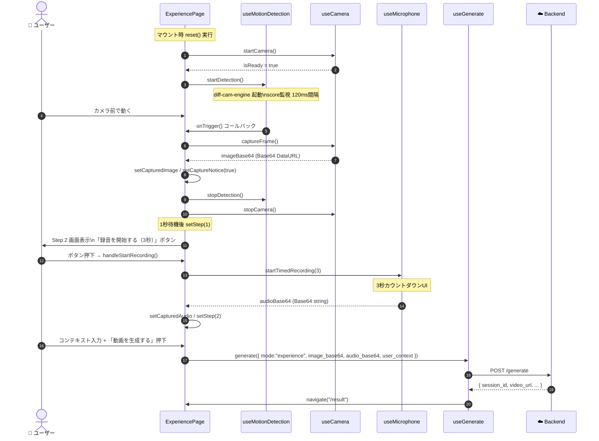
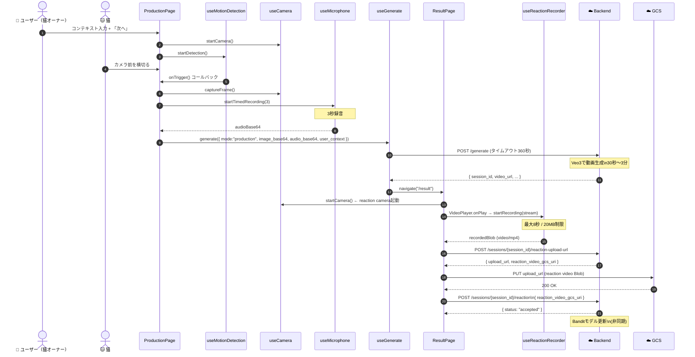
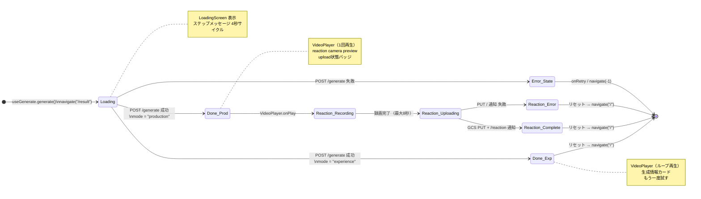
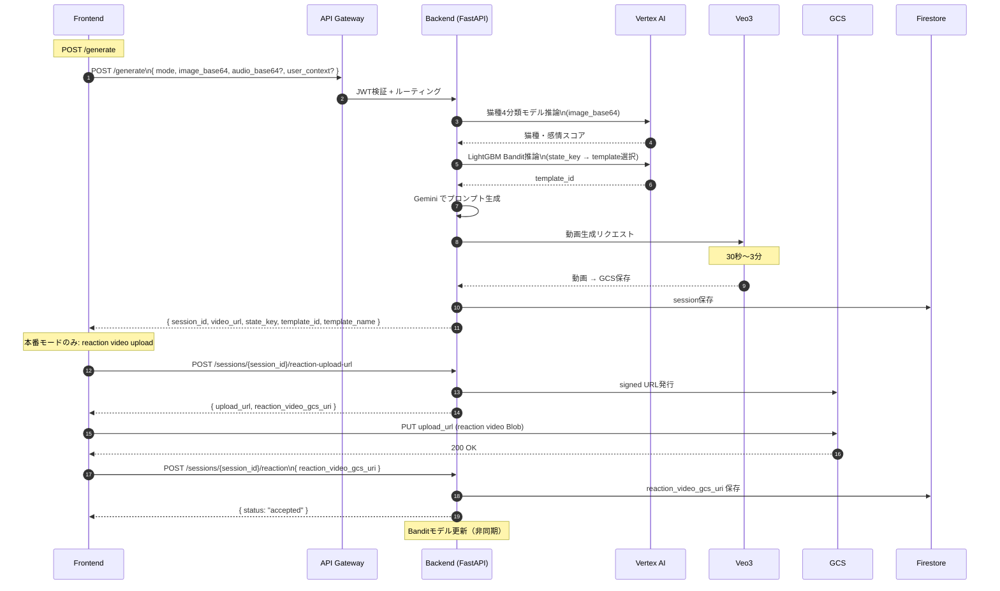

# 🐱 nekkoflix — フロントエンド詳細設計書

| 項目 | 内容 |
|------|------|
| ドキュメントバージョン | 2.0 |
| 作成日 | 2026-03-28 |
| ステータス | Active |
| 対応基本設計書 | docs/ja/High_Level_Design.md |
| 対応バックエンド設計書 | docs/ja/Backend_Design.md |
| 対応インフラ設計書 | docs/ja/INFRASTRUCTURE.md |
| 対象実装 | `frontend/` |

---

## 目次

1. [技術スタック](#1-技術スタック)
2. [設計方針](#2-設計方針)
3. [ディレクトリ・ファイル構成（現行実装）](#3-ディレクトリファイル構成現行実装)
4. [主要ファイル責務一覧](#4-主要ファイル責務一覧)
5. [コンポーネントツリー（Mermaid）](#5-コンポーネントツリーmermaid)
6. [ルーティング設計](#6-ルーティング設計)
7. [状態管理設計](#7-状態管理設計)
8. [APIクライアント設計](#8-apiクライアント設計)
9. [画面設計 — LandingPage](#9-画面設計--landingpage)
10. [体験モード 詳細フロー](#10-体験モード-詳細フロー)
11. [本番モード 詳細フロー](#11-本番モード-詳細フロー)
12. [ResultPage 状態遷移設計](#12-resultpage-状態遷移設計)
13. [カスタムフック設計（シグネチャ付き）](#13-カスタムフック設計シグネチャ付き)
14. [実装上の重要設計パターン](#14-実装上の重要設計パターン)
15. [UIコンポーネント Props 一覧](#15-uiコンポーネント-props-一覧)
16. [デザイントークン](#16-デザイントークン)
17. [ブラウザAPI利用設計](#17-ブラウザapi利用設計)
18. [環境変数・ビルド設定](#18-環境変数ビルド設定)
19. [テスト・品質観点](#19-テスト品質観点)
20. [通信フロー全体（Mermaid）](#20-通信フロー全体mermaid)

---

## 1. 技術スタック

| カテゴリ | 選定 | バージョン |
|---|---|---|
| UIフレームワーク | React | 19 |
| ビルドツール | Vite | 8 |
| 言語 | TypeScript | 5 |
| ルーティング | `react-router-dom` | 7 |
| スタイリング | Tailwind CSS + カスタムCSS | 3 |
| アイコン | `lucide-react` | — |
| API通信 | `fetch` ベース自前wrapper | — |
| 状態管理 | `useState` + `useContext` | — |
| 動き検知 | `diff-cam-engine` | — |
| 録音/録画 | `MediaRecorder` Web API | — |

---

## 2. 設計方針

### 2.1 UX方針

- **ページ遷移型ステップフロー** を採用する。旧来の1ページタブ切替から、ランディング → モード別ステップページ → 結果画面への線形遷移に変更。
- モード選択はランディングページのカードUIで行い、体験モード・本番モードの導線を明確に分離する。
- 各ステップの役割・ユーザー操作が画面内に常に説明される設計とする。

### 2.2 処理方針

- 静止画・音声は `/generate` に直接送る（GCS経由しない）。
- reaction video 本体のみ Backend から signed URL を取得して GCS に direct upload する。
- 体験モードでは reaction video の録画・upload は行わない（モデル更新なし）。
- 旧 `/feedback` UI は廃止済み。

### 2.3 Hook分離方針

フロントの主要機能は以下の単位で分け、ページ側が orchestration 層となる。

```
useCamera          ← カメラstream管理・静止画capture
useMotionDetection ← diff-cam-engine 動き検知
useMicrophone      ← 音声録音・base64化
useReactionRecorder← reaction video 録画
useGenerate        ← POST /generate・状態更新・画面遷移
useToast           ← トースト通知
```

### 2.4 変更しない範囲

以下のファイルは UI 改善時にも変更しない（バックエンド契約）。

- `hooks/useGenerate.ts`
- `lib/api.ts`
- `types/api.ts`
- `types/app.ts`

---

## 3. ディレクトリ・ファイル構成（現行実装）

```text
frontend/
├── index.html
├── vite.config.ts
├── tailwind.config.ts
├── tsconfig.app.json
└── src/
    ├── App.tsx                          # Router定義・GenerationContextProvider
    ├── main.tsx                         # ReactDOM.createRoot
    ├── index.css                        # グローバルスタイル・アニメーション定義
    ├── components/
    │   ├── layout/
    │   │   ├── AppLayout.tsx            # ヘッダー・Toast表示エリア・<Outlet>
    │   │   ├── PageHeader.tsx           # タイトル + 戻るボタン（共通）
    │   │   └── StepIndicator.tsx        # ステップ進捗UI（新規）
    │   ├── result/
    │   │   ├── ErrorScreen.tsx          # エラー表示・リトライ/戻るボタン
    │   │   ├── LoadingScreen.tsx        # ローディングアニメーション
    │   │   └── VideoPlayer.tsx          # 動画プレーヤー・ミュート切替
    │   └── ui/
    │       ├── Badge.tsx
    │       ├── Button.tsx
    │       ├── Spinner.tsx
    │       └── Toast.tsx
    ├── contexts/
    │   └── GenerationContext.tsx        # 生成結果・状態・エラーの共有
    ├── hooks/
    │   ├── useCamera.ts                 # getUserMedia・captureFrame
    │   ├── useGenerate.ts               # POST /generate・Context更新・遷移
    │   ├── useMicrophone.ts             # 録音・base64変換
    │   ├── useMotionDetection.ts        # diff-cam-engine動き検知
    │   ├── useReactionRecorder.ts       # reaction video録画（本番のみ）
    │   └── useToast.ts                  # トースト通知状態管理
    ├── lib/
    │   ├── api.ts                       # fetchラッパー・ApiError変換
    │   ├── audioUtils.ts                # blobToBase64
    │   ├── imageUtils.ts                # canvasToBase64
    │   └── uploadLimits.ts              # サイズ・秒数 定数
    ├── pages/
    │   ├── LandingPage.tsx              # モード選択・コンセプト説明（新規）
    │   ├── ExperiencePage.tsx           # 体験モード 3ステップ（新規）
    │   ├── ProductionPage.tsx           # 本番モード 2ステップ（新規）
    │   └── ResultPage.tsx               # 生成結果・reaction upload
    └── types/
        ├── api.ts                       # GenerateRequest/Response等
        └── app.ts                       # ResultState型
```

---

## 4. 主要ファイル責務一覧

| ファイル | 責務 | 変更可否 |
|---|---|---|
| `App.tsx` | Router定義・`GenerationContextProvider` 配置 | ✅ UI変更可 |
| `contexts/GenerationContext.tsx` | 生成結果・エラー・状態遷移の共有 | ✅ UI変更可 |
| `lib/api.ts` | fetchラッパー・`ApiError`・タイムアウト360秒 | ❌ 変更禁止 |
| `hooks/useGenerate.ts` | `/generate` 呼び出し・状態更新・`/result` 遷移 | ❌ 変更禁止 |
| `hooks/useCamera.ts` | カメラstream管理・静止画capture | ❌ 変更禁止 |
| `hooks/useMotionDetection.ts` | `diff-cam-engine` 動き検知 | ❌ 変更禁止 |
| `hooks/useMicrophone.ts` | 指定秒数録音・base64化 | ❌ 変更禁止 |
| `hooks/useReactionRecorder.ts` | reaction video 録画・20MB検証 | ❌ 変更禁止 |
| `pages/LandingPage.tsx` | モード選択・コンセプト説明 | ✅ UI変更可 |
| `pages/ExperiencePage.tsx` | 体験モード 3ステップ orchestration | ✅ UI変更可 |
| `pages/ProductionPage.tsx` | 本番モード 2ステップ orchestration | ✅ UI変更可 |
| `pages/ResultPage.tsx` | 動画再生・reaction upload・モード別表示 | ✅ UI変更可 |
| `components/layout/StepIndicator.tsx` | ステップ進捗インジケーター | ✅ UI変更可 |
| `components/result/VideoPlayer.tsx` | 動画再生・ミュート切替 | ✅ UI変更可 |
| `types/api.ts` | API型定義 | ❌ 変更禁止 |

---

## 5. コンポーネントツリー（Mermaid）

```mermaid
graph TD
    A["App.tsx\nGenerationContextProvider + RouterProvider"]

    A --> AL["AppLayout\nヘッダー・Toast"]
    AL --> LP["LandingPage\nモード選択"]
    AL --> EP["ExperiencePage\n体験モード 3ステップ"]
    AL --> PP["ProductionPage\n本番モード 2ステップ"]
    AL --> RP["ResultPage\n結果・Reaction"]

    EP --> SI_E["StepIndicator\nsteps=['撮影','鳴きマネ録音','コンテキスト']"]
    EP --> CAM_E["&lt;video&gt; カメラプレビュー"]
    EP --> MIC_E["録音UI（ボタン→カウントダウン）"]
    EP --> CTX_E["&lt;textarea&gt; コンテキスト入力"]

    PP --> SI_P["StepIndicator\nsteps=['コンテキスト入力','撮影・録音']"]
    PP --> CTX_P["&lt;textarea&gt; コンテキスト入力"]
    PP --> CAM_P["&lt;video&gt; カメラプレビュー"]

    RP --> LS["LoadingScreen"]
    RP --> VP["VideoPlayer"]
    RP --> ES["ErrorScreen"]
    RP --> RCV["&lt;video&gt; reaction camera\n（本番モードのみ）"]

    EP --> uCAM_E["useCamera"]
    EP --> uMD_E["useMotionDetection"]
    EP --> uMIC_E["useMicrophone"]
    EP --> uGEN_E["useGenerate"]

    PP --> uCAM_P["useCamera"]
    PP --> uMD_P["useMotionDetection"]
    PP --> uMIC_P["useMicrophone"]
    PP --> uGEN_P["useGenerate"]

    RP --> uCAM_R["useCamera\n（本番のみ有効化）"]
    RP --> uRR["useReactionRecorder\n（本番のみ有効化）"]

    style A fill:#4D8C6F,color:#fff
    style EP fill:#E8F4EE
    style PP fill:#E8F4EE
    style RP fill:#E8F4EE
```



---

## 6. ルーティング設計

### 6.1 Route 一覧

```tsx
// src/App.tsx
const router = createBrowserRouter([
  {
    path: "/",
    element: <AppLayout />,          // ヘッダー + Toast
    children: [
      { index: true,             element: <LandingPage />    },  // /
      { path: "experience",      element: <ExperiencePage /> },  // /experience
      { path: "production",      element: <ProductionPage /> },  // /production
      { path: "result",          element: <ResultPage />     },  // /result
    ],
  },
]);
```

| path | コンポーネント | 役割 |
|---|---|---|
| `/` | `LandingPage` | モード選択・コンセプト説明 |
| `/experience` | `ExperiencePage` | 体験モード 3ステップ（内部state管理） |
| `/production` | `ProductionPage` | 本番モード 2ステップ（内部state管理） |
| `/result` | `ResultPage` | 生成結果表示・reaction video upload |

### 6.2 ナビゲーション方針

- `/experience`, `/production` の内部ステップはURLを変えず、**ページローカルstate** で管理する（カメラstreamやBase64データをstep間で引き継ぐため）。
- `ResultPage` は `GenerationContext.resultState === "idle"` の場合 `/` にリダイレクトする。
- 「もう一度試す」ボタンは `reset()` + `navigate("/")` でトップに戻す。

---

## 7. 状態管理設計

### 7.1 `GenerationContext` — 共有状態

```tsx
// src/contexts/GenerationContext.tsx
interface GenerationContextValue {
  input: GenerateRequest | null;          // 送信したリクエスト（mode情報を含む）
  response: GenerateResponse | null;      // バックエンドからのレスポンス
  resultState: ResultState;               // "idle" | "loading" | "done" | "error"
  errorCode: string | null;
  errorMessage: string | null;
  setLoading: (input: GenerateRequest) => void;
  setDone: (response: GenerateResponse) => void;
  setError: (code: string, message: string) => void;
  reset: () => void;
}
```

### 7.2 ページローカル state

**`ExperiencePage`:**

| state名 | 型 | 役割 |
|---|---|---|
| `step` | `0 \| 1 \| 2` | 現在のステップ |
| `capturedImage` | `string \| null` | Step 1で取得したBase64画像 |
| `capturedAudio` | `string \| null` | Step 2で取得したBase64音声 |
| `userContext` | `string` | Step 3のテキスト入力 |
| `captureNotice` | `boolean` | 「動きを検知しました！」オーバーレイ表示フラグ |
| `micCountdown` | `number` | 録音カウントダウン（3→0） |
| `isRecordingStarted` | `boolean` | 録音ボタン押下後フラグ |

**`ProductionPage`:**

| state名 | 型 | 役割 |
|---|---|---|
| `step` | `0 \| 1` | 現在のステップ |
| `userContext` | `string` | Step 1のテキスト入力 |
| `flowLabel` | `string` | 検知後の処理状況テキスト |
| `lastTriggerAt` | `string \| null` | 直近の動き検知時刻 |

**`ResultPage`:**

| state名 | 型 | 役割 |
|---|---|---|
| `reactionUploadState` | `"idle" \| "recording" \| "uploading" \| "completed" \| "error"` | reaction video upload状態 |
| `reactionError` | `string \| null` | uploadエラーメッセージ |

### 7.3 状態フロー（Mermaid）

```mermaid
stateDiagram-v2
  [*] --> idle : アプリ起動 / reset()

  idle --> loading : useGenerate.generate() 呼び出し\nsetLoading(input)

  loading --> done : POST /generate 成功\nsetDone(response)
  loading --> error : POST /generate 失敗\nsetError(code, message)

  done --> idle : reset() → navigate("/")
  error --> idle : retry / navigate(-1)

  note right of idle : resultState === "idle" のとき\nResultPage は "/" にリダイレクト
  note right of loading : LoadingScreen を表示\n通常 30秒〜3分
  note right of done : 体験: VideoPlayer + 生成情報\n本番: VideoPlayer + reaction camera
```

---

## 8. APIクライアント設計

### 8.1 `types/api.ts` — 型定義

```ts
// src/types/api.ts（変更禁止）

export interface GenerateRequest {
  mode: "experience" | "production";
  image_base64: string;        // canvas経由でキャプチャしたBase64
  audio_base64?: string;       // useMicrophoneが返すBase64（任意）
  user_context?: string;       // ユーザー入力テキスト（任意）
}

export interface GenerateResponse {
  session_id: string;
  video_url: string;           // Veo3が生成した動画のURL
  state_key: string;           // Bandit状態管理キー
  template_id: string;
  template_name: string;
}

export interface ReactionUploadUrlResponse {
  session_id: string;
  upload_url: string;          // GCS signed PUT URL
  reaction_video_gcs_uri: string;
  expires_in_seconds: number;
}

export interface ReactionUploadCompleteRequest {
  reaction_video_gcs_uri: string;
}
```

### 8.2 `lib/api.ts` — fetchラッパー

```ts
// src/lib/api.ts（変更禁止）
const TIMEOUT_MS = 360_000;  // 360秒（Veo3生成待ちを考慮）

// 主要関数:
postJson(path, body)        // POST application/json → タイムアウト付き
putBinary(url, blob, mime)  // GCS signed URL へのPUT（Blobをそのまま送信）

// API関数:
generateVideo(req: GenerateRequest): Promise<GenerateResponse>
issueReactionUploadUrl(sessionId: string): Promise<ReactionUploadUrlResponse>
completeReactionUpload(sessionId: string, req: ReactionUploadCompleteRequest): Promise<ReactionUploadResponse>
```

### 8.3 API一覧

| メソッド | パス | 用途 | 変換元hook |
|---|---|---|---|
| `POST` | `/generate` | 動画生成リクエスト | `useGenerate` |
| `POST` | `/sessions/{id}/reaction-upload-url` | signed URL発行 | `ResultPage` directly |
| `PUT` | `<signed URL>` | reaction video GCS upload | `ResultPage` directly |
| `POST` | `/sessions/{id}/reaction` | upload完了通知 | `ResultPage` directly |

---

## 9. 画面設計 — LandingPage

**役割:** 初回訪問ユーザーが世界観を理解し、体験/本番どちらのモードを使うか判断する画面。

```
┌────────────────────────────────────────┐
│  🐱 nekko[flix]                        │  ← ヒーロー・グラデーション背景
│  ペットもAIの進化のループに入る未来を、   │
│  いま体験する                            │
├────────────────────────────────────────┤
│  [What is Pets in the Loop?]           │  ← コンセプト説明カード
│  ガラスモーフィズム背景                   │
├───────────────┬────────────────────────┤
│  🐾 体験モード │  🎬 本番モード          │  ← 2カラムモード選択カード
│  あなたが猫に  │  実際の猫でAIを鍛える    │
│  なりきる      │                        │
│  [体験モード   │  [本番モードで使う]      │
│   で試す]      │                        │
└───────────────┴────────────────────────┘
    navigate("/experience")  navigate("/production")
```

**コンポーネント構成:**

```tsx
<LandingPage>
  {/* 背景装飾（blur装飾） */}
  {/* ヒーローセクション */}
  <section>
    <span>Pets in the Loop</span>     {/* バッジ */}
    <h1>nekko<span>flix</span></h1>   {/* グラデーションテキスト */}
    <p>ペットもAIの進化のループに入る未来を、いま体験する</p>
  </section>
  {/* コンセプト説明（glassmorphismカード） */}
  <section>...</section>
  {/* モード選択カード 2枚 */}
  <section>
    <ModeCard mode="experience" onClick={() => navigate("/experience")} />
    <ModeCard mode="production" onClick={() => navigate("/production")} />
  </section>
</LandingPage>
```

---

## 10. 体験モード 詳細フロー

### 10.1 ステップ構成

| Step | 番号 | 画面要素 | 遷移条件 |
|------|------|---------|---------|
| Step 1 | `step === 0` | カメラプレビュー + 動き検知ステータス | 動き検知後1秒 → 自動 |
| Step 2 | `step === 1` | 録音ボタン → カウントダウン | 録音完了後 → 自動（スキップも可） |
| Step 3 | `step === 2` | コンテキスト入力 + 生成ボタン | ボタン押下 |

### 10.2 UXフロー（アクタ区別）

```
Step 1: 🎥 撮影
  🤖 ページマウント時にカメラ起動（自動） → startCamera()
  🤖 カメラ準備完了後に動き検知開始（自動） → startDetection()
  🧑 カメラの前で猫のポーズ・動作をする
  🤖 diff-cam-engine が動き検知（score≥20 が2フレーム連続）
  🤖 captureFrame() → Base64画像をstateに保存
  🤖 「動きを検知しました！📸」オーバーレイ表示
  🤖 1秒待機後 → stopDetection() + stopCamera() + setStep(1)

Step 2: 🎤 鳴きマネ録音
  🤖 マイクアイコン表示 + 「録音を開始する（3秒）」ボタン表示
  🧑 準備できたら「録音を開始する（3秒）」ボタンを押す
  🤖 startTimedRecording(3) 開始
  🤖 カウントダウン 3→2→1→0
  🤖 録音完了 → Base64音声をstateに保存
  🤖 setStep(2) 自動遷移
  ※ 🧑 「スキップ」リンクで録音なし（null）のまま Step 3 へ進むことも可能

Step 3: 📝 コンテキスト入力
  🤖 取得済み画像サムネイル + 録音状態を表示
  🧑 猫の性格・好みを任意でテキスト入力（最大500文字）
  🧑 「動画を生成する 🎬」ボタンを押す
  ☁️ POST /generate → GenerationContext.setLoading(input)
  🤖 navigate("/result")
```

### 10.3 体験モード シーケンス図（Mermaid）



---

## 11. 本番モード 詳細フロー

### 11.1 ステップ構成

| Step | 番号 | 画面要素 | 遷移条件 |
|------|------|---------|---------|
| Step 1 | `step === 0` | コンテキスト入力テキストエリア + 「次へ」ボタン | ボタン押下 |
| Step 2 | `step === 1` | カメラプレビュー + 動き検知待機 | 動き検知後 → 自動（録音・生成まで） |

### 11.2 UXフロー（アクタ区別）

```
Step 1: 📝 コンテキスト入力
  🧑 猫の性格・好みをテキスト入力（任意）
  🧑 「次へ →」ボタンを押す → setStep(1)

Step 2: 🎥🎤 撮影・録音
  🤖 カメラ自動起動 → startCamera()
  🤖 動き検知自動開始 → startDetection()
  🧑 猫をカメラの前に準備する
  🤖 動き検知 → captureFrame()
  🤖 3秒録音同時開始 → startTimedRecording(3)
  🤖 flowLabel "動きを検知しました。3秒間音声を録音しています..."
  🤖 録音完了
  ☁️ POST /generate 送信 → navigate("/result")

ResultPage（本番モード）:
  🤖 ローディング表示（30秒〜3分）
  ☁️ 動画URL取得 → VideoPlayer で自動再生
  🤖 onPlay イベント → reaction camera 起動 → 録画開始
  🤖 最大8秒で録画停止 → Blob取得
  ☁️ POST /sessions/{id}/reaction-upload-url → signed URL取得
  ☁️ PUT <signed URL> → GCS に reaction video 直接アップロード
  ☁️ POST /sessions/{id}/reaction → 完了通知 → モデル改善
```

### 11.3 本番モード シーケンス図（Mermaid）



---

## 12. ResultPage 状態遷移設計

### 12.1 resultState による表示切替



### 12.2 体験モード / 本番モード 表示差分

| 要素 | 体験モード | 本番モード |
|------|-----------|-----------|
| 動画ループ再生 | ✅ | ❌（1回再生） |
| 生成情報カード（template名, state_key） | ✅ | ❌ |
| Reaction Status カード | ❌ | ✅ |
| reaction camera preview | ❌ | ✅ |
| reaction video upload 処理 | ❌ | ✅ |

---

## 13. カスタムフック設計（シグネチャ付き）

### 13.1 `useCamera`

```ts
// src/hooks/useCamera.ts
const {
  videoRef,       // React.RefObject<HTMLVideoElement | null>
  isReady,        // boolean — stream が video に反映されたら true
  error,          // string | null — getUserMedia エラーメッセージ
  startCamera,    // () => Promise<void> — getUserMedia + video.srcObject 設定
  stopCamera,     // () => void — stream track 全停止
  captureFrame,   // () => string | null — canvas経由でBase64 DataURL を返す
  getStream,      // () => MediaStream | null — 現在の stream 参照を返す
} = useCamera();
```

**内部処理:**
1. `startCamera()` → `navigator.mediaDevices.getUserMedia({ video: true })`
2. `videoRef.current.srcObject = stream`
3. `video.onloadedmetadata` → `isReady = true`
4. `captureFrame()` → `canvas.drawImage(video)` → `canvas.toDataURL("image/jpeg")`
5. `stopCamera()` → `stream.getTracks().forEach(t => t.stop())`

---

### 13.2 `useMotionDetection`

```ts
// src/hooks/useMotionDetection.ts
const {
  motionScore,     // number — 直近フレームのmotion score
  status,          // "idle" | "watching" | "detected" | "cooldown"
  startDetection,  // () => void — diff-cam-engine起動
  stopDetection,   // () => void — engine停止・クリーンアップ
} = useMotionDetection({
  videoRef,             // RefObject<HTMLVideoElement | null>
  getStream,            // () => MediaStream | null
  onTrigger,            // () => void — 検知時コールバック
  pixelDiffThreshold?,  // number, default: 25
  scoreThreshold?,      // number, default: 20
  consecutiveFrames?,   // number, default: 2
  cooldownMs?,          // number, default: 10_000
});
```

**内部処理:**
1. `startDetection()` → `diffCamEngine.start({ video, captureCallback, ... })`
2. 各フレームで `score = 変化ピクセル数 * 重み`
3. `score >= scoreThreshold` が `consecutiveFrames` 回連続 → `onTrigger()` 呼び出し
4. 呼び出し後 `cooldownMs` (10秒) は再発火しない

---

### 13.3 `useMicrophone`

```ts
// src/hooks/useMicrophone.ts
const {
  isRecording,          // boolean
  startTimedRecording,  // (durationSeconds: number) => Promise<string | null>
                        //   → Base64エンコードされた音声 or null（失敗時）
  resetAudio,           // () => void — 前回の録音データをクリア
} = useMicrophone();
```

**内部処理:**
1. `startTimedRecording(3)` → `navigator.mediaDevices.getUserMedia({ audio: true })`
2. `MediaRecorder.start()` → `setTimeout(stop, durationSeconds * 1000)`
3. `ondataavailable` → chunks 蓄積
4. `onstop` → `new Blob(chunks)` → `blobToBase64()` → resolve

**制限定数（`uploadLimits.ts`）:**

```ts
MAX_AUDIO_RECORDING_SECONDS = 3    // 録音秒数
MAX_AUDIO_UPLOAD_BYTES = 8 * 1024 * 1024  // 8MB
```

---

### 13.4 `useGenerate`

```ts
// src/hooks/useGenerate.ts
const {
  isLoading,  // boolean
  generate,   // (req: GenerateRequest) => Promise<void>
              //   → Context更新 + navigate("/result")
} = useGenerate();
```

**内部処理:**
1. `generate(req)` → `context.setLoading(req)`
2. `navigate("/result")` — ローディング画面を即時表示
3. `await generateVideo(req)` (lib/api.ts, タイムアウト360秒)
4. 成功 → `context.setDone(response)`
5. 失敗 → `context.setError(code, message)`

---

### 13.5 `useReactionRecorder`

```ts
// src/hooks/useReactionRecorder.ts
const {
  isRecording,    // boolean
  recordedBlob,   // Blob | null — 録画完了後に set
  error,          // string | null
  startRecording, // (stream: MediaStream) => void — 外部のcamera streamを渡す
  reset,          // () => void
} = useReactionRecorder();
```

**内部処理:**
1. `startRecording(stream)` → `new MediaRecorder(stream)` → `start()`
2. `setTimeout(stop, MAX_REACTION_VIDEO_SECONDS * 1000)` (8秒)
3. `ondataavailable` → chunks 蓄積
4. `onstop` → `new Blob(chunks, { type: "video/mp4" })`
5. `blob.size > MAX_REACTION_VIDEO_BYTES` (20MB) → エラー

---

## 14. 実装上の重要設計パターン

### 14.1 stale closure 回避パターン

`useMotionDetection` の `onTrigger` は `startDetection` の `useCallback` deps に含まれるため、`onTrigger` が毎レンダリングで新しい関数参照になると `startDetection` も再生成され `useEffect` が無限ループする可能性がある。

これを回避するため、`ExperiencePage`・`ProductionPage` では以下のパターンを採用する。

```ts
// ページの最新クロージャ（state等）にアクセスするハンドラを ref で管理
const triggerHandlerRef = useRef<() => void>(() => {});

// 毎レンダリングで ref に最新のクロージャを書き込む（hookの外で実行）
triggerHandlerRef.current = () => {
  // captureFrame, userContext, isLoading など最新の値を参照できる
  const image = captureFrame();
  if (!image) return;
  setCapturedImage(image);
  // ...
};

// stable な onTrigger（empty deps = 一度だけ生成、参照が変化しない）
const stableOnTrigger = useCallback(() => {
  triggerHandlerRef.current();
}, []); // ← これにより startDetection も安定した参照を持つ

const { startDetection, stopDetection } = useMotionDetection({
  videoRef,
  getStream,
  onTrigger: stableOnTrigger,  // ← 安定した参照
});
```

### 14.2 カメラ起動の1回限り保証

`useEffect` は React StrictMode でダブルインボケーションされる可能性がある。カメラの重複起動を防ぐため `useRef` フラグを使う。

```ts
const hasCameraStartedRef = useRef(false);

useEffect(() => {
  if (step !== 0 || hasCameraStartedRef.current) return;
  hasCameraStartedRef.current = true;
  void startCamera().then(() => startDetection());
}, [step, startCamera, startDetection]);
```

### 14.3 アンマウント時のクリーンアップ

ページから離れた際（ブラウザバック等）にカメラstream・検知engineが残らないようにする。

```ts
useEffect(() => () => {
  stopDetection();
  stopCamera();
}, [stopDetection, stopCamera]);
```

### 14.4 体験モード Step 2 → Step 3 遷移

録音ボタン押下後にカウントダウンと録音を同時進行し、完了後に自動遷移する。

```ts
const handleStartRecording = useCallback((): void => {
  if (isRecordingStarted) return;
  setIsRecordingStarted(true);
  setMicCountdown(MIC_SECONDS); // 3
  resetAudio();

  // カウントダウン（UI更新）
  let remaining = MIC_SECONDS;
  const intervalId = window.setInterval(() => {
    remaining -= 1;
    setMicCountdown(remaining);
    if (remaining <= 0) clearInterval(intervalId);
  }, 1000);

  // 録音本体（非同期）
  void startTimedRecording(MIC_SECONDS).then((audio) => {
    clearInterval(intervalId);
    setCapturedAudio(audio);   // Base64 or null
    setStep(2);                // 自動遷移
    setIsRecordingStarted(false);
  });
}, [isRecordingStarted, resetAudio, startTimedRecording]);
```

---

## 15. UIコンポーネント Props 一覧

### `StepIndicator`

```tsx
// src/components/layout/StepIndicator.tsx
interface StepIndicatorProps {
  steps: string[];      // ステップ名リスト（例: ["撮影", "鳴きマネ録音", "コンテキスト"]）
  currentStep: number;  // 現在のステップ（0-indexed）
}
```

| `currentStep` との関係 | スタイル |
|---|---|
| `index < currentStep`（完了） | グリーン塗りつぶし + CheckIcon |
| `index === currentStep`（現在） | グリーン枠 + 白背景（shadow-glow） |
| `index > currentStep`（未来） | グレー枠 + グレー文字 |

---

### `VideoPlayer`

```tsx
// src/components/result/VideoPlayer.tsx
interface VideoPlayerProps {
  src: string;       // 動画URL
  loop?: boolean;    // ループ再生（体験: true, 本番: false）
  onPlay?: () => void;  // 再生開始イベント（本番: reaction録画開始に使用）
}
```

---

### `LoadingScreen`

```tsx
// src/components/result/LoadingScreen.tsx
interface LoadingScreenProps {
  stateKey?: string;      // GenerationContext.response.state_key（デバッグ用）
  templateName?: string;  // GenerationContext.response.template_name
}
```

**ステップメッセージ（4秒サイクル）:**
1. 🔍 猫の感情を分析しています...
2. ✍️ AIがプロンプトを構築しています...
3. 🎬 Veo3が動画を生成中です...

---

### `ErrorScreen`

```tsx
// src/components/result/ErrorScreen.tsx
interface ErrorScreenProps {
  message: string | null;
  onRetry: () => void;    // navigate(0) でページリロード
  onBack: () => void;     // navigate(-1) で前ページへ
}
```

---

### `Button`

```tsx
// src/components/ui/Button.tsx
type ButtonVariant = "primary" | "secondary" | "ghost" | "text";
type ButtonSize = "sm" | "md" | "lg" | "xl";

interface ButtonProps extends ButtonHTMLAttributes<HTMLButtonElement> {
  variant?: ButtonVariant;
  size?: ButtonSize;
  leftIcon?: ReactNode;
  rightIcon?: ReactNode;
}
```

---

## 16. デザイントークン

`tailwind.config.ts` から引用。UIコンポーネント実装時はこれらのトークンを使用すること。

### 16.1 カラー

| トークン | 値 | 用途 |
|---|---|---|
| `accent` | `#4D8C6F` | プライマリカラー・アクセント |
| `accent-light` | `#E8F4EE` | アクセントの薄い背景 |
| `accent-dark` | `#3A6E56` | ホバー・グラデーション終端 |
| `bg` | `#FAFAF8` | ページ背景 |
| `surface` | `#FFFFFF` | カード背景 |
| `surface-alt` | `#F4F4F0` | サブ背景 |
| `text-primary` | `#1C1C1A` | 本文 |
| `text-secondary` | `#6B7280` | サブテキスト |
| `text-muted` | `#9CA3AF` | 補足テキスト |
| `border` | `#E5E7EB` | ボーダー |
| `border-selected` | `#4D8C6F` | 選択状態ボーダー |

### 16.2 アニメーション

| トークン | keyframe | 用途 |
|---|---|---|
| `animate-fadeIn` | opacity 0→1 | ページ・カード表示時 |
| `animate-slideUp` | translateY 20px→0 + opacity | ヒーロー登場 |
| `animate-pulse-ring` | scale 0.8→1.6 + opacity 0.8→0 | ローディング・録音中 |
| `animate-spin-slow` | 3秒/回転 | ローディングリング |
| `animate-bounce-gentle` | translateY 0→-10px→0 | 肉球アイコン |

### 16.3 シャドウ・形状

| トークン | 値 | 用途 |
|---|---|---|
| `shadow-card` | `0 1px 4px rgba(0,0,0,0.06)` | 通常カード |
| `shadow-card-hover` | `0 8px 24px rgba(0,0,0,0.10)` | ホバーカード |
| `shadow-btn-primary` | `0 4px 14px rgba(77,140,111,0.35)` | プライマリボタン |
| `shadow-glow` | `0 0 20px rgba(77,140,111,0.25)` | StepIndicator 現在ステップ |
| `rounded-card` | `12px` | 小カード |
| `rounded-card-lg` | `20px` | 中カード |
| `rounded-card-xl` | `28px` | 大カード（カメラプレビュー等） |
| `rounded-btn` | `10px` | ボタン |

### 16.4 グラデーション

| トークン | 値 | 用途 |
|---|---|---|
| `gradient-hero` | `radial-gradient(ellipse 100% 70% at 50% -10%, #E8F4EE 0%, #FAFAF8 65%)` | LandingPage背景 |
| `gradient-btn` | `linear-gradient(135deg, #4D8C6F 0%, #3A6E56 100%)` | プライマリボタン・バッジ |
| `gradient-card` | `linear-gradient(180deg, #FFFFFF 0%, #F9FAF8 100%)` | カード背景 |

---

## 17. ブラウザAPI利用設計

### 17.1 `/generate` 前の入力取得

| データ | 取得方法 | 制限 |
|---|---|---|
| 静止画 | `<video>` + `<canvas>.drawImage()` → `toDataURL("image/jpeg")` | 7MB以内 |
| 音声 | `MediaRecorder` + `getUserMedia({ audio: true })` | 3秒録音・8MB以内 |
| テキスト | `<textarea>` | 500文字以内 |

### 17.2 reaction video（本番モードのみ）

| ステップ | 実装 |
|---|---|
| カメラstream取得 | `useCamera.startCamera()` （ResultPage, production時のみ起動） |
| 録画開始 | `VideoPlayer.onPlay` イベント → `useReactionRecorder.startRecording(stream)` |
| 録画停止 | 8秒後自動 `MediaRecorder.stop()` |
| サイズ検証 | `blob.size > 20MB` → エラー、uploadせず |
| アップロード | `lib/api.ts` putBinary(signed_url, blob, "video/mp4") |

### 17.3 使用ブラウザAPI一覧

| API | 用途 | hook |
|---|---|---|
| `navigator.mediaDevices.getUserMedia({ video: true })` | カメラ取得 | `useCamera` |
| `navigator.mediaDevices.getUserMedia({ audio: true })` | マイク取得 | `useMicrophone` |
| `MediaRecorder` | 音声録音・reaction録画 | `useMicrophone`, `useReactionRecorder` |
| `<canvas>.drawImage` / `toDataURL` | 静止画取得 | `useCamera` |
| `fetch` + AbortController | API通信・タイムアウト | `lib/api.ts` |
| `diff-cam-engine` | フレーム差分動き検知 | `useMotionDetection` |

---

## 18. 環境変数・ビルド設定

```bash
# .env
VITE_BACKEND_URL=https://your-backend.example.com
```

| コマンド | 用途 |
|---|---|
| `npm run dev` | 開発サーバー起動（localhost:5173） |
| `npm run build` | 本番バンドル生成 |
| `npm run lint` | ESLint実行 |
| `npx tsc --noEmit` | 型チェックのみ（ビルドなし） |

---

## 19. テスト・品質観点

### 19.1 自動チェック

```bash
cd frontend/

# TypeScript 型チェック（必須）
npx tsc --noEmit

# Lint
npm run lint

# ビルド確認
npm run build
```

### 19.2 手動確認項目

#### 体験モードフロー

| # | 操作 | 期待結果 |
|---|------|---------|
| 1 | `/` を開く | LandingPage 表示。コンセプト説明 + 2モードカード |
| 2 | 「体験モードで試す」 | `/experience` 遷移。Step 1/3 インジケーター + カメラUI |
| 3 | カメラ前で動く | 動き検知 → 📸オーバーレイ → 1秒後 Step 2 自動遷移 |
| 4 | 「録音を開始する（3秒）」押下 | カウントダウン 3→2→1→0 → Step 3 自動遷移 |
| 5 | 「スキップ」押下 | 音声なしで Step 3 に遷移 |
| 6 | Step 3 でテキスト入力 → 「動画を生成する」 | `/result` 遷移・ローディング表示 |
| 7 | 結果（体験モード） | VideoPlayer（ループ再生）+ 生成情報カード。reaction UIなし |
| 8 | 「もう一度試す」 | `/` に戻りコンテキストリセット |

#### 本番モードフロー

| # | 操作 | 期待結果 |
|---|------|---------|
| 9 | 「本番モードで使う」 | `/production` 遷移。Step 1/2 インジケーター + コンテキスト入力 |
| 10 | テキスト入力（任意）→「次へ」 | Step 2 遷移。カメラ起動・動き検知待機 |
| 11 | カメラ前で動く | 動き検知 → 撮影 + 録音 → `/result` 遷移 |
| 12 | 結果（本番モード） | VideoPlayer（1回再生）+ Reaction Status カード + reaction camera |
| 13 | 動画再生開始 | reaction camera が録画開始（最大8秒） |
| 14 | 録画完了 | GCS upload → backend 通知 → "completed" バッジ表示 |

#### エラーケース

| # | 条件 | 期待結果 |
|---|------|---------|
| 15 | generateAPI タイムアウト | ErrorScreen 表示。「もう一度試す」で `/result` リロード |
| 16 | カメラ許可拒否 | cameraError 表示。処理が止まる |
| 17 | reaction video 20MB超 | upload スキップ。エラーメッセージ表示 |

---

## 20. 通信フロー全体（Mermaid）



---

*本設計書は `frontend/` 配下の実装と常に同期を保つこと。実装変更時はセクション 3〜14 を優先的に更新すること。*
