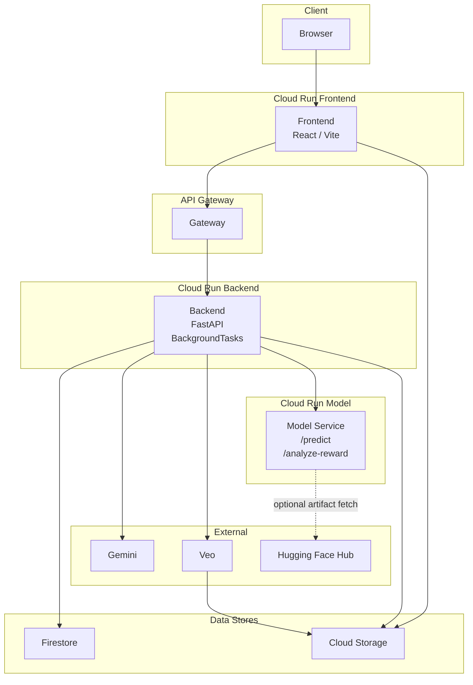
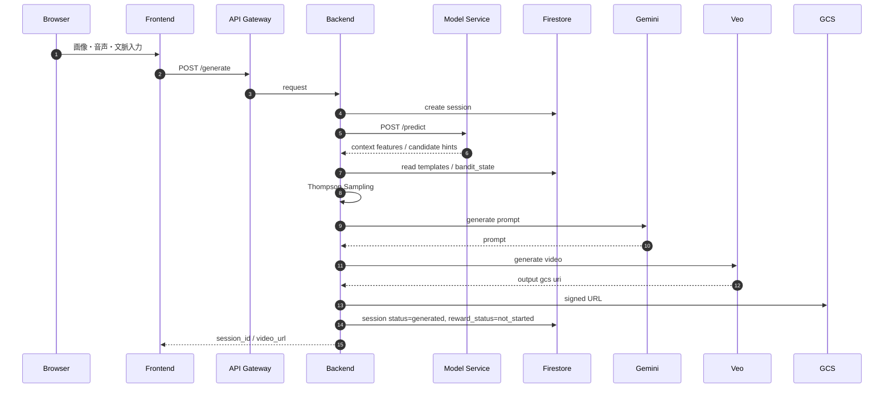
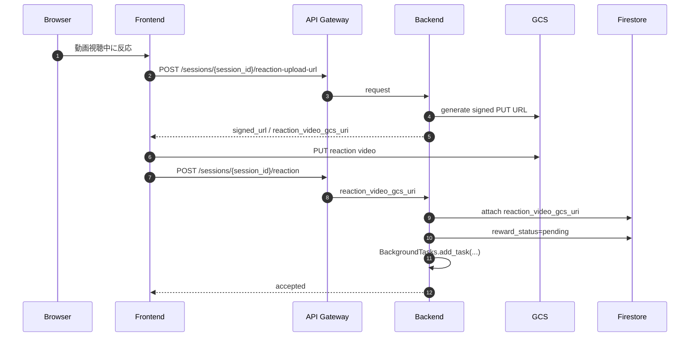
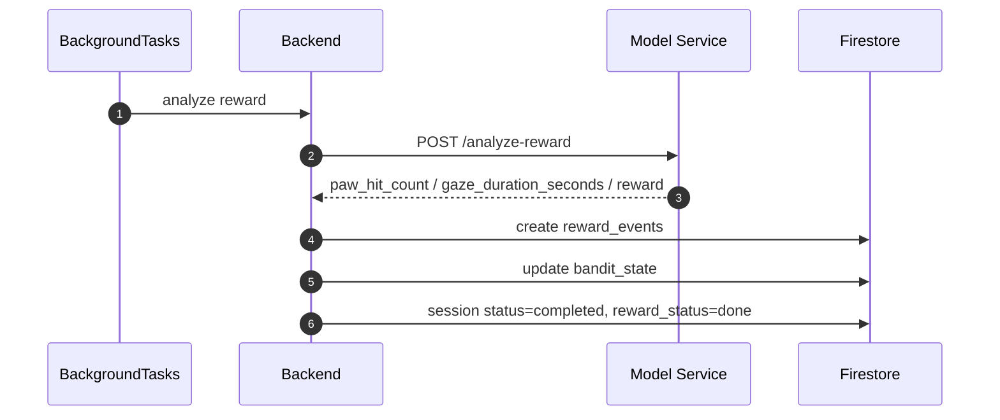
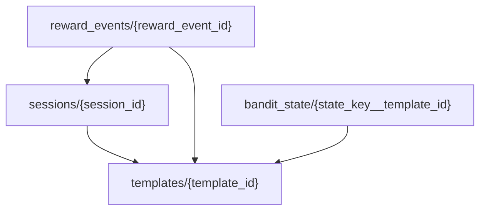

# 🐱 nekkoflix — インフラ詳細設計書

| 項目 | 内容 |
|------|------|
| ドキュメントバージョン | v5.1 |
| 作成日 | 2026-03-27 |
| ステータス | Draft |
| 対応基本設計書 | docs/ja/High_Level_Design.md |
| 対応モデル設計書 | docs/ja/MODELING.md |
| 対応バックエンド設計書 | docs/ja/Backend_Design.md |

---

## v5.1 更新メモ

本書は以下を正式前提とする。

- `model/` は Cloud Run 上の FastAPI service として動作する
- backend は model service の `/predict` と `/analyze-reward` を呼ぶ
- 動画生成は `POST /generate` で完結させ、reward 解析は FastAPI `BackgroundTasks` で非同期化する
- frontend は動画再生中の猫の反応動画を録画し、signed URL で GCS に直接 upload する
- backend は reaction upload 用 signed URL を発行し、upload 完了通知を受けて Firestore を更新する
- Firestore は `templates / sessions / reward_events / bandit_state` を中核にする
- API Gateway は一般公開 API のみを公開する
- Cloud Run の deploy は Cloud Build で行う
- Cloud Run 自体は Terraform 管理から外す方針とする

## 現状との関係

重要: 本書はターゲット構成の正本である。現時点では Terraform 実装や backend 実装に旧前提が残る可能性があるが、今後の変更は本書に合わせて寄せる。

---

## 目次

1. [アーキテクチャ全体像](#1-アーキテクチャ全体像)
2. [公開 API 境界](#2-公開-api-境界)
3. [GCP リソース設計](#3-gcp-リソース設計)
4. [Firestore 論理設計](#4-firestore-論理設計)
5. [ネットワーク設計](#5-ネットワーク設計)
6. [IAM・セキュリティ設計](#6-iamセキュリティ設計)
7. [CI/CD 設計](#7-cicd-設計)
8. [運用設計](#8-運用設計)
9. [実装反映時の変更ポイント](#9-実装反映時の変更ポイント)

---

## 1. アーキテクチャ全体像

### 1.1 ターゲットサービス構成

### 1.2 役割分担

| コンポーネント | 主責務 |
|---|---|
| Frontend | 画像・音声・文脈の送信、動画再生、reaction video 録画、GCS direct upload |
| API Gateway | 一般公開 API の入口、JWT 検証 |
| Backend | session 管理、model 呼び出し、bandit 選択、生成統括、reaction upload URL 発行、upload 完了通知、BackgroundTasks 起動、Firestore 更新 |
| Model Service | 文脈推論、reward 解析 |
| Firestore | template / session / reward / bandit 状態の正本 |
| GCS | 生成動画と reaction video の保存 |

### 1.3 主要フロー

#### 生成

#### reaction video upload

#### reward analysis

---

## 2. 公開 API 境界

API Gateway 配下に置くのは以下のみ。

- `GET /`
- `GET /health`
- `POST /generate`
- `POST /sessions/{session_id}/reaction-upload-url`
- `POST /sessions/{session_id}/reaction`

制約:

- `POST /sessions/{session_id}/reaction` は `reaction_video_gcs_uri` 通知 API とする
- reaction video 本体は signed URL を使って GCS に direct upload する
- frontend は録画時間を最大 8 秒に制御する
- reaction video の運用上限は 20MB とする
- backend は byte trimming を行わない

signed URL 仕様:

- method は `PUT`
- object path は `reaction_videos/{session_id}/{uuid}.mp4`
- content type は `video/mp4`
- expires は `REACTION_VIDEO_UPLOAD_URL_EXPIRES_SECONDS`
- backend は通知時に bucket 名と object prefix を検証する

---

## 3. GCP リソース設計

### 3.1 採用リソース

| リソース | 用途 |
|---|---|
| Cloud Run Frontend | UI 提供 |
| Cloud Run Backend | 公開 API と BackgroundTasks 実行 |
| Cloud Run Model | `/predict`, `/analyze-reward` |
| API Gateway | 一般公開 API 入口 |
| Firestore | template / session / reward / bandit 状態 |
| Cloud Storage | 生成動画、reaction video |
| Artifact Registry | frontend / backend / model image |
| Cloud Build | build / push / deploy |
| Secret Manager | 機密情報 |

### 3.2 Cloud Run 設計

#### Frontend

- public
- Gateway URL を環境変数で注入

#### Backend

- 公開 service
- API Gateway 経由の公開 API を持つ
- reward analysis は FastAPI `BackgroundTasks` で起動する
- reaction upload 完了通知 request は軽量 JSON を前提とする
- `candidate_video_ids` は Firestore `templates` から組み立てる

#### Model Service

- backend からのみ呼ばれる想定
- `/predict`
- `/analyze-reward`
- artifact はローカル bundle もしくは Hugging Face から解決

### 3.3 GCS

bucket の役割:

- `veo-output`
- `reaction-video`

推奨:

- private bucket
- 生成動画は signed URL で再生
- reaction video は signed URL で direct upload
- reaction video には lifecycle を設定
- reaction video は frontend で 8 秒以内に制御する

### 3.4 Firestore

永続化対象:

- `templates`
- `sessions`
- `reward_events`
- `bandit_state`

### 3.5 Secret Manager

対象候補:

- `HF_TOKEN`
- backend から model を呼ぶための将来 secret

---

## 4. Firestore 論理設計

### 4.1 `templates`

- template metadata
- prompt source
- active flag

### 4.2 `sessions`

- generate request の正本
- 生成結果 URI
- reaction video URI
- reward 状態

`reward_status` 遷移:

- `not_started`
- `pending`
- `done`
- `failed`

生成完了時点では `not_started` を維持し、reaction upload 完了後に `pending` へ遷移する。

### 4.3 `reward_events`

- reaction video 解析結果
- 最終 reward
- 解析モデル情報

### 4.4 `bandit_state`

- `alpha`
- `beta`
- `selection_count`
- `last_reward`
- `reward_sum`

---

## 5. ネットワーク設計

### 5.1 公開経路

- Browser -> Frontend
- Frontend -> API Gateway
- API Gateway -> Backend

### 5.2 内部経路

- Frontend -> GCS
- Backend -> Model Service
- Backend -> Firestore
- Backend -> GCS

### 5.3 BackgroundTasks の扱い

reward analysis は backend process 内の `BackgroundTasks` で起動する。

要件:

- `/generate` のレスポンスとは分離する
- reaction upload 完了通知後にのみ起動する
- 失敗時は session / reward_status に反映する

---

## 6. IAM・セキュリティ設計

### 6.1 backend 実行 SA

必要権限:

- Firestore 読み書き
- GCS 生成動画 bucket 読み書き
- GCS reaction video bucket への signed URL 発行
- model service への `run.invoker`

### 6.2 Cloud Build SA

必要権限:

- Artifact Registry 書き込み
- Cloud Run deploy
- API Gateway 更新

### 6.3 model service SA

必要権限:

- 必要に応じて GCS read
- 必要に応じて Secret Manager read

---

## 7. CI/CD 設計

### 7.1 trigger 分割

- frontend trigger
- backend trigger
- apigateway trigger

### 7.2 backend deploy 時に注入する主設定

- `MODEL_SERVICE_URL`
- `REACTION_VIDEO_BUCKET_NAME`
- `REACTION_VIDEO_UPLOAD_URL_EXPIRES_SECONDS`

### 7.3 API Gateway deploy

OpenAPI には一般公開 API のみ含める。

含める:

- `/`
- `/health`
- `/generate`
- `/sessions/{session_id}/reaction-upload-url`
- `/sessions/{session_id}/reaction`

---

## 8. 運用設計

### 8.1 正常系運用

- generate 成功後に reward は `not_started` のまま返る
- reaction upload 完了通知後に BackgroundTasks が起動される
- reward analysis 完了で session が `completed` になる

### 8.2 障害時運用

- signed URL 取得または upload 失敗時は frontend から再試行する
- reaction 通知失敗時も frontend から再送可能にする
- reward analysis 恒久失敗時は `reward_status=failed`

### 8.3 監視対象

- signed URL 発行失敗
- model `/analyze-reward` timeout
- Firestore 更新失敗
- background reward analysis failure

---

## 9. 実装反映時の変更ポイント

### 9.1 `infra/apigateway/openapi.yaml`

更新内容:

- `/feedback` 削除
- `/sessions/{session_id}/reaction-upload-url` 追加
- `/sessions/{session_id}/reaction` 追加
- reaction 通知 API は `reaction_video_gcs_uri` を受ける

### 9.2 `infra/terraform`

追加・更新内容:

- reaction video bucket を direct upload 前提で整理
- backend SA の signed URL 発行権限を整理
- backend deploy に必要な env を tfvars / trigger substitutions に追加

### 9.3 `infra/ci/cloud_build`

更新内容:

- backend deploy 時に reaction video / signed URL 用 env を渡す

### 9.4 `infra/firestore_initial_setup`

維持:

- `templates`
- `bandit_state`

新 runtime で生成:

- `sessions`
- `reward_events`

---

本書のポイントは、backend を業務状態の正本としつつ、reward 解析は `BackgroundTasks` で簡潔に非同期化し、reaction video 本体は signed URL で GCS に直接 upload することにある。worker service や Cloud Tasks は hackathon スコープでは採用しない。
