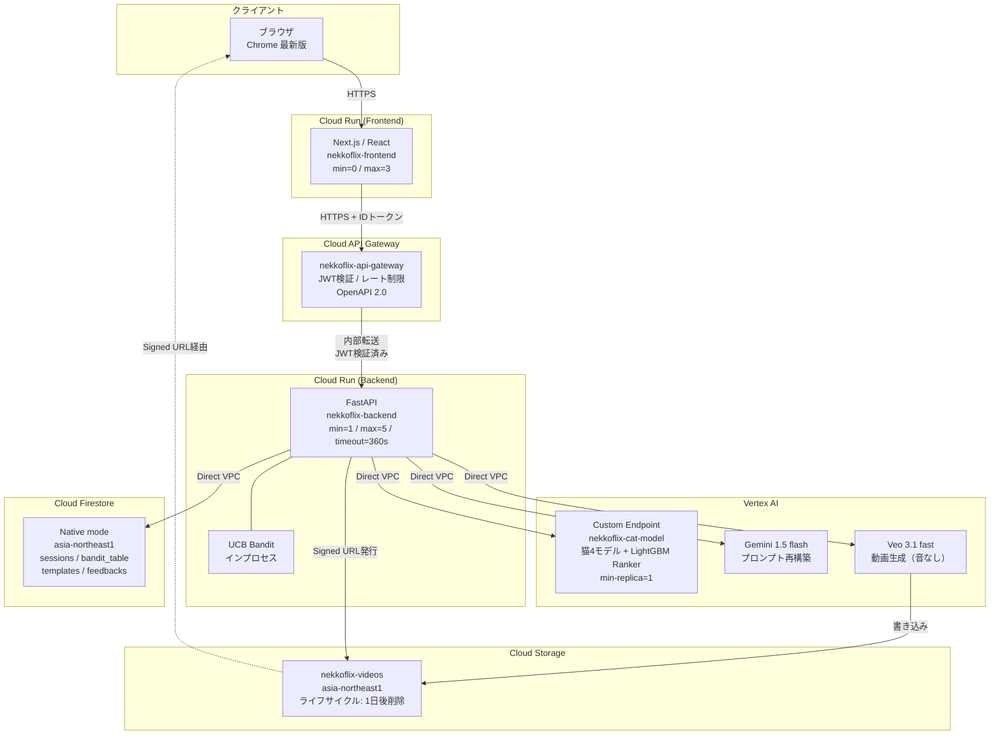
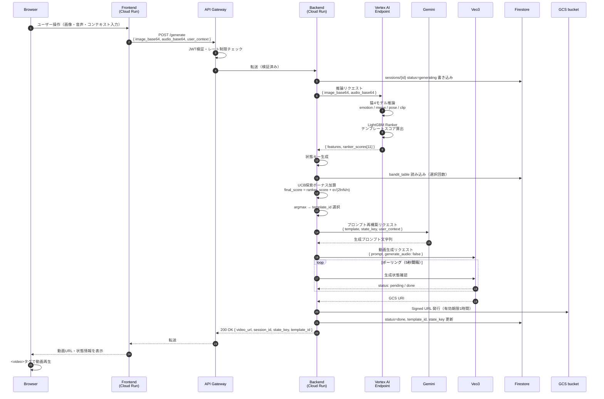
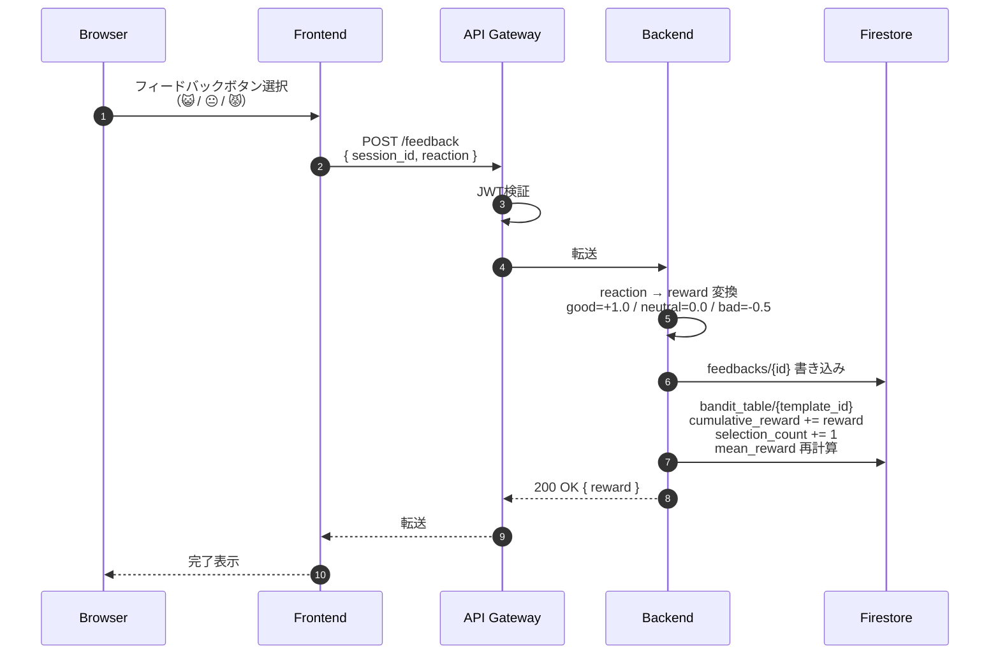
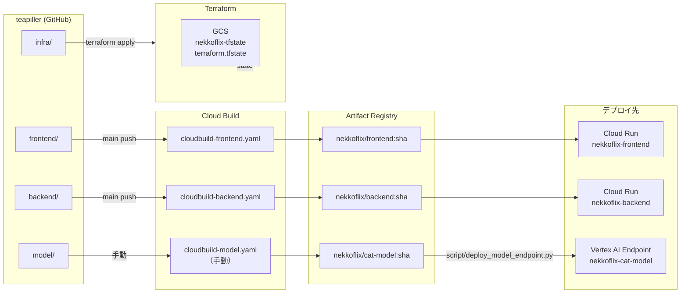

# 🐱 nekkoflix — インフラ詳細設計書

| 項目 | 内容 |
|------|------|
| ドキュメントバージョン | v2.0 |
| 作成日 | 2026-03-19 |
| ステータス | Draft |
| 対応基本設計書 | docs/ja/High_Level_Design.md v2.0 |

---

## v2.0 更新メモ

本ドキュメントには旧 `LightGBM Ranker` 前提の記述が残っている。インフラ観点での正式前提は以下とする。

- Vertex AI Custom Endpoint は v1 では `LightGBM Regressor` ベース
- Backend へ返す推論結果は `predicted_rewards`
- 動画候補は `video-1..video-10`
- Vertex AI Custom Endpoint は `emotion / pose / clip / Reward Regressor` を同一コンテナに含む
- 現時点の model deploy は Cloud Build 連携ではなく、ローカル `docker build` と `gcloud` を前提とする

Backend / Model の正式契約は `docs/_internal/Phase0_Endpoint_Contract.md` を参照する。
実装と運用の直近手順は `docs/_internal/Phase3_Model_Deployment_Runbook.md` を参照する。

---

## 目次

1. [アーキテクチャ全体像](#1-アーキテクチャ全体像)
2. [Terraform設計](#2-terraform設計)
3. [GCPリソース詳細](#3-gcpリソース詳細)
4. [ネットワーク詳細](#4-ネットワーク詳細)
5. [IAM・セキュリティ詳細](#5-iamセキュリティ詳細)
6. [CI/CDパイプライン詳細](#6-cicdパイプライン詳細)
7. [必要ファイル一覧](#7-必要ファイル一覧)
8. [運用設計](#8-運用設計)
9. [コスト試算](#9-コスト試算)
10. [TBD](#10-tbd)

---

## 1. アーキテクチャ全体像

### 1.1 サービス構成図



### 1.2 データフロー図 — POST /generate



### 1.3 データフロー図 — POST /feedback



### 1.4 デプロイ構成図



---

## 2. Terraform設計

### 2.1 ディレクトリ・モジュール構成

```
infra/
├── terraform/
│   ├── environments/
│   │   ├── dev/
│   │   │   ├── main.tf          # dev環境のルート（moduleを呼び出す）
│   │   │   ├── variables.tf
│   │   │   ├── terraform.tfvars # dev用の変数値（gitignore対象）
│   │   │   └── backend.tf       # GCS remoteバックエンド設定
│   │   └── prod/
│   │       ├── main.tf
│   │       ├── variables.tf
│   │       ├── terraform.tfvars
│   │       └── backend.tf
│   └── modules/
│       ├── cloud_run/           # Cloud Run（FE/BE共用モジュール）
│       │   ├── main.tf
│       │   ├── variables.tf
│       │   └── outputs.tf
│       ├── api_gateway/         # Cloud API Gateway
│       │   ├── main.tf
│       │   ├── variables.tf
│       │   └── outputs.tf
│       ├── vertex_ai/           # Vertex AI Endpoint
│       │   ├── main.tf
│       │   ├── variables.tf
│       │   └── outputs.tf
│       ├── firestore/           # Cloud Firestore
│       │   ├── main.tf
│       │   ├── variables.tf
│       │   └── outputs.tf
│       ├── gcs/                 # Cloud Storage
│       │   ├── main.tf
│       │   ├── variables.tf
│       │   └── outputs.tf
│       ├── iam/                 # IAM バインディング
│       │   ├── main.tf
│       │   ├── variables.tf
│       │   └── outputs.tf
│       ├── artifact_registry/   # Artifact Registry
│       │   ├── main.tf
│       │   └── variables.tf
│       └── vpc/                 # VPC / Serverless VPC Access
│           ├── main.tf
│           ├── variables.tf
│           └── outputs.tf
└── apigateway/
    └── openapi.yaml             # API Gateway の OpenAPI 2.0 定義
```

### 2.2 Terraform state管理（GCS Remote Backend）

Terraform の state ファイルは、専用の GCS バケットで管理する。アプリケーションの動画バケット（`nekkoflix-videos`）とは**別バケット**とする。

**stateバケット設定：**

| 項目 | 値 |
|---|---|
| バケット名 | `nekkoflix-tfstate` |
| リージョン | `asia-northeast1` |
| バージョニング | 有効（state破損時のロールバック用） |
| 公開アクセス | 無効 |
| 暗号化 | Google管理キー（デフォルト） |

**`infra/terraform/environments/dev/backend.tf`：**

```hcl
terraform {
  backend "gcs" {
    bucket = "nekkoflix-tfstate"
    prefix = "terraform/state/dev"
  }
}
```

**`infra/terraform/environments/prod/backend.tf`：**

```hcl
terraform {
  backend "gcs" {
    bucket = "nekkoflix-tfstate"
    prefix = "terraform/state/prod"
  }
}
```

> **注意：** stateバケット自体はTerraformで管理するとニワトリ・卵問題が生じるため、以下のスクリプトで初回のみ手動作成する。

```bash
# script/init_terraform_backend.sh
#!/bin/bash
PROJECT_ID="your-project-id"
BUCKET_NAME="nekkoflix-tfstate"
REGION="asia-northeast1"

gsutil mb -p ${PROJECT_ID} -l ${REGION} gs://${BUCKET_NAME}
gsutil versioning set on gs://${BUCKET_NAME}
gsutil pap set enforced gs://${BUCKET_NAME}
echo "Terraform state bucket created: gs://${BUCKET_NAME}"
```

### 2.3 変数定義と環境分離

**`infra/terraform/environments/dev/variables.tf`（共通変数定義）：**

```hcl
variable "project_id" {
  description = "GCP Project ID"
  type        = string
}

variable "region" {
  description = "GCP Region"
  type        = string
  default     = "asia-northeast1"
}

variable "environment" {
  description = "Environment name (dev / prod)"
  type        = string
}

variable "backend_image" {
  description = "Backend Docker image URI (Artifact Registry)"
  type        = string
}

variable "frontend_image" {
  description = "Frontend Docker image URI (Artifact Registry)"
  type        = string
}

variable "vertex_endpoint_id" {
  description = "Vertex AI Endpoint ID for cat model"
  type        = string
  default     = ""
}

variable "gemini_model" {
  description = "Gemini model name"
  type        = string
  default     = "gemini-1.5-flash"
}

variable "veo_model" {
  description = "Veo model name"
  type        = string
  default     = "veo-3.1-fast"
}

variable "gcs_video_bucket" {
  description = "GCS bucket name for generated videos"
  type        = string
}
```

**`infra/terraform/environments/dev/terraform.tfvars`（dev用実値・gitignore対象）：**

```hcl
project_id       = "nekkoflix-dev"
region           = "asia-northeast1"
environment      = "dev"
backend_image    = "asia-northeast1-docker.pkg.dev/nekkoflix-dev/nekkoflix/backend:latest"
frontend_image   = "asia-northeast1-docker.pkg.dev/nekkoflix-dev/nekkoflix/frontend:latest"
gcs_video_bucket = "nekkoflix-videos-dev"
```

### 2.4 環境別ルートモジュール

**`infra/terraform/environments/dev/main.tf`（抜粋）：**

```hcl
terraform {
  required_version = ">= 1.5"
  required_providers {
    google = {
      source  = "hashicorp/google"
      version = "~> 5.0"
    }
  }
}

provider "google" {
  project = var.project_id
  region  = var.region
}

# ── VPC ──────────────────────────────────────────
module "vpc" {
  source      = "../../modules/vpc"
  project_id  = var.project_id
  region      = var.region
  environment = var.environment
}

# ── Artifact Registry ────────────────────────────
module "artifact_registry" {
  source      = "../../modules/artifact_registry"
  project_id  = var.project_id
  region      = var.region
  environment = var.environment
}

# ── GCS ──────────────────────────────────────────
module "gcs_videos" {
  source      = "../../modules/gcs"
  project_id  = var.project_id
  region      = var.region
  bucket_name = var.gcs_video_bucket
  lifecycle_age_days = 1
}

module "gcs_tfstate" {
  # stateバケットはTerraform管理外（手動作成）
  # このモジュールは呼ばない
}

# ── Firestore ─────────────────────────────────────
module "firestore" {
  source      = "../../modules/firestore"
  project_id  = var.project_id
  region      = var.region
  environment = var.environment
}

# ── IAM ──────────────────────────────────────────
module "iam" {
  source          = "../../modules/iam"
  project_id      = var.project_id
  environment     = var.environment
  gcs_bucket_name = var.gcs_video_bucket
}

# ── Cloud Run: Backend ────────────────────────────
module "backend" {
  source      = "../../modules/cloud_run"
  project_id  = var.project_id
  region      = var.region
  name        = "nekkoflix-backend-${var.environment}"
  image       = var.backend_image
  service_account = module.iam.backend_sa_email
  min_instances   = 1
  max_instances   = 5
  timeout_seconds = 360
  ingress         = "INGRESS_TRAFFIC_INTERNAL_ONLY"
  vpc_connector   = module.vpc.connector_name
  env_vars = {
    GCP_PROJECT_ID           = var.project_id
    GCP_REGION               = var.region
    VERTEX_ENDPOINT_ID       = var.vertex_endpoint_id
    GEMINI_MODEL             = var.gemini_model
    VEO_MODEL                = var.veo_model
    GCS_BUCKET_NAME          = var.gcs_video_bucket
    GCS_SIGNED_URL_EXPIRATION_HOURS = "1"
    ENVIRONMENT              = var.environment
  }
}

# ── Cloud Run: Frontend ───────────────────────────
module "frontend" {
  source      = "../../modules/cloud_run"
  project_id  = var.project_id
  region      = var.region
  name        = "nekkoflix-frontend-${var.environment}"
  image       = var.frontend_image
  service_account = module.iam.frontend_sa_email
  min_instances   = 0
  max_instances   = 3
  timeout_seconds = 60
  ingress         = "INGRESS_TRAFFIC_ALL"
  env_vars = {
    NEXT_PUBLIC_BACKEND_URL = "https://${module.api_gateway.gateway_url}"
    ENVIRONMENT             = var.environment
  }
}

# ── Cloud API Gateway ─────────────────────────────
module "api_gateway" {
  source          = "../../modules/api_gateway"
  project_id      = var.project_id
  region          = var.region
  environment     = var.environment
  backend_url     = module.backend.service_url
  service_account = module.iam.apigateway_sa_email
}
```

### 2.5 Terraform実行手順

```bash
# 0. stateバケットの初回作成（初回のみ）
bash script/init_terraform_backend.sh

# 1. 初期化
cd infra/terraform/environments/dev
terraform init

# 2. 差分確認
terraform plan -var-file="terraform.tfvars"

# 3. 適用
terraform apply -var-file="terraform.tfvars"

# 4. 特定リソースのみ適用（例：Cloud Runのみ更新）
terraform apply -target=module.backend -var-file="terraform.tfvars"

# 5. 破棄（デモ終了後）
terraform destroy -var-file="terraform.tfvars"
```

---

## 3. GCPリソース詳細

### 3.1 Cloud Run — Frontend

**`infra/terraform/modules/cloud_run/main.tf`（Frontend用設定値）：**

| パラメータ | 値 | 備考 |
|---|---|---|
| name | `nekkoflix-frontend-{env}` | |
| region | `asia-northeast1` | |
| image | Artifact Registryの最新イメージ | Cloud Buildがpush後に更新 |
| min-instances | `0` | 審査員デモ前に手動で1に上げることも可 |
| max-instances | `3` | |
| memory | `512Mi` | |
| cpu | `1` | |
| timeout | `60s` | |
| ingress | `INGRESS_TRAFFIC_ALL` | パブリック公開 |
| allow-unauthenticated | `true` | ブラウザからの直接アクセス |
| concurrency | `80` | デフォルト |

```hcl
# modules/cloud_run/main.tf
resource "google_cloud_run_v2_service" "this" {
  name     = var.name
  location = var.region

  template {
    service_account = var.service_account
    timeout         = "${var.timeout_seconds}s"

    scaling {
      min_instance_count = var.min_instances
      max_instance_count = var.max_instances
    }

    containers {
      image = var.image

      resources {
        limits = {
          cpu    = var.cpu
          memory = var.memory
        }
      }

      dynamic "env" {
        for_each = var.env_vars
        content {
          name  = env.key
          value = env.value
        }
      }

      ports {
        container_port = var.container_port
      }
    }

    dynamic "vpc_access" {
      for_each = var.vpc_connector != null ? [1] : []
      content {
        connector = var.vpc_connector
        egress    = "PRIVATE_RANGES_ONLY"
      }
    }
  }

  ingress = var.ingress
}

# パブリックアクセス許可（Frontend のみ）
resource "google_cloud_run_v2_service_iam_member" "public" {
  count    = var.allow_unauthenticated ? 1 : 0
  location = google_cloud_run_v2_service.this.location
  name     = google_cloud_run_v2_service.this.name
  role     = "roles/run.invoker"
  member   = "allUsers"
}
```

---

### 3.2 Cloud Run — Backend

| パラメータ | 値 | 備考 |
|---|---|---|
| name | `nekkoflix-backend-{env}` | |
| region | `asia-northeast1` | |
| min-instances | `1` | コールドスタート防止（ハッカソン当日必須） |
| max-instances | `5` | |
| memory | `2Gi` | 猫モデル推論の結果処理・Gemini応答バッファ |
| cpu | `2` | |
| timeout | `360s` | Veo3生成待機 |
| ingress | `INGRESS_TRAFFIC_INTERNAL_ONLY` | API Gatewayからのみ受け付け |
| concurrency | `10` | 生成処理は重いため低めに設定 |
| vpc_connector | `nekkoflix-vpc-connector` | Direct VPC Egress |

**環境変数（Secret Manager参照なし・Cloud Run直接設定）：**

| 変数名 | 値 | 説明 |
|---|---|---|
| `GCP_PROJECT_ID` | `nekkoflix-{env}` | GCPプロジェクトID |
| `GCP_REGION` | `asia-northeast1` | リージョン |
| `VERTEX_ENDPOINT_ID` | `{endpoint-id}` | 猫モデルEndpoint ID |
| `VERTEX_ENDPOINT_LOCATION` | `asia-northeast1` | |
| `GEMINI_MODEL` | `gemini-1.5-flash` | |
| `VEO_MODEL` | `veo-3.1-fast` | |
| `GCS_BUCKET_NAME` | `nekkoflix-videos-{env}` | |
| `GCS_SIGNED_URL_EXPIRATION_HOURS` | `1` | |
| `FIRESTORE_DATABASE_ID` | `(default)` | |
| `ENVIRONMENT` | `dev` / `prod` | |

---

### 3.3 Cloud API Gateway

**設定ファイル：** `infra/apigateway/openapi.yaml`

```yaml
# infra/apigateway/openapi.yaml
swagger: "2.0"
info:
  title: nekkoflix-api
  description: nekkoflix Backend API Gateway
  version: "1.0"
host: nekkoflix-api-gateway-xxxx.ew.gateway.dev  # デプロイ後に確定
schemes:
  - https
produces:
  - application/json

securityDefinitions:
  google_id_token:
    authorizationUrl: ""
    flow: implicit
    type: oauth2
    x-google-issuer: "https://accounts.google.com"
    x-google-jwks_uri: "https://www.googleapis.com/oauth2/v3/certs"
    x-google-audiences: "your-client-id"  # FrontendのService Account Client ID

paths:
  /health:
    get:
      summary: ヘルスチェック
      operationId: health
      x-google-backend:
        address: https://nekkoflix-backend-xxxx-an.a.run.app/health
      responses:
        "200":
          description: OK

  /generate:
    post:
      summary: 動画生成
      operationId: generate
      security:
        - google_id_token: []
      x-google-backend:
        address: https://nekkoflix-backend-xxxx-an.a.run.app/generate
        deadline: 360.0
      parameters:
        - in: body
          name: body
          schema:
            $ref: "#/definitions/GenerateRequest"
      responses:
        "200":
          description: 生成成功
        "401":
          description: 認証エラー
        "429":
          description: レート制限超過
        "502":
          description: Backend エラー

  /feedback:
    post:
      summary: フィードバック送信
      operationId: feedback
      security:
        - google_id_token: []
      x-google-backend:
        address: https://nekkoflix-backend-xxxx-an.a.run.app/feedback
        deadline: 30.0
      parameters:
        - in: body
          name: body
          schema:
            $ref: "#/definitions/FeedbackRequest"
      responses:
        "200":
          description: 送信成功

definitions:
  GenerateRequest:
    type: object
    required:
      - mode
      - image_base64
    properties:
      mode:
        type: string
        enum: [experience, production]
      image_base64:
        type: string
      audio_base64:
        type: string
      user_context:
        type: string

  FeedbackRequest:
    type: object
    required:
      - session_id
      - reaction
    properties:
      session_id:
        type: string
      reaction:
        type: string
        enum: [good, neutral, bad]
```

**Terraform定義：**

```hcl
# modules/api_gateway/main.tf
resource "google_api_gateway_api" "nekkoflix" {
  provider = google-beta
  api_id   = "nekkoflix-api-${var.environment}"
  project  = var.project_id
}

resource "google_api_gateway_api_config" "nekkoflix" {
  provider      = google-beta
  api           = google_api_gateway_api.nekkoflix.api_id
  api_config_id = "nekkoflix-config-${var.environment}"
  project       = var.project_id

  openapi_documents {
    document {
      path     = "openapi.yaml"
      contents = base64encode(file("${path.module}/../../../apigateway/openapi.yaml"))
    }
  }

  gateway_config {
    backend_config {
      google_service_account = var.service_account
    }
  }
}

resource "google_api_gateway_gateway" "nekkoflix" {
  provider   = google-beta
  api_config = google_api_gateway_api_config.nekkoflix.id
  gateway_id = "nekkoflix-gateway-${var.environment}"
  region     = var.region
  project    = var.project_id
}

output "gateway_url" {
  value = google_api_gateway_gateway.nekkoflix.default_hostname
}
```

---

### 3.4 Vertex AI Endpoint（猫モデル + LightGBM Ranker）

**Terraform管理範囲：** Endpointリソース（器）のみをTerraformで作成。モデルのアップロードとデプロイは `script/deploy_model_endpoint.py` で実施。

```hcl
# modules/vertex_ai/main.tf
resource "google_vertex_ai_endpoint" "cat_model" {
  name         = "nekkoflix-cat-model"
  display_name = "nekkoflix Cat Model + LightGBM Ranker"
  location     = var.region
  project      = var.project_id
}

output "endpoint_id" {
  value = google_vertex_ai_endpoint.cat_model.name
}
```

**モデルデプロイスクリプト（Terraform外）：**

```python
# script/deploy_model_endpoint.py
import subprocess
import os
from google.cloud import aiplatform

PROJECT_ID = os.environ["GCP_PROJECT_ID"]
REGION = os.environ.get("GCP_REGION", "asia-northeast1")
ENDPOINT_ID = os.environ["VERTEX_ENDPOINT_ID"]
IMAGE_URI = os.environ["MODEL_IMAGE_URI"]  # Artifact Registry上のイメージURI

aiplatform.init(project=PROJECT_ID, location=REGION)

# 1. モデル登録
model = aiplatform.Model.upload(
    display_name="nekkoflix-cat-model-ranker",
    artifact_uri=None,
    serving_container_image_uri=IMAGE_URI,
    serving_container_predict_route="/predict",
    serving_container_health_route="/health",
    serving_container_ports=[8080],
)

print(f"Model uploaded: {model.resource_name}")

# 2. Endpointへデプロイ
endpoint = aiplatform.Endpoint(ENDPOINT_ID)
endpoint.deploy(
    model=model,
    deployed_model_display_name="cat-model-ranker-v1",
    machine_type="n1-standard-4",
    min_replica_count=1,
    max_replica_count=2,
    traffic_split={"0": 100},
)

print(f"Model deployed to endpoint: {ENDPOINT_ID}")
```

**Vertex AI Endpointのスペック：**

| パラメータ | 初期値 | 備考 |
|---|---|---|
| machine_type | `n1-standard-4` | 4vCPU / 15GB RAM |
| min_replica_count | `1` | コールドスタート防止 |
| max_replica_count | `2` | デモ中の同時リクエスト対応 |
| accelerator_type | なし（初期） | レイテンシ超過時にT4追加 |
| prediction_timeout | `30s` | Backend側のタイムアウトと整合 |

---

### 3.5 Cloud Firestore

```hcl
# modules/firestore/main.tf
resource "google_firestore_database" "nekkoflix" {
  project     = var.project_id
  name        = "(default)"
  location_id = var.region
  type        = "FIRESTORE_NATIVE"

  # Point-in-time recovery（本番環境のみ）
  point_in_time_recovery_enablement = var.environment == "prod" ? "POINT_IN_TIME_RECOVERY_ENABLED" : "POINT_IN_TIME_RECOVERY_DISABLED"
}
```

**インデックス設計：**

デフォルトのシングルフィールドインデックスに加え、以下の複合インデックスを定義する。

| コレクション | フィールド1 | フィールド2 | 用途 |
|---|---|---|---|
| `bandit_table` | `state_key` ASC | `template_id` ASC | UCB計算時の状態キー絞り込み |
| `bandit_table` | `state_key` ASC | `mean_reward` DESC | 報酬上位テンプレートの取得 |
| `sessions` | `status` ASC | `created_at` DESC | 状態別セッション一覧 |
| `feedbacks` | `template_id` ASC | `created_at` DESC | テンプレート別フィードバック集計 |

**Firestoreセキュリティルール：**

クライアント（ブラウザ）からの直接アクセスはせず、すべてBackend（サービスアカウント）経由とする。セキュリティルールでクライアントからの読み書きを全拒否する。

```
// firestore.rules
rules_version = '2';
service cloud.firestore {
  match /databases/{database}/documents {
    // すべてのクライアント直接アクセスを拒否
    // アクセスはBackendのサービスアカウント（ADC）経由のみ許可
    match /{document=**} {
      allow read, write: if false;
    }
  }
}
```

**初期データ投入スクリプト：**

```python
# script/init_firestore.py
from google.cloud import firestore
import os

PROJECT_ID = os.environ["GCP_PROJECT_ID"]
db = firestore.Client(project=PROJECT_ID)

TEMPLATES = [
    {"id": "T01", "name": "playful yarn ball bouncing",
     "prompt_text": "A colorful yarn ball bouncing and rolling across a wooden floor in warm sunlight"},
    {"id": "T02", "name": "fish swimming in aquarium",
     "prompt_text": "Colorful tropical fish swimming gracefully in a clear aquarium"},
    {"id": "T03", "name": "bird flying across sky",
     "prompt_text": "A small bird flying slowly across a bright blue sky with fluffy clouds"},
    # ... T04〜T11 (合計11本)
]

STATE_KEYS = [
    "waiting_for_food_happy", "waiting_for_food_sad", "waiting_for_food_angry",
    "brushing_happy", "brushing_sad", "brushing_angry",
    "isolation_happy", "isolation_sad", "isolation_angry",
]

# テンプレート登録
for tmpl in TEMPLATES:
    db.collection("templates").document(tmpl["id"]).set({
        "template_id": tmpl["id"],
        "name": tmpl["name"],
        "prompt_text": tmpl["prompt_text"],
        "is_active": True,
        "auto_generated": False,
        "created_at": firestore.SERVER_TIMESTAMP,
    })

# Banditテーブル初期化（コールドスタート防止: selection_count=1）
for state_key in STATE_KEYS:
    for tmpl in TEMPLATES:
        doc_id = f"{state_key}__{tmpl['id']}"
        db.collection("bandit_table").document(doc_id).set({
            "template_id": tmpl["id"],
            "state_key": state_key,
            "selection_count": 1,
            "cumulative_reward": 0.0,
            "mean_reward": 0.0,
            "updated_at": firestore.SERVER_TIMESTAMP,
        })

print("Firestore initialization complete.")
print(f"  Templates: {len(TEMPLATES)}")
print(f"  Bandit table entries: {len(STATE_KEYS) * len(TEMPLATES)}")
```

---

### 3.6 Cloud Storage

```hcl
# modules/gcs/main.tf

# 動画バケット
resource "google_storage_bucket" "videos" {
  name          = var.bucket_name
  project       = var.project_id
  location      = var.region
  force_destroy = var.environment != "prod"

  # 公開アクセスブロック
  public_access_prevention    = "enforced"
  uniform_bucket_level_access = true

  # ライフサイクル（1日後に動画を自動削除）
  lifecycle_rule {
    condition {
      age = var.lifecycle_age_days  # 1
    }
    action {
      type = "Delete"
    }
  }

  # CORS（Backend経由のSigned URLアクセス用）
  cors {
    origin          = ["*"]
    method          = ["GET"]
    response_header = ["Content-Type"]
    max_age_seconds = 3600
  }
}

# Terraform stateバケット（手動作成のため Terraform 管理外）
# script/init_terraform_backend.sh で作成
```

---

### 3.7 Artifact Registry

```hcl
# modules/artifact_registry/main.tf
resource "google_artifact_registry_repository" "nekkoflix" {
  project       = var.project_id
  location      = var.region
  repository_id = "nekkoflix"
  format        = "DOCKER"
  description   = "nekkoflix Docker images"
}
```

**イメージのタグ戦略：**

| イメージ | タグ形式 | 例 |
|---|---|---|
| frontend | `{git-sha}` / `latest` | `abc1234` / `latest` |
| backend | `{git-sha}` / `latest` | `abc1234` / `latest` |
| cat-model | `{git-sha}` / `stable` | `abc1234` / `stable` |

---

## 4. ネットワーク詳細

### 4.1 VPC・サブネット設計

```hcl
# modules/vpc/main.tf
resource "google_compute_network" "nekkoflix" {
  name                    = "nekkoflix-vpc-${var.environment}"
  project                 = var.project_id
  auto_create_subnetworks = false
}

resource "google_compute_subnetwork" "backend" {
  name          = "nekkoflix-backend-subnet"
  project       = var.project_id
  region        = var.region
  network       = google_compute_network.nekkoflix.id
  ip_cidr_range = "10.0.0.0/24"

  private_ip_google_access = true  # Cloud APIへのプライベートアクセス
}

# Serverless VPC Access Connector（Cloud Run → VPC）
resource "google_vpc_access_connector" "nekkoflix" {
  name          = "nekkoflix-vpc-connector"
  project       = var.project_id
  region        = var.region
  ip_cidr_range = "10.8.0.0/28"
  network       = google_compute_network.nekkoflix.name
  min_instances = 2
  max_instances = 3
  machine_type  = "e2-micro"
}

output "connector_name" {
  value = google_vpc_access_connector.nekkoflix.id
}
```

### 4.2 Direct VPC Egress設定

Cloud Run BackendからVertex AI・Firestore・GCSへの通信はDirect VPC Egress（Serverless VPC Access Connector経由）を使用する。Cloud RunのTerraform定義に以下を含める。

```hcl
# cloud_run module: vpc_access設定
vpc_access {
  connector = var.vpc_connector
  egress    = "PRIVATE_RANGES_ONLY"  # プライベートIPへの通信のみVPC経由
}
```

### 4.3 Firewall Rules

```hcl
# modules/vpc/main.tf（続き）

# Cloud RunからのEgressを許可（GCP内部サービス向け）
resource "google_compute_firewall" "allow_internal_egress" {
  name    = "nekkoflix-allow-internal-egress"
  network = google_compute_network.nekkoflix.name
  project = var.project_id

  direction = "EGRESS"
  allow {
    protocol = "tcp"
    ports    = ["443"]  # HTTPS
  }
  destination_ranges = ["10.0.0.0/8", "199.36.153.8/30"]  # GCP内部 + restrictedAPI
  priority           = 1000
}

# デフォルトのIngress拒否
resource "google_compute_firewall" "deny_all_ingress" {
  name    = "nekkoflix-deny-all-ingress"
  network = google_compute_network.nekkoflix.name
  project = var.project_id

  direction = "INGRESS"
  deny {
    protocol = "all"
  }
  source_ranges = ["0.0.0.0/0"]
  priority      = 65534
}
```

### 4.4 Private Google Access

VPC内からCloud API（Vertex AI・Firestore・GCS）へはプライベートIPで接続するため、サブネットの `private_ip_google_access = true` を設定済み（4.1参照）。

---

## 5. IAM・セキュリティ詳細

### 5.1 サービスアカウント定義

```hcl
# modules/iam/main.tf

# Frontend SA
resource "google_service_account" "frontend" {
  project      = var.project_id
  account_id   = "nekkoflix-frontend-sa"
  display_name = "nekkoflix Frontend Service Account"
}

# API Gateway SA
resource "google_service_account" "apigateway" {
  project      = var.project_id
  account_id   = "nekkoflix-apigateway-sa"
  display_name = "nekkoflix API Gateway Service Account"
}

# Backend SA
resource "google_service_account" "backend" {
  project      = var.project_id
  account_id   = "nekkoflix-backend-sa"
  display_name = "nekkoflix Backend Service Account"
}
```

### 5.2 IAMバインディング一覧

```hcl
# modules/iam/main.tf（続き）

# API Gateway → Backend Cloud Run 呼び出し権限
resource "google_cloud_run_v2_service_iam_member" "apigateway_invoke_backend" {
  location = var.region
  name     = "nekkoflix-backend-${var.environment}"
  role     = "roles/run.invoker"
  member   = "serviceAccount:${google_service_account.apigateway.email}"
}

# Backend → Vertex AI
resource "google_project_iam_member" "backend_vertex" {
  project = var.project_id
  role    = "roles/aiplatform.user"
  member  = "serviceAccount:${google_service_account.backend.email}"
}

# Backend → Firestore
resource "google_project_iam_member" "backend_firestore" {
  project = var.project_id
  role    = "roles/datastore.user"
  member  = "serviceAccount:${google_service_account.backend.email}"
}

# Backend → GCS（動画バケット）
resource "google_storage_bucket_iam_member" "backend_gcs_admin" {
  bucket = var.gcs_bucket_name
  role   = "roles/storage.objectAdmin"
  member = "serviceAccount:${google_service_account.backend.email}"
}

# Artifact Registry: Cloud Build からの push 権限
resource "google_project_iam_member" "cloudbuild_ar_writer" {
  project = var.project_id
  role    = "roles/artifactregistry.writer"
  member  = "serviceAccount:${data.google_project.project.number}@cloudbuild.gserviceaccount.com"
}

# Cloud Build → Cloud Run デプロイ権限
resource "google_project_iam_member" "cloudbuild_run_deploy" {
  project = var.project_id
  role    = "roles/run.developer"
  member  = "serviceAccount:${data.google_project.project.number}@cloudbuild.gserviceaccount.com"
}
```

**IAMバインディングサマリー：**

| SA | ロール | スコープ | 用途 |
|---|---|---|---|
| `nekkoflix-apigateway-sa` | `roles/run.invoker` | Backend Cloud Run | API GatewayからBackendの呼び出し |
| `nekkoflix-backend-sa` | `roles/aiplatform.user` | プロジェクト | Vertex AI / Gemini / Veo3 |
| `nekkoflix-backend-sa` | `roles/datastore.user` | プロジェクト | Firestore読み書き |
| `nekkoflix-backend-sa` | `roles/storage.objectAdmin` | 動画バケット | GCS動画の読み書き・Signed URL発行 |
| Cloud Build SA | `roles/artifactregistry.writer` | プロジェクト | Dockerイメージpush |
| Cloud Build SA | `roles/run.developer` | プロジェクト | Cloud Runデプロイ |

### 5.3 Secret Manager設計

ハッカソンMVPでは環境変数をCloud Run直接設定とし、Secret Managerは使用しない。ただし本番運用への移行時の方針を以下に記載する。

| シークレット名 | 現在の管理 | 将来の管理 |
|---|---|---|
| GCPサービスアカウントキー | 不要（ADC使用） | 不要のまま |
| APIキー類 | Cloud Run環境変数 | Secret Manager |
| Firestore認証 | ADC | ADCのまま |

---

## 6. CI/CDパイプライン詳細

### 6.1 Cloud Build トリガー設定

**`infra/cloudbuild/cloudbuild-backend.yaml`：**

```yaml
# infra/cloudbuild/cloudbuild-backend.yaml
steps:
  # 1. Dockerイメージのビルド
  - name: "gcr.io/cloud-builders/docker"
    args:
      - build
      - -t
      - "asia-northeast1-docker.pkg.dev/$PROJECT_ID/nekkoflix/backend:$COMMIT_SHA"
      - -t
      - "asia-northeast1-docker.pkg.dev/$PROJECT_ID/nekkoflix/backend:latest"
      - -f
      - backend/Dockerfile
      - backend/
    id: build-backend

  # 2. Artifact Registryへpush
  - name: "gcr.io/cloud-builders/docker"
    args:
      - push
      - "asia-northeast1-docker.pkg.dev/$PROJECT_ID/nekkoflix/backend:$COMMIT_SHA"
    id: push-backend-sha
    waitFor: ["build-backend"]

  - name: "gcr.io/cloud-builders/docker"
    args:
      - push
      - "asia-northeast1-docker.pkg.dev/$PROJECT_ID/nekkoflix/backend:latest"
    id: push-backend-latest
    waitFor: ["build-backend"]

  # 3. Cloud Runへデプロイ
  - name: "gcr.io/google.com/cloudsdktool/cloud-sdk"
    entrypoint: gcloud
    args:
      - run
      - deploy
      - nekkoflix-backend-prod
      - --image=asia-northeast1-docker.pkg.dev/$PROJECT_ID/nekkoflix/backend:$COMMIT_SHA
      - --region=asia-northeast1
      - --platform=managed
      - --service-account=nekkoflix-backend-sa@$PROJECT_ID.iam.gserviceaccount.com
    id: deploy-backend
    waitFor: ["push-backend-sha"]

options:
  logging: CLOUD_LOGGING_ONLY

substitutions:
  _SERVICE_NAME: nekkoflix-backend-prod

timeout: 1200s
```

**`infra/cloudbuild/cloudbuild-frontend.yaml`：**

```yaml
# infra/cloudbuild/cloudbuild-frontend.yaml
steps:
  - name: "gcr.io/cloud-builders/docker"
    args:
      - build
      - -t
      - "asia-northeast1-docker.pkg.dev/$PROJECT_ID/nekkoflix/frontend:$COMMIT_SHA"
      - -t
      - "asia-northeast1-docker.pkg.dev/$PROJECT_ID/nekkoflix/frontend:latest"
      - -f
      - frontend/Dockerfile
      - frontend/
    id: build-frontend

  - name: "gcr.io/cloud-builders/docker"
    args:
      - push
      - "asia-northeast1-docker.pkg.dev/$PROJECT_ID/nekkoflix/frontend:$COMMIT_SHA"
    waitFor: ["build-frontend"]

  - name: "gcr.io/cloud-builders/docker"
    args:
      - push
      - "asia-northeast1-docker.pkg.dev/$PROJECT_ID/nekkoflix/frontend:latest"
    waitFor: ["build-frontend"]

  - name: "gcr.io/google.com/cloudsdktool/cloud-sdk"
    entrypoint: gcloud
    args:
      - run
      - deploy
      - nekkoflix-frontend-prod
      - --image=asia-northeast1-docker.pkg.dev/$PROJECT_ID/nekkoflix/frontend:$COMMIT_SHA
      - --region=asia-northeast1
      - --platform=managed
      - --service-account=nekkoflix-frontend-sa@$PROJECT_ID.iam.gserviceaccount.com
      - --allow-unauthenticated
    waitFor: ["push-frontend-sha"]

options:
  logging: CLOUD_LOGGING_ONLY

timeout: 900s
```

**`infra/cloudbuild/cloudbuild-model.yaml`（手動トリガー）：**

```yaml
# infra/cloudbuild/cloudbuild-model.yaml
steps:
  - name: "gcr.io/cloud-builders/docker"
    args:
      - build
      - -t
      - "asia-northeast1-docker.pkg.dev/$PROJECT_ID/nekkoflix/cat-model:$COMMIT_SHA"
      - -t
      - "asia-northeast1-docker.pkg.dev/$PROJECT_ID/nekkoflix/cat-model:stable"
      - -f
      - model/Dockerfile
      - model/
    id: build-model

  - name: "gcr.io/cloud-builders/docker"
    args:
      - push
      - "asia-northeast1-docker.pkg.dev/$PROJECT_ID/nekkoflix/cat-model:$COMMIT_SHA"
    waitFor: ["build-model"]

  - name: "gcr.io/cloud-builders/docker"
    args:
      - push
      - "asia-northeast1-docker.pkg.dev/$PROJECT_ID/nekkoflix/cat-model:stable"
    waitFor: ["build-model"]

  # モデルのVertex AIへのデプロイはスクリプトで別途実施
  # python script/deploy_model_endpoint.py

options:
  logging: CLOUD_LOGGING_ONLY

timeout: 2400s  # 大きめのイメージのため40分
```

### 6.2 Dockerfile詳細

**`backend/Dockerfile`：**

```dockerfile
# backend/Dockerfile
FROM python:3.11-slim

WORKDIR /app

# 依存関係インストール（キャッシュ効率化）
COPY pyproject.toml ./
RUN pip install --no-cache-dir uv && \
    uv pip install --system --no-cache-dir -e .

COPY src/ ./src/

ENV PORT=8080
EXPOSE 8080

CMD ["uvicorn", "app.main:app", "--host", "0.0.0.0", "--port", "8080", "--workers", "1"]
```

**`frontend/Dockerfile`：**

```dockerfile
# frontend/Dockerfile
FROM node:20-slim AS builder

WORKDIR /app
COPY package*.json ./
RUN npm ci
COPY . .
RUN npm run build

FROM node:20-slim AS runner
WORKDIR /app

ENV NODE_ENV=production
ENV PORT=3000

COPY --from=builder /app/.next/standalone ./
COPY --from=builder /app/.next/static ./.next/static
COPY --from=builder /app/public ./public

EXPOSE 3000
CMD ["node", "server.js"]
```

**`model/Dockerfile`：**

```dockerfile
# model/Dockerfile（現行実装）
FROM python:3.11-slim

WORKDIR /app

COPY . /app

CMD ["uvicorn", "src.app:app", "--host", "0.0.0.0", "--port", "8080"]
```

> 補足:
> 現時点の `model/` は `/predict`, `/health` を提供する FastAPI app として実装されている。
> 実デプロイ前には `reward_regressor.joblib` を含む artifact 一式を `model/artifacts/`
> に配置する必要がある。

---

## 7. 必要ファイル一覧

### 7.1 インフラ関連ファイル

| ファイルパス | 役割 | 管理方法 |
|---|---|---|
| `infra/terraform/environments/dev/main.tf` | dev環境ルートモジュール | Git管理 |
| `infra/terraform/environments/dev/variables.tf` | 変数定義 | Git管理 |
| `infra/terraform/environments/dev/terraform.tfvars` | dev用変数値 | **gitignore対象** |
| `infra/terraform/environments/dev/backend.tf` | stateバックエンド設定 | Git管理 |
| `infra/terraform/environments/prod/*` | prod環境同上 | Git管理 |
| `infra/terraform/modules/*/main.tf` | 各モジュール定義 | Git管理 |
| `infra/apigateway/openapi.yaml` | API Gateway OpenAPI定義 | Git管理 |
| `infra/cloudbuild/cloudbuild-backend.yaml` | BackendビルドCI | Git管理 |
| `infra/cloudbuild/cloudbuild-frontend.yaml` | FrontendビルドCI | Git管理 |
| `infra/cloudbuild/cloudbuild-model.yaml` | モデルビルドCI（手動） | Git管理 |

### 7.2 スクリプトファイル

| ファイルパス | 役割 | 実行タイミング |
|---|---|---|
| `script/init_terraform_backend.sh` | Terraform stateバケット作成 | 初回のみ手動 |
| `script/deploy_model_endpoint.py` | Vertex AI Endpointへモデルデプロイ | モデル更新時に手動 |
| `script/init_firestore.py` | Firestoreの初期データ投入 | 初回・テンプレート追加時に手動 |
| `script/test_endpoint.py` | Vertex AI Endpointの動作確認 | デプロイ後に手動 |

### 7.3 設定ファイル

| ファイルパス | 役割 |
|---|---|
| `.env.example` | 環境変数テンプレート（Git管理） |
| `.env` | ローカル開発用実値（**gitignore対象**） |
| `.gitignore` | `*.tfvars`、`.env`、`__pycache__`等を除外 |
| `docker-compose.yml` | ローカル開発用（frontend + backend のみ） |

**`.gitignore`（インフラ関連の抜粋）：**

```gitignore
# Terraform
*.tfvars
!*.tfvars.example
.terraform/
.terraform.lock.hcl
terraform.tfstate
terraform.tfstate.backup
*.tfplan

# 環境変数
.env
!.env.example

# Python
__pycache__/
*.pyc
.venv/

# Node
node_modules/
.next/
```

---

## 8. 運用設計

### 8.1 ロギング設計

| サービス | ログ出力先 | 保持期間 | 主要ログ内容 |
|---|---|---|---|
| Cloud Run Frontend | Cloud Logging | 30日 | アクセスログ・エラーログ |
| Cloud Run Backend | Cloud Logging | 30日 | リクエストログ・エラー詳細・session_id・処理時間 |
| API Gateway | Cloud Logging | 30日 | リクエストログ・認証結果・レート制限ヒット |
| Vertex AI Endpoint | Cloud Logging | 30日 | 推論リクエスト・レスポンスタイム |

**BackendのStructured Logging方針：**

```python
# backend/src/app/main.py
import structlog
import logging

structlog.configure(
    processors=[
        structlog.processors.add_log_level,
        structlog.processors.TimeStamper(fmt="iso"),
        structlog.processors.JSONRenderer(),
    ]
)

logger = structlog.get_logger()

# 使用例
logger.info("generate_start", session_id=session_id, mode=mode)
logger.info("vertex_ai_complete", session_id=session_id, duration_ms=duration)
logger.error("veo_failed", session_id=session_id, error=str(e))
```

### 8.2 モニタリング設計

| メトリクス | 監視方法 | アラート閾値 |
|---|---|---|
| Backend リクエスト成功率 | Cloud Monitoring | 成功率 < 90% |
| Veo3 生成時間 | Cloud Monitoring カスタムメトリクス | p95 > 250秒 |
| Vertex AI Endpointレイテンシ | Cloud Monitoring | p95 > 25秒 |
| Cloud Run インスタンス数 | Cloud Monitoring | max_instances到達 |
| Firestore 書き込みエラー | Cloud Logging ベースアラート | エラー発生時 |

---

## 9. コスト試算

### 9.1 ハッカソン当日（デモ想定：4〜8時間）

| サービス | 想定使用量 | 概算コスト |
|---|---|---|
| Cloud Run Backend（min=1, n1相当） | 8時間 × 1インスタンス | ~$0.20 |
| Cloud Run Frontend（min=0） | リクエストベース | ~$0.05 |
| Vertex AI Endpoint（n1-standard-4, min=1） | 8時間 × 1インスタンス | ~$1.20 |
| Gemini 1.5 flash | 〜50回生成 | ~$0.10 |
| Veo3.1-fast | 〜20本生成（$0.35/本想定） | ~$7.00 |
| Cloud API Gateway | 〜500リクエスト | ~$0.01 |
| Cloud Firestore | 軽微な読み書き | ~$0.01 |
| Cloud Storage | 〜20本の動画（数十MB） | ~$0.01 |
| **合計** | | **~$8.50** |

> **コスト最適化のポイント：** デモ終了後に `terraform destroy` でCloud Run・Vertex AI EndpointのminInstancesを0/0にする。Vertex AI Endpointはデプロイ解除する。

### 9.2 開発期間中の継続コスト

| サービス | 月額概算 |
|---|---|
| Vertex AI Endpoint（開発時はminReplica=0） | ~$0（未使用時） |
| Cloud Run（開発時はmin=0） | ~$0（未使用時） |
| Firestore（少量の読み書き） | ~$1 |
| Cloud Storage | ~$1 |
| Artifact Registry | ~$1 |
| **月額合計（開発中）** | **~$3** |

---

## 10. TBD

| # | 項目 | 内容 | 優先度 |
|---|---|---|---|
| TBD-1 | openapi.yaml のホスト名 | API Gatewayデプロイ後に確定するhostname | 高（デプロイ後即確定） |
| TBD-2 | terraform.tfvarsの共有方法 | gitignore対象のtfvarsをチームで安全に共有する方法（1Password / Secret Manager / 直接共有） | 高 |
| TBD-3 | Vertex AI EndpointのGPU移行閾値 | 推論レイテンシ > 20秒の場合にT4へ移行。移行判断のためのテスト実施 | 中 |
| TBD-4 | API Gatewayのレート制限値 | デモ中の想定リクエスト数から設定値を決定 | 中 |
| TBD-5 | Firestoreセキュリティルールの適用 | `firestore.rules` のデプロイ手順をTerraformまたはFirebase CLIで整備 | 中 |
| TBD-6 | Cloud Buildトリガーのファイルフィルタ設定 | `backend/**` 変更時のみ `cloudbuild-backend.yaml` を発火させるGCPコンソール設定 | 低 |
| TBD-7 | ローカル開発時のVertex AI Endpointモック | `docker-compose.yml` にモックサーバーを追加するか、デプロイ済みEndpointをローカルから直接叩くか | 低 |
