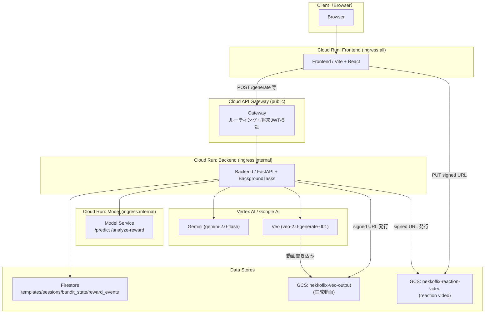
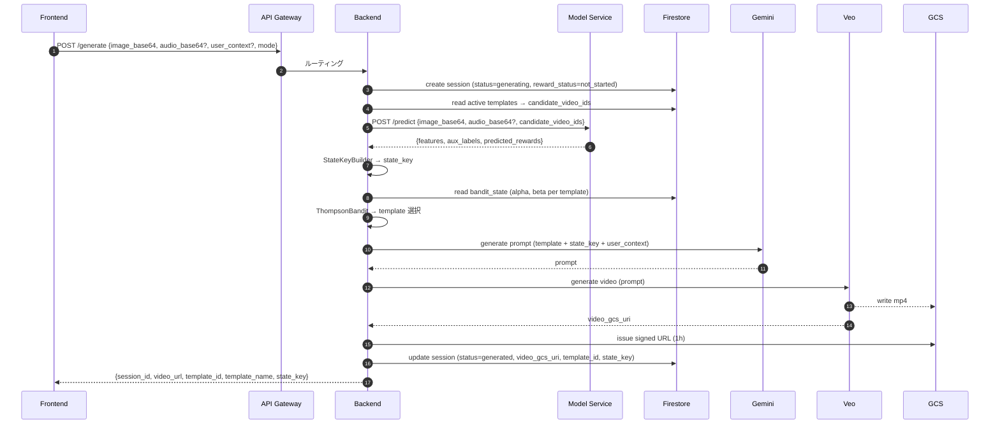
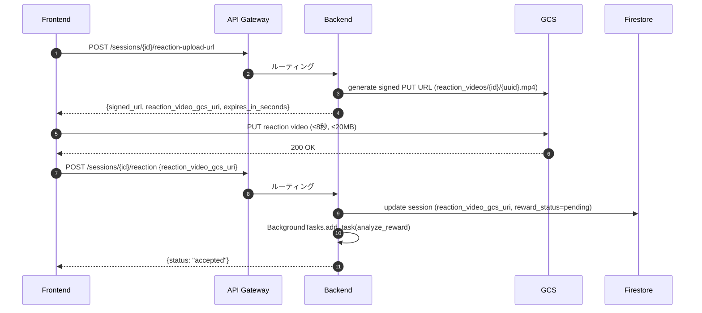
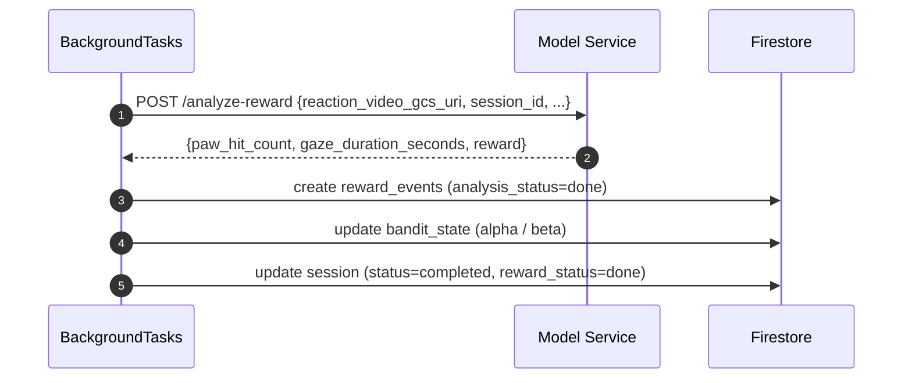
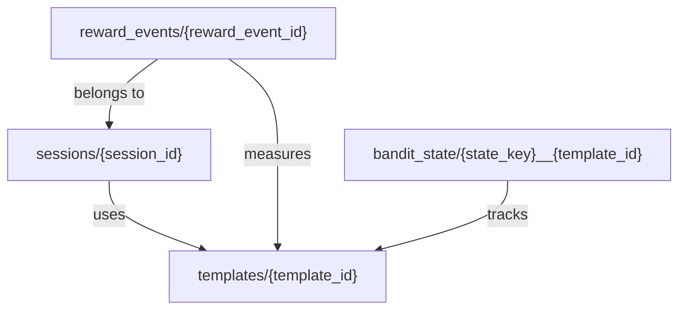
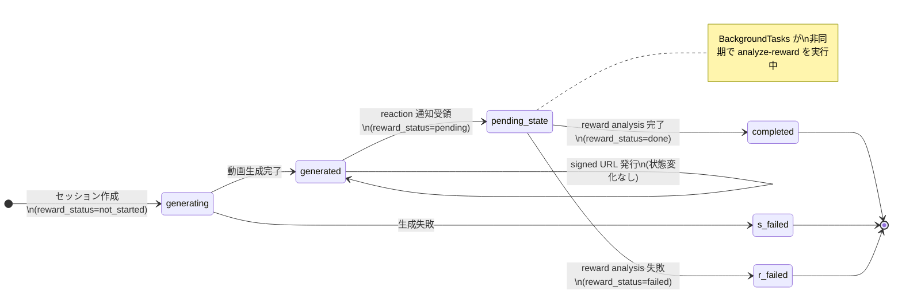
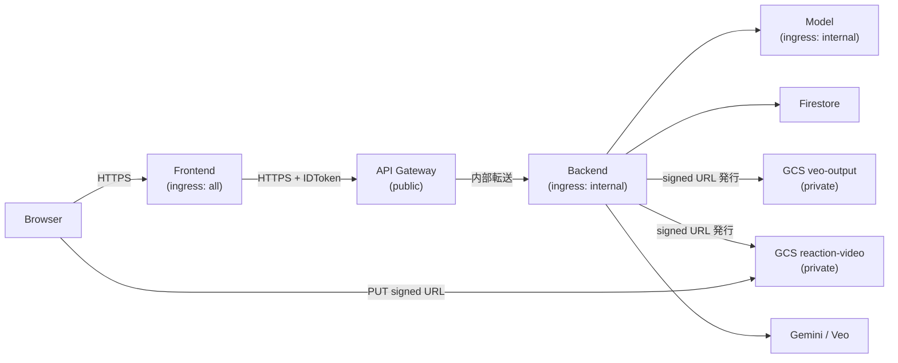
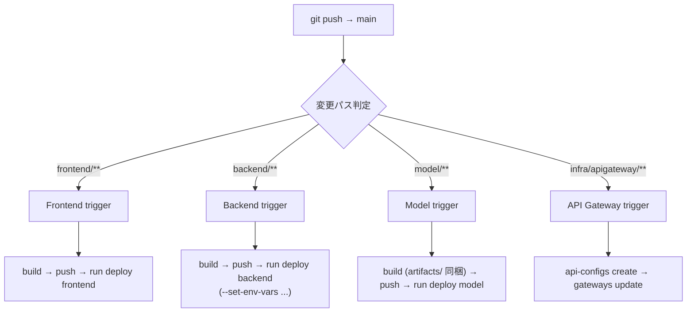

# 🐱 nekkoflix — インフラ詳細設計書

| 項目 | 内容 |
|------|------|
| ドキュメントバージョン | v6.0 |
| 作成日 | 2026-03-28 |
| ステータス | Active |
| 対応基本設計書 | docs/ja/High_Level_Design.md |
| 対応バックエンド設計書 | docs/ja/Backend_Design.md |

---

## 目次

1. [アーキテクチャ全体像](#1-アーキテクチャ全体像)
2. [Cloud Run 詳細設計](#2-cloud-run-詳細設計)
3. [GCP リソース設計](#3-gcp-リソース設計)
4. [Firestore スキーマ詳細](#4-firestore-スキーマ詳細)
5. [ネットワーク設計](#5-ネットワーク設計)
6. [IAM・セキュリティ設計](#6-iamセキュリティ設計)
7. [CI/CD 設計](#7-cicd-設計)
8. [環境変数・シークレット設計](#8-環境変数シークレット設計)
9. [運用設計](#9-運用設計)

---

## 1. アーキテクチャ全体像

### 1.1 サービス構成図



### 1.2 役割分担

| コンポーネント | 主責務 |
|---|---|
| Frontend | 画像・音声・文脈送信、動画再生、reaction video 録画・GCS direct upload |
| API Gateway | 公開 API 入口。将来の JWT 認証・レート制限の受け口 |
| Backend | セッション管理、model 呼び出し、bandit 選択、動画生成統括、signed URL 発行、BackgroundTasks 起動 |
| Model Service | `/predict`（猫状態推論）・`/analyze-reward`（reaction video 解析）|
| Firestore | template / session / reward / bandit 状態の正本 |
| GCS | 生成動画（`veo-output`）と reaction video（`reaction-video`）の保存 |

### 1.3 主要フロー（シーケンス図）

#### 生成フロー



#### reaction video アップロードフロー



#### reward analysis フロー（BackgroundTasks）



---

## 2. Cloud Run 詳細設計

### 2.1 Frontend

| 設定項目 | 値 | 根拠 |
|---|---|---|
| ingress | `all` | ブラウザからの直接アクセス |
| min-instances | `0` | デモ以外は常時起動不要 |
| max-instances | `3` | デモ同時利用数 |
| CPU | `1` | 静的ファイル配信のみ |
| memory | `512Mi` | — |
| timeout | `60s` | 動的処理なし |
| port | `8080` | Vite preview / nginx |

**環境変数：**

| 変数名 | 説明 |
|---|---|
| `VITE_BACKEND_URL` | API Gateway の公開 URL |

---

### 2.2 Backend

| 設定項目 | 値 | 根拠 |
|---|---|---|
| ingress | `internal-and-cloud-load-balancing` | API Gateway 経由のみ受け付け |
| min-instances | `1` | コールドスタートによる timeout 防止 |
| max-instances | `5` | ハッカソンデモ規模 |
| CPU | `2` | BackgroundTasks の並行実行を考慮 |
| memory | `2Gi` | model 呼び出しバッファ |
| timeout | `360s` | Veo 生成（最大 180s）+ バッファ |
| concurrency | `10` | `/generate` 同時実行数 |
| port | `8080` | FastAPI / uvicorn |

> **BackgroundTasks と concurrency の関係：**  
> `/reaction` 完了通知後、`BackgroundTasks` は同一 uvicorn worker 内で非同期実行される。  
> `concurrency=10` は HTTP リクエスト処理数のため、background task は独立して継続する。

---

### 2.3 Model Service

| 設定項目 | 値 | 根拠 |
|---|---|---|
| ingress | `internal` | Backend からのみ呼ばれる |
| min-instances | `1` | モデルロード時間が長いためコールドスタート防止 |
| max-instances | `3` | — |
| CPU | `4` | CPU 推論（4モデル直列） |
| memory | `8Gi` | HuggingFace モデルのロード領域 |
| timeout | `120s` | 4モデル推論 + `/analyze-reward` |
| port | `8080` | FastAPI |

**artifact 同梱戦略：**

```dockerfile
# model/Dockerfile（抜粋）
FROM python:3.11-slim
COPY model/artifacts/ /app/artifacts/
# → HF_TOKEN 不要。起動時 download なし。起動時間を安定化。
```

---

## 3. GCP リソース設計

### 3.1 採用リソース一覧

| リソース名 | サービス | 用途 |
|---|---|---|
| `nekkoflix-frontend` | Cloud Run | UI 配信 |
| `nekkoflix-backend` | Cloud Run | 公開 API・BackgroundTasks |
| `nekkoflix-model` | Cloud Run | 猫状態推論・reward 解析 |
| `nekkoflix-gateway` | API Gateway | 公開 API 入口 |
| `nekkoflix-db` | Firestore | セッション・bandit 状態 |
| `nekkoflix-veo-output` | Cloud Storage | Veo 生成動画 |
| `nekkoflix-reaction-video` | Cloud Storage | reaction video |
| `nekkoflix` | Artifact Registry | コンテナ image |

### 3.2 GCS バケット設計

#### veo-output バケット

| 設定 | 値 |
|---|---|
| location | `asia-northeast1` |
| public access | 無効（signed URL のみ） |
| signed URL 有効期限 | `3600` 秒 |
| lifecycle | 作成から **1日後**に自動削除 |

lifecycle ルール：

```json
{
  "rule": [
    { "action": { "type": "Delete" }, "condition": { "age": 1 } }
  ]
}
```

#### reaction-video バケット

| 設定 | 値 |
|---|---|
| location | `asia-northeast1` |
| public access | 無効（signed URL PUT のみ） |
| object path | `reaction_videos/{session_id}/{uuid}.mp4` |
| content-type | `video/mp4` |
| lifecycle | 作成から **7日後**に自動削除 |

lifecycle ルール：

```json
{
  "rule": [
    { "action": { "type": "Delete" }, "condition": { "age": 7 } }
  ]
}
```

### 3.3 Artifact Registry image 命名規則

```
asia-northeast1-docker.pkg.dev/{PROJECT_ID}/nekkoflix/{service}:{tag}

# tag 戦略
- latest   ← main ブランチ push 時
- {sha}    ← コミット SHA（ロールバック用）
```

---

## 4. Firestore スキーマ詳細

### 4.1 コレクション関係図



### 4.2 `templates` コレクション

**ドキュメント ID：** `T01`, `T02`... （`init_firestore.py` で初期投入）

| フィールド名 | 型 | 必須 | 説明 |
|---|---|---|---|
| `template_id` | string | ✅ | `T01` 形式 |
| `name` | string | ✅ | テンプレート名 |
| `prompt_text` | string | ✅ | Gemini に渡すプロンプトのひな形 |
| `clip_embedding_label` | string | ❌ | CLIPスコア算出用ラベル |
| `is_active` | boolean | ✅ | `false` のとき候補から除外 |
| `auto_generated` | boolean | ✅ | Gemini 自律生成かどうか |
| `created_at` | timestamp | ✅ | 作成日時 |

### 4.3 `sessions` コレクション

**ドキュメント ID：** UUID v4

| フィールド名 | 型 | 必須 | 説明 |
|---|---|---|---|
| `session_id` | string | ✅ | UUID v4 |
| `mode` | string | ✅ | `experience` \| `production` |
| `status` | string | ✅ | `generating` \| `generated` \| `completed` \| `failed` |
| `reward_status` | string | ✅ | `not_started` \| `pending` \| `done` \| `failed` |
| `state_key` | string | ❌ | 例: `waiting_for_food_happy_curious_cat` |
| `template_id` | string | ❌ | Bandit が選択したテンプレート ID |
| `user_context` | string | ❌ | ユーザー入力コンテキスト |
| `video_gcs_uri` | string | ❌ | GCS 上の生成動画 URI |
| `reaction_video_gcs_uri` | string | ❌ | GCS 上の reaction video URI |
| `reward_event_id` | string | ❌ | 対応 `reward_events` ID |
| `created_at` | timestamp | ✅ | 作成日時 |
| `generated_at` | timestamp | ❌ | 動画生成完了日時 |
| `completed_at` | timestamp | ❌ | reward analysis 完了日時 |
| `error` | string | ❌ | エラーメッセージ（失敗時）|

**`status` × `reward_status` 状態遷移：**



### 4.4 `bandit_state` コレクション

**ドキュメント ID：** `{state_key}__{template_id}`（例: `waiting_for_food_happy__T02`）

| フィールド名 | 型 | 必須 | 説明 |
|---|---|---|---|
| `state_key` | string | ✅ | 猫の状態キー |
| `template_id` | string | ✅ | テンプレート ID |
| `alpha` | float | ✅ | Beta 分布の α（初期値: `1.0`）|
| `beta` | float | ✅ | Beta 分布の β（初期値: `1.0`）|
| `selection_count` | int | ✅ | arm の累積選択回数 |
| `reward_sum` | float | ✅ | 累積報酬合計 |
| `last_reward` | float | ❌ | 直近の reward 値 |
| `updated_at` | timestamp | ✅ | 最終更新日時 |

> **初期状態：** `init_firestore.py` で全テンプレート × 代表状態キーに `alpha=1.0, beta=1.0` を投入し、コールドスタートを防ぐ。

### 4.5 `reward_events` コレクション

**ドキュメント ID：** UUID v4

| フィールド名 | 型 | 必須 | 説明 |
|---|---|---|---|
| `reward_event_id` | string | ✅ | UUID v4 |
| `session_id` | string | ✅ | 対応セッション ID |
| `template_id` | string | ✅ | 対象テンプレート ID |
| `state_key` | string | ✅ | 対象状態キー |
| `reaction_video_gcs_uri` | string | ✅ | 解析した reaction video URI |
| `paw_hit_count` | int | ❌ | 前足スクリーンタッチ回数 |
| `gaze_duration_seconds` | float | ❌ | 視線継続時間（秒）|
| `reward` | float | ✅ | 最終報酬値 |
| `analysis_status` | string | ✅ | `done` \| `failed` |
| `analysis_model_versions` | map | ❌ | 解析モデルのバージョン情報 |
| `created_at` | timestamp | ✅ | 作成日時 |
| `analyzed_at` | timestamp | ❌ | 解析完了日時 |

---

## 5. ネットワーク設計

### 5.1 通信経路図



### 5.2 ingress 設定の根拠

| サービス | ingress | 根拠 |
|---|---|---|
| Frontend | `all` | ブラウザから直接アクセス |
| Backend | `internal-and-cloud-load-balancing` | API Gateway 経由のみ |
| Model Service | `internal` | Backend からのみ呼ばれる |

### 5.3 BackgroundTasks の実行環境

| 観点 | 内容 |
|---|---|
| 実行場所 | 同一 Cloud Run インスタンスの同一 uvicorn worker |
| 起動タイミング | `/reaction` のレスポンス送信後 |
| 失敗時 | `reward_status=failed` を Firestore に記録。自動 retry なし |
| 採用根拠 | Cloud Tasks / Pub/Sub は ハッカソンスコープ外。best-effort で十分 |

---

## 6. IAM・セキュリティ設計

### 6.1 サービスアカウント一覧

| SA 名 | アタッチ先 |
|---|---|
| `nekkoflix-frontend-sa` | Cloud Run Frontend |
| `nekkoflix-backend-sa` | Cloud Run Backend |
| `nekkoflix-model-sa` | Cloud Run Model |
| `nekkoflix-cloudbuild-sa` | Cloud Build |

### 6.2 Backend SA 権限

| ロール | 対象リソース | 用途 |
|---|---|---|
| `roles/datastore.user` | Firestore | セッション・bandit 状態の読み書き |
| `roles/storage.objectAdmin` | `veo-output` bucket | 動画 URI 参照・signed URL 発行 |
| `roles/storage.objectAdmin` | `reaction-video` bucket | reaction video signed PUT URL 発行 |
| `roles/run.invoker` | Model Service Cloud Run | `/predict`, `/analyze-reward` 呼び出し |
| `roles/aiplatform.user` | Vertex AI | Gemini・Veo 呼び出し |

### 6.3 Cloud Build SA 権限

| ロール | 用途 |
|---|---|
| `roles/artifactregistry.writer` | image push |
| `roles/run.admin` | Cloud Run deploy |
| `roles/iam.serviceAccountUser` | deploy 時の SA 付与 |
| `roles/apigateway.admin` | API Gateway 更新 |

### 6.4 API Gateway 認証設計

| フェーズ | 認証 |
|---|---|
| MVP（ハッカソン） | **認証なし**（オープンアクセス）|
| 本番移行時 | Google OIDC JWT 検証を OpenAPI spec に追加 |

> Backend は `internal-and-cloud-load-balancing` ingress のため、API Gateway を経由しない直接アクセスはネットワークレベルでブロックされる。

---

## 7. CI/CD 設計

### 7.1 Cloud Build トリガー構成



### 7.2 `cloudbuild-backend.yaml`

```yaml
# infra/ci/cloudbuild-backend.yaml
steps:
  - name: "gcr.io/cloud-builders/docker"
    args:
      - build
      - -t
      - "${_REGION}-docker.pkg.dev/${PROJECT_ID}/nekkoflix/backend:${SHORT_SHA}"
      - -t
      - "${_REGION}-docker.pkg.dev/${PROJECT_ID}/nekkoflix/backend:latest"
      - -f
      - backend/Dockerfile
      - .
    id: build-backend

  - name: "gcr.io/cloud-builders/docker"
    args: [push, --all-tags, "${_REGION}-docker.pkg.dev/${PROJECT_ID}/nekkoflix/backend"]
    id: push-backend
    waitFor: [build-backend]

  - name: "gcr.io/google.com/cloudsdktool/cloud-sdk"
    entrypoint: gcloud
    args:
      - run
      - deploy
      - nekkoflix-backend
      - --image=${_REGION}-docker.pkg.dev/${PROJECT_ID}/nekkoflix/backend:${SHORT_SHA}
      - --region=${_REGION}
      - --ingress=internal-and-cloud-load-balancing
      - --min-instances=1
      - --max-instances=5
      - --concurrency=10
      - --cpu=2
      - --memory=2Gi
      - --timeout=360s
      - --service-account=nekkoflix-backend-sa@${PROJECT_ID}.iam.gserviceaccount.com
      - --set-env-vars=GCP_PROJECT_ID=${PROJECT_ID}
      - --set-env-vars=VIDEO_BUCKET_NAME=${_VIDEO_BUCKET_NAME}
      - --set-env-vars=REACTION_VIDEO_BUCKET_NAME=${_REACTION_VIDEO_BUCKET_NAME}
      - --set-env-vars=MODEL_SERVICE_URL=${_MODEL_SERVICE_URL}
      - --set-env-vars=REACTION_VIDEO_UPLOAD_URL_EXPIRES_SECONDS=600
    id: deploy-backend
    waitFor: [push-backend]

substitutions:
  _REGION: asia-northeast1
  _VIDEO_BUCKET_NAME: nekkoflix-veo-output
  _REACTION_VIDEO_BUCKET_NAME: nekkoflix-reaction-video
  _MODEL_SERVICE_URL: ""   # Cloud Build trigger substitution で上書き
```

### 7.3 `cloudbuild-model.yaml`（抜粋）

```yaml
steps:
  - name: "gcr.io/cloud-builders/docker"
    args:
      - build
      - -t
      - "${_REGION}-docker.pkg.dev/${PROJECT_ID}/nekkoflix/model:${SHORT_SHA}"
      - -f
      - model/Dockerfile
      - .    # artifacts/ を image に同梱する前提

  - name: "gcr.io/google.com/cloudsdktool/cloud-sdk"
    entrypoint: gcloud
    args:
      - run
      - deploy
      - nekkoflix-model
      - --image=${_REGION}-docker.pkg.dev/${PROJECT_ID}/nekkoflix/model:${SHORT_SHA}
      - --region=${_REGION}
      - --ingress=internal
      - --min-instances=1
      - --cpu=4
      - --memory=8Gi
      - --timeout=120s
      # HF_TOKEN は artifacts/ 同梱のため不要
```

### 7.4 API Gateway deploy コマンド

```bash
# openapi.yaml 更新後
gcloud api-gateway api-configs create nekkoflix-config-v{N} \
  --api=nekkoflix-api \
  --openapi-spec=infra/apigateway/openapi.yaml \
  --project=${PROJECT_ID}

gcloud api-gateway gateways update nekkoflix-gateway \
  --api=nekkoflix-api \
  --api-config=nekkoflix-config-v{N} \
  --location=asia-northeast1
```

**openapi.yaml に含める公開エンドポイント：**

| パス | メソッド |
|---|---|
| `/` | GET |
| `/health` | GET |
| `/generate` | POST |
| `/sessions/{session_id}/reaction-upload-url` | POST |
| `/sessions/{session_id}/reaction` | POST |

---

## 8. 環境変数・シークレット設計

### 8.1 環境変数注入フロー

```
Cloud Build substitutions  →  gcloud run deploy --set-env-vars
        ↓
Cloud Run コンテナ OS 環境変数
        ↓
src/config.py（Pydantic BaseSettings）
        ↓
各 Service クラスがコンストラクタで受け取る
```

### 8.2 Backend 環境変数一覧

| 変数名 | 型 | 必須 | デフォルト | 説明 |
|---|---|---|---|---|
| `GCP_PROJECT_ID` | str | ✅ | — | GCP プロジェクト ID |
| `GCP_REGION` | str | ❌ | `asia-northeast1` | デプロイリージョン |
| `FIRESTORE_DATABASE_ID` | str | ✅ | `(default)` | Firestore DB ID |
| `VIDEO_BUCKET_NAME` | str | ✅ | — | Veo 生成動画バケット名 |
| `REACTION_VIDEO_BUCKET_NAME` | str | ✅ | — | reaction video バケット名 |
| `MODEL_SERVICE_URL` | str | ✅ | — | Model Service の内部 URL |
| `MODEL_SERVICE_TIMEOUT_SECONDS` | int | ❌ | `60` | model 呼び出し timeout |
| `THOMPSON_DEFAULT_ALPHA` | float | ❌ | `1.0` | bandit 初期 α |
| `THOMPSON_DEFAULT_BETA` | float | ❌ | `1.0` | bandit 初期 β |
| `REWARD_SUCCESS_THRESHOLD` | float | ❌ | `0.5` | α 更新の報酬しきい値 |
| `REACTION_VIDEO_MAX_BYTES` | int | ❌ | `20971520` | reaction video 上限 (20MB) |
| `REACTION_VIDEO_UPLOAD_URL_EXPIRES_SECONDS` | int | ❌ | `600` | signed URL 有効秒数 |
| `ENVIRONMENT` | str | ❌ | `production` | `development` / `production` |

### 8.3 Secret Manager

| シークレット名 | 用途 | 使用サービス |
|---|---|---|
| `HF_TOKEN` | Hugging Face Hub からの artifact fetch（将来対応） | Model Service（optional） |

```bash
# HF_TOKEN が必要になった場合の Cloud Run 設定
gcloud run deploy nekkoflix-model --set-secrets=HF_TOKEN=HF_TOKEN:latest
```

### 8.4 ローカル開発用 `.env.example`

```bash
# GCP
GCP_PROJECT_ID=your-project-id
GCP_REGION=asia-northeast1
FIRESTORE_DATABASE_ID=(default)

# GCS
VIDEO_BUCKET_NAME=nekkoflix-veo-output
REACTION_VIDEO_BUCKET_NAME=nekkoflix-reaction-video

# Model Service
MODEL_SERVICE_URL=http://localhost:8001
MODEL_SERVICE_TIMEOUT_SECONDS=60

# Bandit
THOMPSON_DEFAULT_ALPHA=1.0
THOMPSON_DEFAULT_BETA=1.0
REWARD_SUCCESS_THRESHOLD=0.5

# Reaction Video
REACTION_VIDEO_MAX_BYTES=20971520
REACTION_VIDEO_UPLOAD_URL_EXPIRES_SECONDS=600

# Frontend
VITE_BACKEND_URL=https://gateway-xxx.uc.gateway.dev

ENVIRONMENT=development
```

---

## 9. 運用設計

### 9.1 正常系フロー確認チェックリスト

| イベント | 確認場所 | 期待値 |
|---|---|---|
| generate 完了 | `sessions/{id}.status` | `generated` |
| reaction 通知受領 | `sessions/{id}.reward_status` | `pending` |
| reward analysis 完了 | `sessions/{id}.status` | `completed` |
| bandit 更新 | `bandit_state/{key}__{id}.alpha` | 更新済み |

### 9.2 障害時の対応 SOP

| 障害内容 | 症状 | 対応手順 |
|---|---|---|
| signed URL 取得失敗 | Frontend が upload 不可 | Frontend 側でリトライ（最大3回）|
| reaction upload 失敗 | GCS PUT が 4xx/5xx | signed URL 有効期限内にリトライ |
| reward analysis 失敗 | `reward_status=failed` | Firestore 確認後、手動で `/reaction` を再送信 |
| Model Service timeout | `/generate` が 504 | Cloud Run min-instances を確認。再リクエスト |
| Veo 生成失敗 | `session.status=failed` | フロントのリトライボタンで再送信 |

### 9.3 Cloud Logging クエリ例

**session_id で Backend イベントを追跡：**

```
resource.type="cloud_run_revision"
resource.labels.service_name="nekkoflix-backend"
jsonPayload.session_id="{session_id}"
```

**reward analysis 失敗を抽出：**

```
resource.type="cloud_run_revision"
resource.labels.service_name="nekkoflix-backend"
jsonPayload.event="reward_analysis_failed"
severity>=ERROR
```

**model service 応答時間の確認：**

```
resource.type="cloud_run_revision"
resource.labels.service_name="nekkoflix-backend"
jsonPayload.event="model_predict_completed"
```

### 9.4 監視ポイント

| メトリクス | しきい値 | 意味 |
|---|---|---|
| Backend リクエスト p99 latency | > 300s | Veo 生成が遅延中 |
| Model Service の 5xx 率 | > 0 | 推論エラー |
| Background Task failure 率 | > 10% | `reward_status=failed` 急増 |
| `reaction-video` bucket object 数 | 異常増加 | lifecycle 設定の確認 |

---

**設計原則：**

> `BackgroundTasks` による最小非同期・reaction video の GCS direct upload・Firestore を業務状態の正本とする設計を一貫して維持する。  
> Cloud Tasks / Pub/Sub / worker service はハッカソンスコープでは不採用。シンプルさ優先。
